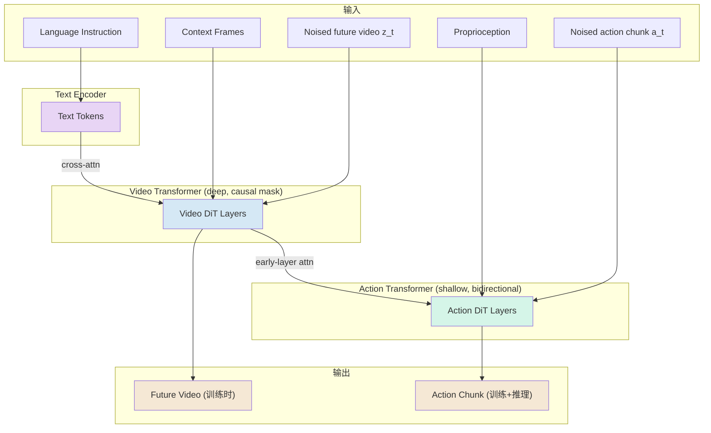
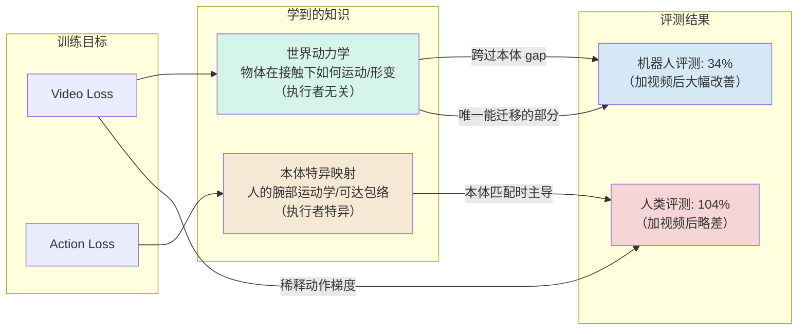

> **abstract**
> Dyna-2 是一个 world-action model (WAM)，在 >1,000,000 小时第一人称人类操作视频上预训练，展示了从人类数据到机器人数据的跨本体 scaling law。但这篇笔记的核心论点不是"1M 小时"——而是以下三件更重要的事：
>
> 1. **视频协同训练是跨本体迁移的主要驱动力**，由一个干净的双分离实验证明（同一干预：同本体评测退到基线的 104%、即略微变差；跨本体评测降到 34%、即大幅改善）；
> 2. **世界建模的全部收益通过共享 trunk 的表征在训练期交付，推理期零代价**——因为 $u_\theta^{\rm act}$ 的参数表里根本没有 $z_t$；
> 3. **"scaling law"这个词在跨本体曲线上被过度使用了**：79.4% 的 MSE 效应集中在 10k→100k 一个数量级，形状是台阶而非幂律，4 点拟合无法区分二者。
>
> WAM 概念出处：[DreamZero_精读学习笔记_Obsidian](../dreamzero/)（本文 ref [4]）。

### 全文速览——笔记作者的再分析三联图


> 上图是**笔记作者基于原文自己披露的数值重做的三联图，原文没有这张图**。三个面板对应本笔记的三条骨架批判：
> - **A**：跨本体 MSE 曲线是台阶不是幂律——逐段 Δ 标注为 −0.006 / −0.050 / −0.007，10k→100k 占 79% 的总改善，灰色虚线是原文幂律拟合，与实测点系统性偏离
> - **B**：14 个真机任务的归一化轨迹——Rope Tie（红）与 Food Scooping（橙）两条反向线醒目突出，蓝色聚合均值带 ±1SE≈4.2pp，右侧参照误差棒是单任务 10 trials 的 95% CI 半宽 ±31pp
> - **C**：Figure 12 的双分离——同一干预（加视频数据），人类评测 104%（略差）vs 机器人评测 34%（大幅改善）

---

## 1. 文章元信息与语料规模

| 项目 | 内容 |
|---|---|
| 标题 | Dyna-2: A 1-Million-Hour Scaling Law for World-Action Models |
| 作者 | Dyna Robotics（公司技术报告，非同行评审） |
| 日期 | 2026 年 8 月 |
| 阅读时长 | 31 min |
| 结构 | 7 节：Introduction / Architecture & objectives / Scaling laws / Additional capabilities / Related work / Conclusion / References |

语料规模（页面 JS 计数器）：

| 指标 | 数值 |
|---|---|
| Clips 总数 | **43.8M** |
| 独立任务指令 | **97,160** |
| 不同物体 | **9,917** |
| 总时长 | >1,000,000 小时 ≈ 170 年连续清醒经验 |

内容：头戴式第一人称录制的日常操作——做饭、收拾、折叠、组装，来自数据合作方与自建采集。

---

## 2. 架构与训练目标——真正该记住的设计决策

### 2.1 Mixture-of-Transformers 架构

Dyna-2 是一个 WAM：单个生成模型，可联合或分别去噪未来视频与未来动作，backbone 是 video-diffusion。架构是 mixture-of-transformers（refs: MoT、[π0](../pi0-model-architecture-flow-matching-notes-obsidian-mermaid-fixed/)、Transfusion），核心设计：

- 每个模态（video / action）各自 tokenize、各自有独立的一套 DiT 层，通过 attention 互相 attend
- **Proprioception 直接喂 action transformer**，不进 video 流
- **Video token 用因果掩码；action token 用双向自注意力**（无因果掩码），并 attend 到观测上下文的 video token
- **Video token cross-attend 到 text token；text 不直接影响 action token**

> **Info**
> 术语：DiT（Diffusion Transformer）
> **一句话**：把扩散模型里那个负责去噪的网络从 **U-Net 换成 Transformer**。出处：Peebles & Xie, *Scalable Diffusion Models with Transformers*, ICCV 2023（本文 ref [27]）。Sora、Stable Diffusion 3、以及现在几乎所有视频生成模型都是 DiT 架构。
>
> **要分清两件事**（初学最容易混）：
> - **扩散 / flow matching** = 训练与采样的*数学框架*（加噪→学去噪）
> - **DiT** = 实现这个去噪函数的*网络架构*
>
> 两者正交。你熟悉的 [π0](../pi0-model-architecture-flow-matching-notes-obsidian-mermaid-fixed/) 用 flow matching 配 Transformer，Dyna-2 也是——只不过它把同一套机制同时用在了视频 latent 上。
>
> **DiT 块与普通 Transformer 块的唯一实质差别：它必须知道“现在噪声有多大”（时间步 $t$）。** 做法是 **adaLN-Zero**：把 $t$（及类别/文本等条件）过一个小 MLP，回归出每层 LayerNorm 的缩放 $\gamma$、平移 $\beta$，以及残差分支的门控 $\alpha$：
> $$h \leftarrow h + \alpha(t)\cdot \text{Attn}\big(\gamma(t)\cdot\text{LN}(h)+\beta(t)\big)$$
> “Zero” 指 $\alpha$ 初始化为 0，于是每个块开训时是恒等映射，训练更稳。除此之外就是普通的 self-attention + FFN 堆叠。
>
> **为什么换掉 U-Net：** U-Net 的卷积归纳偏置是局部性与尺度层级，不好扩容；换成 Transformer 后，**算力（Gflops）与生成质量（FVD/FID）出现干净的幂律关系**。这正是 Dyna-2 能把模型堵到百万小时数据上而不饱和的前提——**“架构能吃下 1M 小时”这个结论本身就建立在 DiT 的可扩展性上。**
>
> **视频上怎么用**：先用 3D VAE 把视频压缩成时空 latent，切成 spacetime patch 展平成 token 序列，交给 DiT 堆去噪。Dyna-2 里的 $z_t$ 就是这个加噪的视频 latent，**不是像素**。
>
> **回到本文的两处具体用法**：
> 1. “每个模态各有一套 DiT 层” = video 和 action 各自一栈 DiT 块、权重不共享，只在 attention 处交互（即 mixture-of-transformers）
> 2. 下段“时序推理集中在早期层”指的就是这些 DiT 块的层号——所以 action 塔才能只接早期层就够用

深度不对称：基于 ref [1]（*Causality in Video Diffusers is Separable from Denoising*）的发现——DiT 式视频扩散架构的时序推理能力主要集中在早期层，因此 **action transformer 做得更浅，只在早期层接入 video 流**，显著改善实时推理延迟且不牺牲性能。这与 [RTC](../rtc-realtime-constraint-summary/) 讨论的实时性约束直接呼应。

### 2.2 Flow matching 训练目标

记 $c$ = 条件上下文（过去帧 + proprio + 语言指令），$z$ = 未来视频 latent，$a$ = 未来动作块：

$$z_t = tz+(1-t)\varepsilon_z,\quad a_t = ta+(1-t)\varepsilon_a,\quad \varepsilon_z,\varepsilon_a\sim\mathcal N(0,I)$$

Scaling law 实验用的变体是 video + action 共同训练，两个独立的边际速度场共享 trunk：

$$\mathcal L_{\rm co}(\theta)=\mathbb E\lVert u_\theta^{\rm vid}(z_t;t,c)-(z-\varepsilon_z)\rVert^2+\lambda\,\mathbb E\lVert u_\theta^{\rm act}(a_t;t,c)-(a-\varepsilon_a)\rVert^2$$

> **Info**
> 术语：trunk（主干）到底指什么
> **一般含义**：深度网络里被多个任务头（head）共用的那部分网络，同义词是 backbone / body，中文译“主干”或“骨干网络”。比喻来自树：一根树干（trunk）分出几根枝条（head）。多任务学习的经典结构就是 *shared trunk + task-specific heads*。
>
> **但在 Dyna-2 里要小心**：它是 mixture-of-transformers，video 与 action **各有各的 DiT 层，权重并不共享**。所以这里的 trunk 不是 ResNet backbone 那种“一条主干后面挂几个头”的字面意思。
>
> **真正被共享的是视频塔（video transformer）及其表征**，因为两条梯度都会流进去：
> - video loss 直接更新视频塔；
> - action loss **也**更新视频塔——因为 action token 要 attend 到 context video token，梯度顺着这条 attention 通路回流。
>
> 所以“两个损失共享一个 trunk”准确的意思是：**两个损失作用在同一套底层表征上**。视频塔在信息上处于上游，action head 只能通过 attention 去“读”它。
>
> 这正是 §7.3 双分离论证的支点：视频损失把接触动力学写进视频塔 → action head 读到它 → 换本体时 action head 自己那套人体运动学映射失效，但它从视频塔读到的世界动力学仍然成立。

### 2.3 最关键的一条设计——$u_\theta^{\rm act}$ 不接 $z_t$

> **Important**
> 原文原话
> *"Because $u_\theta^{\rm act}$ never takes $z_t$ as an argument, the video loss can shape the shared representation, but at inference time the model stays reactive (i.e., the policy neither generates nor attends to predicted future video at inference time)."*

这意味着三件事：

1. Dyna-2 **不是**"视频模型当 planner"那一路（UniPi），**也不是** [DreamZero](../dreamzero/) 那种把预测的视频 latent 写回 KV cache 再闭环的做法——世界模型的全部收益**只通过共享 trunk 的表征、在训练时交付**，推理时一分钱不付
2. 视频损失在此处的角色是一个**架构上被隔离的辅助损失（auxiliary loss）**
3. 这是后面第 5 节"双分离"现象能被干净解释的前提，也是整套东西能实时部署的原因

> **Tip**
> 对自己工作的启发
> 对 [π0](../pi0-model-architecture-flow-matching-notes-obsidian-mermaid-fixed/) 系 / openpi 微调而言，这是最可迁移的一条设计：**你可以在不改推理链路、不付视频 rollout 代价的前提下，加一个视频预测辅助头去买跨本体泛化。**

### 2.4 架构数据流图



> **Warning**
> 注意图中的关键缺失
> **Text → Action 没有直接连线；Noised future video $z_t$ → Action Transformer 没有连线。** 前者意味着语言影响动作的唯一路径是 text → video trunk → 共享表征 → action head。后者意味着推理时不生成也不 attend 未来视频。

### 2.6 伪动作监督——一个被低估的对齐选择

通过手姿质量门槛的 episode 带 3D hand-pose 轨迹，由此导出伪动作监督：**腕部位姿（wrist pose）作为末端执行器轨迹 + 由拇指-食指开合距离（thumb–index aperture）导出的连续抓取信号**。

原文声明"不做任何视觉或本体相关的处理去缩小与下游机器人数据的 gap"。

> **Warning**
> 我的修正
> "不做对齐"这句话**只在像素与 co-training 层面成立**。腕部 6-DoF 位姿 + 一维连续开合，恰好就是"6-DoF 手臂 + 平行夹爪"的动作参数化——而下游主力评测平台正是 YAM 双臂 + 自研平行夹爪。真正诚实的表述是：**没有视觉对齐、没有 co-training 对齐，但有一个刻意选择的、本体中性且偏夹爪形态的动作参数化在替他们完成本体桥接。**
>
> 佐证：换成 WUJI-2 20-DoF 五指灵巧手的两个任务结果明显偏弱或行为异常——Highlighter in Drawer 在 10k 就跳到 80% 然后不动，Bottle Cap Untwisting 到 1M 也只有 50%。这与 [UniDex](../unidex/) 处理的跨本体动作空间问题一脉相承。

---

## 3. 实验方法论——值得直接抄的部分

> **Info**
> 术语：held-out（留出集）
> **字面意思**：“被拿出来扣住的”。指**从训练中完全排除、只用来评测的数据**。中文常译“留出集”，与 validation set / test set 同一家族。对应概念是 in-domain（训练分布内）。
>
> **为什么非要这么做**：神经网络能直接背下训练数据。在训练集上测出的低误差可能只是背诵，不是能力。**只有模型没见过的数据才能区分“学会了”与“背下了”。** 尤其在 scaling law 研究里这是生死线：数据越多模型背得越多，若在训练集上量误差，会拟合出一条漂亮但毫无意义的曲线。
>
> **本文有两个彼此独立的 held-out 集，千万不要混**：
>
> | | held-out **人类**数据 | held-out **机器人**数据 |
> |---|---|---|
> | 是什么 | 单独留出的 **100 小时**人类视频，与所有训练子集不相交 | **39 个机器人任务**（12 内部 YAM + 27 外部 xdof ABC） |
> | 扣住了什么 | 具体的**片段** | 整个**本体**（预训练里一条机器人轨迹都没有） |
> | 测的是 | 同分布泛化（human→human） | **跨本体**泛化（human→robot） |
> | 对应章节 | §4 | §5 |
>
> **第二个才是本文的新意。** 普通 held-out 只扣掉一些样本；这里扣掉的是**整个机器人本体**——模型只看过人，直接拿去评机器人，无任何适配与微调。这就是“**zero-shot** 跨本体”里那个零的含金量，也是它相对 RDT2 / LAP（预训练里仍有 UMI 这类机器人形状数据）的差别。
>
> 注意区分：§6 的**真机**结果不是 held-out——那里用了几小时机器人数据做后训练。held-out 只描述 §4、§5 的**离线**评测。

这些方法论选择对自己做 scaling 实验有直接参考价值，单列出来：

1. **嵌套子集（nested subsets）**：1k ⊂ 10k ⊂ 100k ⊂ 1M 小时，每个数据源保持相同比例。更大的预算**只加数据、绝不换数据**，排除分布漂移解释
2. **固定 100 小时验证集**，与所有训练子集不相交
3. **训练与评测配置完全一致**，唯一变量是数据小时数
4. **消除 checkpoint 偏差**：后期窗口取 **10 个 checkpoint**，报告均值与标准差
5. **双指标体系**：引用 Schaeffer et al.（*Are Emergent Abilities of LLMs a Mirage?*），指出非线性/不连续指标会从平滑改进的模型上"制造"假涌现。因此同时报 **2 个连续误差（MSE / L1）+ 2 个阈值化准确率（acc@0.5 / acc@0.1）**
   - 内部经验：$\tau=0.5$ 衡量"大致运动意图"，适合研究跨本体迁移；$\tau=0.1$ 衡量运动精度，适合看同本体趋势
6. **真机用盲测**（评测者不参与模型开发）

> **Tip**
> 可直接复用
> 嵌套子集 + 固定 held-out 集 + 多 checkpoint 均值 + 连续与阈值化双指标 + 盲测——这套方法论骨架可以直接搬到自己的 VLA 微调实验里。**特别是第 5 条，如果只报 success rate 这类离散指标，在小样本上很容易"制造"假的涌现或消失。**

---

## 4. 同本体 Scaling Law（held-out 人类数据）

| 指标 | 1k | 10k | 100k | 1M | 拟合公式 | R² |
|---|---|---|---|---|---|---|
| MSE ↓ | 0.062 | 0.057 | 0.056 | 0.054 | $0.0691\,D^{-0.0184}$ | 0.919 |
| L1 ↓ | 0.140 | 0.131 | 0.129 | 0.127 | $0.151\,D^{-0.0132}$ | 0.879 |
| acc@0.1 ↑ | 0.017 | 0.021 | 0.024 | 0.026 | $0.0116\,D^{+0.0606}$ | 0.926 |
| acc@0.5 ↑ | 0.40 | 0.44 | 0.45 | 0.47 | $0.357\,D^{+0.0203}$ | 0.865 |

原文自评：四个指标都单调改善，阈值化指标改善最快——acc@0.1 全程涨 51%，MSE 只降 12%。

**独立复算**：用上表这 4 个点重做 log-log 最小二乘，得到的指数与原文几乎逐位吻合——说明原文的拟合是诚实的、可以从它自己披露的数据复现出来。这一点应当正面肯定（很多技术报告做不到）。

| 指标 | 我复算的指数 | 原文指数 | 我复算 $R^2$(log) | 1k→1M 相对变化 |
|---|---|---|---|---|
| MSE | −0.0188 | −0.0184 | 0.909 | **−12.9%** |
| L1 | −0.0134 | −0.0132 | 0.859 | −9.3% |
| acc@0.1 | +0.0612 | +0.0606 | 0.958 | **+52.9%** |
| acc@0.5 | +0.0220 | +0.0203 | 0.920 | +17.5% |

> **Warning**
> 但指数本身极小——这是必须点破的第一件事
> - MSE 指数 −0.0184。作为对照，Kaplan et al. LLM 数据 scaling law 的指数是 $L\propto D^{-0.095}$。**Dyna-2 在人类数据上的误差衰减指数比 LLM 小约 5 倍。**
> - 直白翻译：**数据翻 1000 倍，held-out MSE 只降 12.9%。**
> - 唯一陡的是 acc@0.1（+0.0606，涨 52.9%），但它的绝对基数极小：0.017 → 0.026。即在最严格的精度阈值下，**1M 小时模型也只有 2.6% 的动作维度落在真值 ±0.1 内**。
>
> **诚实解读：同本体上这条律的实用意义有限。** 它主要证明"架构能吃下 1M 小时且不饱和"，而不是"再多喂数据就能把人类动作预测做准"。真正有价值的结论在跨本体那一节。

---

## 5. 跨本体 Transfer Scaling Law——全文最强主张，也是最需要审视的一节

### 5.1 实验设定

同一批 scale 阶梯 checkpoint，**零样本**（无任何适配/微调）评在 held-out 机器人数据上。评测集 **39 个任务**（12 个内部 YAM bimanual benchmark + 27 个外部 xdof ABC），涵盖布料处理、打结、装箱、清洁、餐饮服务、装配。**刻意引入外部数据集以避免评测偏向。所有 checkpoint 没有训练过这两个来源的任何一条轨迹。**

| 指标（all 39） | 1k | 10k | 100k | 1M | 拟合公式 | R² |
|---|---|---|---|---|---|---|
| MSE ↓ | 0.180 | 0.174 | 0.124 | 0.117 | $0.306\,D^{-0.0713}$ | 0.884 |
| acc@0.5 ↑ | 0.067 | 0.074 | 0.136 | 0.159 | $0.0241\,D^{+0.139}$ | 0.918 |

原文自评：所有指标随预训练规模单调排序；并自己承认 10k→100k 之间存在 inflection（拐点）。

### 5.2 核心批判：这是台阶，不是幂律

逐段增量复算：

| 数量级跳变 | MSE 变化 | acc@0.5 变化 |
|---|---|---|
| 1k → 10k | −0.006 | +0.007 |
| **10k → 100k** | **−0.050** | **+0.062** |
| 100k → 1M | −0.007 | +0.023 |

**总 MSE 降幅的 79.4% 集中在 10k→100k 这一个数量级内。** 总 acc@0.5 增幅的 67.4% 也集中在同一段。

1k→10k 几乎什么都没发生，10k→100k 突然发生了几乎全部，100k→1M 又几乎什么都没发生。**这条曲线的形状是一个台阶（step / sigmoid），不是幂律。**

用 4 个点做 log-log 拟合，在统计上**根本无法区分"幂律"与"阶跃"**：任何一个在中间某个数量级发生跳变的单调序列，都能被 4 点幂律拟合出 R²≈0.88。**R²=0.884 在这里不构成"存在幂律"的证据，它只构成"存在单调序"的证据。**

> **Warning**
> 更尖锐的一点
> 原文在方法一节专门引用 Schaeffer（"涌现是海市蜃楼"）来论证自己用多指标避免制造假涌现——然后在最关键的跨本体曲线上，**得到的恰恰是一个带明显拐点的形状，却把它当幂律来拟合与命名**。这不是造假（他们如实标出了拐点），但 **"scaling law"这个词在这里是被过度使用的**。

### 5.3 可辩护的结论应当降级为两句话

1. **（强，可信）存在跨本体的单调迁移序**：纯人类数据预训练量越大，从未见过的机器人数据上的离线预测越好——且这是在无任何适配、无机器人形状数据进预训练的条件下测到的。这个"零"是真的零，是本文相对 RDT2 / LAP 的真正新意
2. **（弱，未被证明）它是一条幂律**。4 个点、80% 效应集中在一个数量级、明显拐点，都不支持外推。**任何"再加 10 倍数据能再涨多少"的外推都没有依据**

### 5.4 我的假说：拐点是视频目标从"记忆"切换到"泛化"的相变

> **question**
> 我的推测（可证伪）
> 拐点不是动作目标的性质，是视频目标的相变：
> - 低于某个覆盖度时，视频预测目标最省力的拟合方式是记住特定场景的外观/纹理统计
> - 越过覆盖度阈值后（43.8M clips、9,917 种物体、97,160 条指令），记忆代价超过了学"接触动力学"的代价，模型被迫压缩成一套与执行者无关的世界规律
> - 这套规律恰好是唯一能越过本体 gap 的东西
>
> **可证伪预测**：拐点位置应当随视频数据的多样性（distinct objects / instructions 数）移动，而不随带动作标签的小时数移动。固定总小时数、只改变物体/场景多样性，看拐点是否平移。**这个实验比再堆一个数量级的数据信息量大得多，也便宜得多。** 原文没有做它。

---

## 6. 真机验证——聚合站得住，逐任务读不出信号

### 6.1 实验设定

对 4 个 rung 各取等步数 checkpoint，在同一套 **14 个 benchmark 任务**上后训练；每个任务至多 10 小时机器人数据。唯一变量是人类预训练小时数。不做人-机对齐、不做 co-training。三种本体：11 个任务用 6-DoF YAM + 平行夹爪，2 个用 WUJI-2 20-DoF 五指灵巧手，1 个跑在半人形早期原型上。每个任务 10 次试验（语言跟随 12 次），盲测。

**总分：20% → 28% → 45% → 53%**（1k / 10k / 100k / 1M）。1M 在 14 个任务中的 9 个上最好。

### 6.2 逐任务结果

| 任务 | 指标 | 1k | 10k | 100k | 1M |
|---|---|---|---|---|---|
| Highlighter in Drawer · 灵巧 | 成功率 | 10% | 80% | 80% | 90% |
| Bottle Cap Untwisting · 灵巧 | 成功率 | 10% | 10% | 40% | 50% |
| Trash Tray Pickup | avg/6 | 2.2 | 3.9 | 4.5 | 4.8 |
| Pants Hanger Preparation | 成功率 | 10% | 0% | 20% | 50% |
| Rope Tie | 成功率 | 0% | 40% | **90%** | **40%** |
| Lockbox Key Turning | 成功率 | 0% | 0% | 0% | 90% |
| Food Scooping | 成功率 | 10% | 30% | **80%** | **50%** |
| First Aid Kitting | avg/10 | 2.0 | 0.2 | 2.9 | 4.8 |
| Unsort | avg/10 | 6.4 | 5.5 | 3.6 | 5.8 |
| Fridge Tube Insertion | 成功率 | 10% | 10% | 10% | 20% |
| Tote Construction | 成功率 | 20% | 10% | 40% | 30% |
| Mug Unboxing | 成功率 | 20% | 0% | 10% | 20% |
| Pick & Place | avg/10 | 1.8 | 2.1 | 4.2 | 3.9 |
| Targeted Drink Retrieval · 语言 | 成功率 | 58% | 75% | 83% | 83% |

### 6.3 噪声地板分析

> **Warning**
> 逐任务数字基本读不出信号
> - **10 次试验的二项标准误**：$p=0.5$ 时 $\text{SE}=15.8\text{pp}$，95% CI 半宽 **±31pp**。换言之，除非差距超过 ~30pp，否则分辨不出任何东西。
> - **14 个任务里有 8 个不单调**（Rope Tie、Food Scooping、Unsort、First Aid Kitting、Tote Construction、Mug Unboxing、Pick & Place、Pants Hanger Preparation）。
> - 最刺眼的两个反向结果：**Rope Tie 90%→40%** 和 **Food Scooping 80%→50%**——都是 100k 打败 1M，分别掉了 50pp 和 30pp。**原文正文完全没有讨论这两个反例。**
> - Lockbox Key Turning 0%→90% 是最抓眼球的例子，但只有 10 次试验支撑——应当视为**有趣的线索而非确证**。

**但聚合层面结论仍然站得住**：14 个任务 × 10 次 = 140 次试验，若任务间近似独立，14 个任务成功率均值的 $\text{SE}\approx 4.2\text{pp}$。

- **20%→53%（差 33pp ≈ 8 SE）结实**
- **45%→53%（差 8pp ≈ 2 SE）弱**——即"100k 到 1M 还在涨"这一步本身就在噪声边缘

这与第 5 节离线曲线上"100k→1M 只贡献了 7% 的效应"是**同一个现象的两次独立显现**，互相印证。

> **Important**
> 综合判断
> 真机结果证明的是"预训练规模从 1k 到 100k 量级带来实质性的、可迁移到物理机器人的能力提升"。**它没有证明"从 100k 到 1M 还在继续显著提升"。**

---

## 7. 消融实验——视频协同训练是跨本体迁移的开关

### 7.1 三路受控对比（Figure 10）

固定动作数据量（5k / 50k / 100k 带手姿标注的人类小时），同一 Dyna-2 架构，只变训练目标与数据组成：

| 配方 | 描述 |
|---|---|
| action-only | 只有动作损失，无世界建模 |
| joint | 在同一份数据上同时预测动作块与未来视频 |
| + video co-training | joint + 等量无动作标签的额外人类视频只做视频预测 |

在 39 任务机器人套件上零样本评测，匹配训练步数：

- **joint 以 39/39 全胜 action-only**——任何形式的未来预测都大幅优于纯动作
- **action-only 随数据增长表现出严重且不可预测的过拟合**
- **joint 过拟合更少，但不随数据增长**（曲线是平的）
- **只有加了大量纯视频数据做视频预测，趋势才被扭转**——随动作数据增长而改善
- 在 5k 小规模上，加视频反而没有优势；但差距随数据规模增大而增大

### 7.2 视频是新的 scaling 轴（Figure 11）

固定动作数据量，只 scale 纯视频数据量：

- 动作固定 **50k 小时**，纯视频 0 → 1k → 10k → 50k：零样本 MSE 从 **0.34 → 0.12**
- 动作固定 **250k 小时**，纯视频 0 → 250k → 750k：MSE 从 **0.10 → 0.084**
- 两组都单调改善；不加视频始终最差

> **Tip**
> 实用推论
> 对任何"采了一堆视频但手姿/动作标注跟不上"的团队——无动作标签的视频不是废料。这条直接把沉没数据变成资产。参见 [SiMDex](../simdex/) 对大规模人类视频池的挖掘思路。

### 7.3 Figure 12 的双分离——全文最重要的一张图

> **Info**
> 先澄清一个易误词：原文的 "0-video **arm**"
> 这篇文章里 **arm 一词两义**，读的时候要按上下文切：
> - **机器人手臂**（大多数情况）："bi-manual parallel-jaw **arms**"、"6-DOF YAM **arms**"、Figure 18 指令文本 "Move **arm** toward the beige glove"
> - **实验臂 / 对照组**（临床试验术语 treatment arm / control arm）：Figure 11/12 的 "0-video **arm**"、Figure 16 图注的 "same instruction and first frame across **arms**"
>
> **Figure 12 里是后者。决定性证据**：原文写的是 "% of each **domain's own** 0-video arm"，而两个 domain 是 Human 和 Robot。**人类第一人称视频的评测里不存在任何机器人手臂**，它却同样有一个“自己的 0-video arm”（104%）——若指硬件，这句话在 Human 侧无法成立。
>
> 佐证：“0-video” 修饰的是**训练数据条件**（纯视频小时数 = 0），不是硬件属性；对照 Figure 11 横轴 "Video-only hours" 的取值 0 / 1k / 10k / 50k，**四个取值就是四个实验臂，“0” 那个是基线臂**。
>
> 所以 **"0-video arm" = 不加任何纯视频数据的那个对照组**（即 action-only）。它是归一化的分母，被定为 100%。

实验设计：**动作数据固定 50k 小时不动**，只把纯视频数据从 0 → 1k → 10k → 50k 小时递增，得到四个模型。然后把它们分别拿到两个评测领域上跑，**每个领域各自除以自己那个 0 视频对照组的误差**。

关键：这里归一化的是**误差**，所以**数值越低越好**，100% = 与不加视频时持平：

| 评测领域 | 加满 50k 纯视频后的误差（÷ 自己的 0 视频对照组） | 含义 |
|---|---|---|
| 人类（同本体） | **104%** | 误差反而涨了 4%——没改善，甚至略微变差 |
| 机器人（跨本体） | **34%** | 误差降到不到三分之一——**大幅改善** |

两个领域各自用自己的对照组做分母，是为了把量纲不同的两条曲线放到同一根坐标轴上比较——**比的不是绝对性能，而是“加视频这个干预各自带来了多少变化”**。

这是一个干净的**双分离（double dissociation）**：同一个干预（加视频数据），在同本体上有害、在跨本体上大幅有益。任何"数据多了表征就更好"的笼统说法都解释不了这个符号翻转。



> **Important**
> 我的机制解释
> 唯一自洽的机制是：**两个目标学的根本不是同一样东西，而视频学到的那部分恰好是能越过本体 gap 的那部分。**
>
> - **动作头**学的是"上下文 → 人的腕部位姿 + 拇指食指开合"。这个映射是本体特异的：它编码了人的手臂运动学、可达包络、抓取时序。换到机器人上，这条通路系统性失准。
> - **视频目标**逼迫共享 trunk 预测**场景如何演化**：物体在接触下如何运动、如何形变、如何被遮挡。这些是**世界的性质，不是执行者的性质**。
> - 在人类评测上，动作通路准确且占主导，加视频只是稀释梯度 → 104%。
> - 在机器人评测上，动作通路基本失效（本体错了），性能几乎**完全由 trunk 里那套世界动力学决定** → 视频数据量直接驱动 → 34%。
>
> 再叠加 §2.3 那条架构事实（$u^{\rm act}_\theta$ 看不到 $z_t$，推理时不生成也不 attend 未来视频），这个解释被钉死：**世界建模在这里 100% 是表征学习效应，没有任何推理期的规划成分掺进来。**
>
> **这是整篇报告真正的科学贡献——比"1M 小时"这个标题数字重要得多。**

> **Tip**
> 可操作的工程结论
> - 瓶颈是"换场景就崩"→ 加视频预测辅助损失，方向明确
> - 瓶颈是"同场景精度不够"→ 按 Figure 12，加视频是**负收益**，应该去堆动作标签
> - **这是一条有方向性的决策规则，不是"越多越好"**

---

## 8. 其他能力与延伸分析

### 8.1 WAM vs VLA 同条件对比（Figure 13）

对手是 **Dyna-1**：自家上一代生产环境 VLA，同样 mixture-of-transformers，从 **Qwen3-VL-4B** 初始化。匹配条件：相同预训练与后训练数据集、相同超参；每个架构从 3 个不同预训练 checkpoint 初始化以消除选择偏差。

| 指标 | WAM（early Dyna-2）vs VLA（Dyna-1）|
|---|---|
| 成功率 | WAM 达到 VLA 的 **1.55×** |
| 质量评级 | WAM 达到 VLA 的 **1.12×** |
| 头对头 | WAM 赢 **65%**，VLA 赢 **29%**，平 **6%** |

原文自己强调这个对比**对 WAM 不公平**：early Dyna-2 没有 1M 预训练、是 action-only 损失；整条管线是为 VLA 调好的。原文将此读作 WAM 的下界。误差棒用 paired bootstrap 95% CI。

> **Warning**
> 我的批注
> 这大概是目前公开可见的最诚实的一次 WAM vs VLA 同条件对比（匹配数据、匹配超参、多 checkpoint、paired bootstrap、明说不公平方向）。但仍然是"自家新模型 vs 自家旧模型"，且 early Dyna-2 是 action-only——也就是说**恰恰没有包含第 7 节证明为关键的视频协同训练成分**。所以它比较的其实是"video-diffusion backbone + MoT"vs"VLM backbone + MoT"，不是"WAM 范式"vs"VLA 范式"。

### 8.2 定性案例：切菜（vegetable chopping）

同样数据配置后训练，Dyna-2 切出的芹菜段更薄更均匀，接近专家示范；Dyna-1 明显更差。

| Production VLA (Dyna-1) | Early WAM (Dyna-2) |
|---|---|
| <span class="missing-asset">Missing attachment: dyna2-chopping-vla.jpg\</span> | <span class="missing-asset">Missing attachment: dyna2-chopping-wam.jpg\</span> |

Dyna-1 在这个任务上对扰动脆弱；Dyna-2 能在极端条件下无人干预运行：改变并大幅减少工作区光照仍能精确完成；运行中移除部分视觉输入仍继续（对传感器丢失的鲁棒性）；人把切好的段放回板上破坏进度，Dyna-2 一直清理，**不是在固定循环数后停止，而是在板子空了的时候停**。

> **Tip**
> 最后这条是最有意思的行为学证据
> "在目标状态达成时停止"而不是"在 N 步后停止"，说明策略内部有一个对目标状态的表征，而不只是一段被模仿的动作节律。这与"世界建模让模型理解场景如何演化"一致。

### 8.3 零样本真实部署（Figure 14）——全文最有说服力却最少篇幅的结果

生产验收标准不是"任务完成"而是**质量、节拍、可靠性**三者联合达标。在客户现场，由不参与模型开发的操作员按客户验收标准打分，两个模型在相同任务数据上后训练相同步数，都没见过部署现场数据。

| 评测环境 | Dyna-1 | Dyna-2 |
|---|---|---|
| 自家内部 | ~100% | ~100% |
| **客户现场零样本** | **46%** | **87%** |

> **Important**
> 关键洞察
> 这是全文**唯一一个既没有饱和、也不是 10 次试验噪声**的测量。**同分布 benchmark 对这一代模型已经信息量枯竭了（都是 100%），只有 OOD 部署才能分辨模型好坏。** 对任何做 VLA 评测的人，这是最该记住的一条。

### 8.4 语言跟随（Figure 15）

| 配方 | All (n=36) | Push/pull jenga (n=8) | Object kitting (n=10) | Piece stacking (n=10) | Napkin manipulation (n=8) |
|---|---|---|---|---|---|
| action-only · early corpus | 0.35 | 0.44 | 0.10 | 0.60 | 0.25 |
| video co-train · early corpus | 0.67 | 1.00 | 0.35 | 0.95 | 0.38 |
| video co-train · full Dyna-2 corpus | **0.96** | 1.00 | **0.95** | 1.00 | **0.88** |

目标与数据规模两者都有实质贡献；提升最大的是需要物体接地（object kitting 0.10→0.95）和灵巧动作原语（napkin 0.25→0.88）的任务。

> **Important**
> 与架构事实的对照
> 回到 §2.1 的架构事实——**text 只 cross-attend 进 video 流，不直接影响 action token**。所以语言想影响动作，唯一路径是 text → 视频 trunk → 共享表征 → action head。这不是巧合，而是把"语言接地"结构性地强制成了"语言 → 世界演化 → 动作"。这解释了为什么 action-only 只有 0.35：在 action-only 配方下这条唯一通路上根本没有梯度。

> **Tip**
> 检查自己模型
> 如果你的 VLA 的语言跟随能力弱，检查模型里"语言 → 动作"的梯度通路是否真的存在。如果 text 只通过某条通路影响动作但那条通路上没有梯度，再调数据也没用——这是架构性的。

### 8.5 一步视频生成（Figure 16-18）


> 上图为原文 Figure 16，几何直觉：为什么一步生成困难，以及各方法落在什么位置。

#### 为什么一步这么难

- **回归型蒸馏**（Progressive Distillation / Consistency Models）的损失被条件均值 $\mathbb E[x_0\mid z]$ 最小化 → 一步从噪声得到的是所有可能未来的平均 → 糊
- **分布匹配型蒸馏**（DMD/DMD2 / Self Forcing）能保住细节，但其梯度在教师 score $s_q$ 从未被训练过的地方求值：概率流路径全局弯曲（教师上实测**每步约 4°、全程约 58°**），一步就走出 $s_q$ 的支撑集
- **维度让两者都更糟**：流形假设下 $\dim M_p+\dim M_q<D$ 时二者一般不相交 → $\chi^2(p\Vert q)=\infty$，散度饱和、梯度消失。一步必须一次性承担全部平滑量，多步采样器每步重新投影回数据流形避开它

#### 解法：控制问题——学生与移动目标的追逐博弈

学生 $x=G_\theta(\varepsilon)$，$\varepsilon\sim\mathcal D(0,I)$；$\{q_r\}$，$r\in[0,1]$ 是目标测度族（$q_0$ 在初始化时可达，$q_1$ 是数据）。两者先被 $\mathcal D(0,\sigma^2)$ 平滑以保证重叠：

$$\text{(fast)}\quad \mathrm d\theta/\mathrm dt \propto -w(\hat m)\,\nabla_\theta\mathbb D\!\left(p_\theta * \mathcal D_\sigma \,\Vert\, q_r * \mathcal D_\sigma\right)$$

$$\text{(slow)}\quad \mathrm dr/\mathrm dt=f(\hat m)$$

关键：$f$ 只有当 $\hat m$（学生自身样本的在线读数）表明学生已追平当前目标时才推进 $r$——**目标永远不会跑到学生够不着的地方**。

#### 结果

| Sampler | NFE | 延迟 (ms) | Speedup | FVD ↓ | Motion ↑ | Flicker |
|---|---|---|---|---|---|---|
| Real recorded future | — | — | — | — | 100% | 2.37 |
| Teacher, default (100 steps) | 100 | 10,203 | 1× | 80 | 94% | 2.69 |
| Teacher, cut to 1 step | 2 | 210 | 48.6× | 1039 | 27% | 15.81 |
| DMD2, 2 steps | 2 | 211 | 48.4× | 115 | 79% | 2.95 |
| DMD2, 1 step | 1 | 109 | 93.6× | 599 | 56% | 5.81 |
| **Ours, 1 step** | **1** | **110** | **93×** | **121** | **75%** | **1.94** |

单张 H100，3 秒、3 视角操作视频：从 10,203 ms 降到 110 ms，一次前向取代教师的一百次。

> **Warning**
> 原文未讨论的异常：flicker 低于真实 = 过度平滑
> 一步学生 flicker = **1.94**，低于真实录像的 **2.37**。flicker 低于真实不是"更好"——而是**运动欠生成（过度平滑）**的信号。再结合 motion 只有真实的 75%（教师 94%），一致指向同一个结论：**这个一步学生系统性地少生成了运动，它"太安静"了。** FVD=121 抓不到这一点。
>
> **实用含义**：拿它做评测与规划（作者声称的用途）问题不大；但如果拿它当动力学模型做 MPC，运动幅度被系统性低估会直接偏置代价函数。

---

## 9. 定位：Dyna-2 在坐标系里的位置

| 维度 | 既有工作 | Dyna-2 的差异 |
|---|---|---|
| 机器人 scaling law | EgoScale (~20k 小时) | 延长 2 个数量级，首次在零样本跨本体上展示 |
| 零样本跨本体迁移 | RDT2 / LAP（单一数据规模，预训练含机器人形状数据如 UMI） | 不含任何机器人数据的预训练 + 展示它如何随规模变化 |
| VLM → 策略 | RT-2 / OpenVLA / π0 / GR00T N1 | WAM 路线，用 video-diffusion 替代 VLM backbone |
| 视频 → 策略 | UniPi（视频当 planner）/ DreamZero / UWM / mimic-video | $u^{\rm act}$ 不接 $z_t$，世界模型纯做辅助损失，推理期零代价 |

一句话定位：**Dyna-2 是 WAM 类别里的一个可扩展架构，能吃到百万小时量级，并展示了若干新的 scaling 现象。**

---

## 10. 总评：被证明了什么，没有被证明什么

### 被证明了的（可以拿去用的）

1. **视频协同训练是跨本体迁移的主要驱动力**——由 Figure 10/11/12 的受控实验支撑，尤其是 Figure 12 的符号翻转双分离（人类 104% / 机器人 34%）。这是全文最硬的科学结论，**与"1M 小时"这个标题数字无关**
2. **纯人类第一人称视频预训练、零机器人形状数据、零对齐、零 co-training，可以支撑到真机上的实用策略**——预训练规模从 1k 到 100k 带来实质提升（真机总分 20%→45%）
3. **世界建模的收益可以做成"训练期付费、推理期免费"**——$u^{\rm act}$ 不吃 $z_t$ 这条架构决定，是整套东西能实时跑的原因
4. **同分布 benchmark 已经信息枯竭**——内部评测 Dyna-1/Dyna-2 都是 100%，客户现场 46% vs 87%

### 没有被证明的（不要跟着标题走的）

1. **"幂律"这个词在跨本体曲线上是过度使用的**——4 个点、79.4% 的效应集中在 10k→100k、100k→1M 只贡献约 7%。可辩护的说法是"存在单调迁移序"，不是"存在可外推的幂律"
2. **"100k→1M 仍在显著提升"证据薄弱**——离线只贡献 7% 效应，真机 45%→53% 只有约 2 个标准误。两处独立证据指向同一结论：**收益在 100k 之后明显趋缓**
3. **逐任务真机数字基本读不出信号**——10 trials，95% CI 半宽 ±31pp；8/14 非单调；Rope Tie 90%→40%、Food Scooping 80%→50% 两个反向结果未讨论
4. **同本体 scaling 实用价值有限**——MSE 指数 −0.0184 ≈ LLM 的 1/5；1000× 数据只换 12.9% 的 MSE 下降
5. **"不做任何本体对齐"只在像素与 co-training 层面成立**——动作参数化本身就是一次朝平行夹爪的对齐

### 最该做而没做的实验

> **question**
> 开放问题
> 固定总视频小时数，**只改变视频数据的多样性（distinct objects / distinct instructions）**，看 10k→100k 的拐点是否平移。
> - 拐点随多样性移动 → 证实"触发条件是覆盖度而非数据量"，下一步该投资采集多样性而非采集时长
> - 拐点不动 → "记忆→泛化相变"假说被证伪，需要另找机制

---

## 11. 对自己工作的启发

| 发现 | 对 π0/openpi 微调的启示 |
|---|---|
| $u^{\rm act}$ 不接 $z_t$ | 视频预测辅助头在推理链路上完全隔离，可以加了不用；低风险高回报 |
| Figure 12 双分离 | 瓶颈是跨场景泛化 → 加视频辅助损失；瓶颈是同场景精度 → 堆动作标签。**方向相反，不能混用** |
| 无标注视频 ≠ 废料 | Fig 11 显示固定动作数据、只加纯视频就能改善跨本体泛化 |
| 评测方法论 | 嵌套子集（只加不换）、多 checkpoint 均值、连续+阈值化双指标、盲测 |
| 10 trials 的噪声地板 | ±31pp 半宽——**自己汇报实验结果时，要么加试验次数，要么只报聚合指标并给误差棒** |
| 同分布评测饱和 | 必须建 OOD 评测——同分布上都能 100%，只有 OOD 能分辨好坏 |
| 语言跟随可能是架构性问题 | 检查自己模型里"语言→动作"的梯度通路是否真的存在 |

---

## 12. 如果只记住三件事

1. **双分离实验（Figure 12）**：加视频数据在同本体上略有害（104%）、在跨本体上大幅有益（34%）——世界建模学的是与执行者无关的接触动力学，这才是能跨过本体 gap 的东西。叠加 $u^{\rm act}$ 不接 $z_t$ 的架构事实，这个收益是纯表征效应，推理期零代价。

2. **跨本体曲线是台阶不是幂律**：79.4% 的 MSE 效应集中在 10k→100k 一个数量级，100k→1M 只贡献 ~7%。4 点拟合无法区分幂律与阶跃。"scaling law"被过度使用了；可辩护的是"存在单调迁移序"。

3. **10 次试验的真机评测读不出 30pp 以下的差异**（95% CI 半宽 ±31pp）。Rope Tie 90%→40%、Food Scooping 80%→50% 这类反向结果原文未讨论。聚合结论站得住（20%→53%，SE≈4.2pp），但 45%→53% 只有约 2 个标准误。

---

> **引用格式（原文提供）：**
> ```
> @article{dyna2026dyna2,
>   author = {{Dyna Robotics}},
>   title  = {Dyna-2: A 1-Million-Hour Scaling Law for World-Action Models},
>   year   = {2026}, month = {August}, url = {https://dyna.co/dyna-2},
> }
> ```
