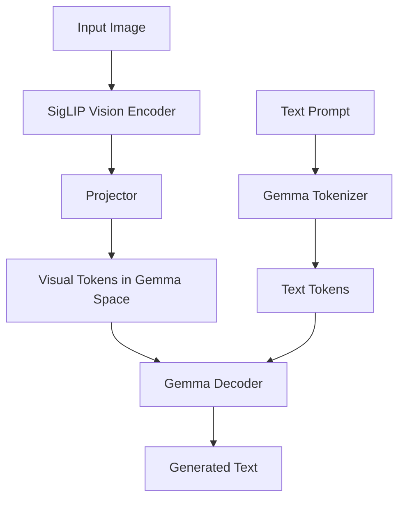

> **Summary**
> PaliGemma 是 Google 推出的轻量级开放权重视觉语言模型（VLM）。它使用 **SigLIP 视觉编码器** 来处理图像，使用 **Gemma 文本解码器** 来处理文本 prompt 并生成文本输出。它更适合做下游任务微调，而不是直接作为通用多轮视觉聊天模型使用。

---

## 1. PaliGemma 是什么？

**PaliGemma** 是一个视觉语言模型，英文通常写作 **PaliGemma**，不是分开的 “Pali Gemma”。

它的输入通常是：

```text
图像 + 文本 prompt
```

它的输出是：

```text
生成的文本
```

可用于：

- 图像描述（image captioning）
- 视觉问答（visual question answering, VQA）
- OCR / 读图中文字
- 目标检测
- 目标分割
- 遥感图像问答
- UI 元素理解
- 专业领域视觉问答

---

## 2. PaliGemma 的整体架构

PaliGemma 可以简化理解为：

```text
image ──> SigLIP vision encoder ──> projector ──┐
                                                ├──> Gemma decoder ──> generated text
text prompt ──> Gemma tokenizer / embeddings ───┘
```

对应模块：

| 模块 | 作用 |
|---|---|
| SigLIP vision encoder | 把图像编码成视觉 token / visual features |
| Projector | 把视觉特征映射到 Gemma 可以接收的 hidden space |
| Gemma tokenizer | 把用户文本 prompt 转成 token |
| Gemma decoder | 融合图像 token 和文本 token，生成文本输出 |

> **Important**
> PaliGemma 中的 SigLIP 主要作为 **视觉编码器** 使用。用户输入的文本 prompt 不是输入给 SigLIP text encoder，而是输入给 Gemma decoder。

---

## 3. ViT 和 SigLIP 的区别

### 3.1 核心区别

**ViT 是视觉模型架构；SigLIP 是图文预训练模型 / 训练方法。**

它们不是完全同一层级的概念。

| 维度 | ViT | SigLIP |
|---|---|---|
| 全称 | Vision Transformer | Sigmoid Loss for Language-Image Pre-training |
| 本质 | 图像编码器架构 | 图文对比学习模型 / 方法 |
| 输入 | 图像 | 图像 + 文本 |
| 输出 | 图像特征或分类结果 | 图像 embedding、文本 embedding、图文相似度 |
| 是否多模态 | 本身不是 | 是 |
| 训练目标 | 图像分类、自监督视觉表征学习等 | 图文对齐 |
| 和 PaliGemma 的关系 | 可作为视觉编码器底层结构 | PaliGemma 使用 SigLIP 的视觉编码器 |

---

### 3.2 ViT 是什么？

ViT，即 **Vision Transformer**，核心思想是：

1. 把图像切成固定大小的 patch；
2. 把每个 patch 当成类似文本 token 的输入；
3. 使用 Transformer 处理这些 patch token；
4. 得到图像表征或分类结果。

简化流程：

```text
image
  ↓
patchify
  ↓
patch embeddings
  ↓
Transformer encoder
  ↓
image representation
```

---

### 3.3 SigLIP 是什么？

SigLIP 是类似 CLIP 的图文对比学习模型。

原始 SigLIP 结构大致是：

```text
image ──> image encoder ──> image embedding
text  ──> text encoder  ──> text embedding

image embedding ↔ text embedding
```

SigLIP 的目标是学习图像和文本之间的对应关系。

它和 CLIP 的主要区别之一是：  
SigLIP 使用 **pairwise sigmoid loss**，而不是 CLIP 中常见的 softmax contrastive loss。

---

### 3.4 ViT 和 SigLIP 的关系

SigLIP 的图像编码器通常可以是 ViT 风格的架构。

所以更准确的理解是：

```text
ViT 是视觉骨架；
SigLIP 是使用视觉骨架 + 文本编码器 + 图文对齐训练得到的多模态模型。
```

> **Note**
> 不应该简单地问 “ViT 和 SigLIP 哪个更强”。  
> 更合理的问题是：  
> **一个普通 ViT 和一个经过图文对齐预训练的 SigLIP vision encoder，哪个更适合做 VLM 的视觉前端？**

在 PaliGemma 里，答案通常是后者。

---

## 4. PaliGemma 中 SigLIP 的文本输入和 Gemma 的文本输入是同一个吗？

答案：**不是同一个。**

更准确地说：

> **Important**
> 在 PaliGemma 里，SigLIP 的 text encoder 通常不参与推理。  
> 用户输入的文本 prompt 是给 Gemma tokenizer / Gemma decoder 的，而不是给 SigLIP 的文本塔。

---

### 4.1 原始 SigLIP 中的文本输入

原始 SigLIP 是图文双塔结构：

```text
SigLIP 原版：

image encoder(image)  ↔  text encoder(text)
```

它需要图像和文本成对输入，用于学习图文 embedding 对齐。

在这个阶段，SigLIP 的 text encoder 是存在的。

---

### 4.2 PaliGemma 中的文本输入

PaliGemma 不是直接运行完整的 SigLIP 双塔模型。

PaliGemma 使用的是：

```text
SigLIP 的 image encoder + Gemma 的 text decoder
```

也就是：

```text
PaliGemma:

image ──> SigLIP image encoder ──> visual tokens ──┐
                                                   ├──> Gemma decoder
text prompt ──> Gemma tokenizer ──> text tokens ───┘
```

因此：

| 问题 | 答案 |
|---|---|
| PaliGemma 是否使用 SigLIP 的视觉编码器？ | 是 |
| PaliGemma 是否通常使用 SigLIP 的文本编码器？ | 否 |
| 用户文本 prompt 输入给谁？ | Gemma tokenizer / Gemma decoder |
| SigLIP 原始训练时是否有文本输入？ | 有 |
| PaliGemma 推理时是否把文本 prompt 输入给 SigLIP text tower？ | 通常不 |

---

## 5. PaliGemma 中图像和文本如何融合？

PaliGemma 的融合方式可以理解为：

1. 图像进入 SigLIP vision encoder；
2. SigLIP 输出视觉特征；
3. Projector 把视觉特征映射到 Gemma 的 hidden dimension；
4. 文本 prompt 通过 Gemma tokenizer 转成 token；
5. 图像 token 和文本 token 一起进入 Gemma decoder；
6. Gemma decoder 自回归生成文本结果。

Mermaid 图示：



---

## 6. 为什么 PaliGemma 不直接用普通 ViT？

普通 ViT 主要学习图像内部表征，常见训练目标是图像分类或视觉自监督任务。

而 SigLIP vision encoder 经过图文对齐训练，它的视觉特征天然更适合和语言模型对接。

对 VLM 来说，视觉编码器不仅要“看得懂图像”，还要输出更容易被语言模型解释的视觉表征。

可以这样理解：

| 视觉编码器类型 | 特点 |
|---|---|
| 普通 ViT | 擅长图像分类、视觉表征 |
| SigLIP vision encoder | 擅长输出与语言语义更对齐的视觉特征 |
| PaliGemma 所需视觉前端 | 更偏向图文语义对齐，而不只是图像分类 |

---

## 7. PaliGemma 的优点

### 7.1 模型较轻量

原版 PaliGemma 约 3B 参数，相比大型闭源 VLM 成本更低，更适合研究、微调和私有化部署。

---

### 7.2 适合下游微调

PaliGemma 的定位不是通用聊天助手，而是适合迁移到具体任务，例如：

- 发票 / 单据 OCR
- 商品图片理解
- 工业质检
- 医学图像辅助描述
- 遥感图像问答
- UI 元素识别
- 垂直领域视觉问答

---

### 7.3 任务形式统一

PaliGemma 把多种视觉任务统一成：

```text
image + prompt → text output
```

例如：

```text
caption this image
```

```text
answer en what is written on the sign?
```

```text
detect cat
```

输出可以是自然语言，也可以是带坐标或特殊 token 的结构化文本。

---

## 8. PaliGemma 的局限

PaliGemma 的局限包括：

1. 它不是主要面向多轮视觉聊天的模型；
2. 预训练版本通常需要 fine-tuning 后才更实用；
3. 复杂推理能力通常不如大型闭源 VLM；
4. 对长上下文、多图比较、开放世界知识更新支持有限；
5. 小模型更容易出现幻觉或格式错误；
6. 检测、分割等任务依赖 prompt 格式和微调数据质量。

---

## 9. 一个容易混淆的问题

### 问题

既然 SigLIP 原本有 text encoder，为什么 PaliGemma 还要用 Gemma 处理文本？

### 答案

因为 SigLIP 的 text encoder 主要用于图文 embedding 对齐，不是自回归文本生成器。

PaliGemma 需要生成自然语言答案，因此需要 Gemma 这样的语言模型 decoder。

所以：

```text
SigLIP text encoder：用于图文匹配 / 对齐
Gemma decoder：用于条件文本生成
```

它们承担的任务不同。

---

## 10. 关键概念速记

| 概念 | 一句话解释 |
|---|---|
| VLM | Vision-Language Model，视觉语言模型 |
| ViT | 把图像 patch 当 token 送入 Transformer 的视觉架构 |
| SigLIP | 使用 sigmoid loss 做图文对齐预训练的多模态模型 |
| Gemma | Google 的轻量级开放语言模型系列 |
| PaliGemma | SigLIP vision encoder + Gemma decoder 组成的 VLM |
| Projector | 把视觉特征映射到语言模型 hidden space 的连接层 |
| Text prompt | 用户输入给 Gemma 的任务指令 |
| Visual tokens | 图像经视觉编码器和 projector 后形成的 token 表示 |

---

## 11. 对话中的核心结论

> **Summary**
> 1. **PaliGemma = SigLIP 视觉编码器 + Gemma 文本解码器。**  
> 2. **ViT 是视觉架构，SigLIP 是图文对齐预训练模型 / 方法。**  
> 3. **SigLIP 的图像编码器可能使用 ViT 风格结构。**  
> 4. **PaliGemma 中用户文本 prompt 走 Gemma，不走 SigLIP text encoder。**  
> 5. **SigLIP 原始训练时有文本输入，但 PaliGemma 推理时通常不使用 SigLIP 文本塔。**

---

## 12. 复习问题

1. PaliGemma 为什么适合做下游微调？
2. ViT 和 SigLIP 为什么不是同一层级的概念？
3. SigLIP 的 image encoder 为什么比普通分类 ViT 更适合 VLM？
4. PaliGemma 中用户文本 prompt 是输入给 SigLIP 还是 Gemma？
5. SigLIP text encoder 和 Gemma decoder 的功能有什么本质区别？
6. Projector 在 PaliGemma 中起什么作用？
7. 为什么 PaliGemma 不是严格意义上的通用多轮视觉聊天模型？

---

## 13. 最简记忆版

```text
ViT：
只看图，是视觉 Transformer 架构。

SigLIP：
看图 + 看文本，用图文对齐训练得到多模态表征。

PaliGemma：
用 SigLIP 看图，用 Gemma 读 prompt 和生成答案。
```

---

## 14. 推荐后续学习路径

1. 先理解 ViT：图像如何被 patchify 成 token；
2. 再理解 CLIP / SigLIP：图像和文本如何被对齐到同一语义空间；
3. 然后理解 LLM decoder：Gemma 如何进行自回归文本生成；
4. 最后理解 VLM fusion：视觉 token 如何接入语言模型。

---

## 15. 术语对照

| 英文 | 中文 |
|---|---|
| Vision-Language Model | 视觉语言模型 |
| Vision Encoder | 视觉编码器 |
| Text Encoder | 文本编码器 |
| Decoder | 解码器 |
| Projector | 投影层 / 连接层 |
| Image Captioning | 图像描述 |
| Visual Question Answering | 视觉问答 |
| Object Detection | 目标检测 |
| Object Segmentation | 目标分割 |
| OCR | 光学字符识别 |
| Contrastive Learning | 对比学习 |
| Embedding Space | 嵌入空间 |
| Autoregressive Generation | 自回归生成 |
