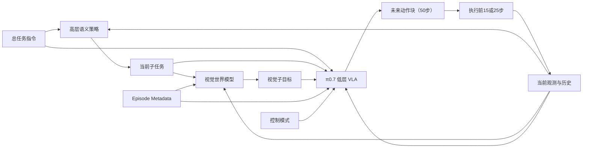

> **abstract**
> 核心结论
> π0.7 的运行时系统不是单个网络直接从总任务生成全部动作，而是一个分层、异步、闭环的控制系统：
>
> 1. 高层语义策略生成当前子任务文本 $\hat{\ell}_t$；
> 2. 世界模型生成视觉子目标 $\tilde g_t$；
> 3. 低层 VLA 策略 $\pi_\theta$ 生成动作块 $a_{t:t+H}$；
> 4. 机器人只执行动作块的一部分，然后根据最新观测重新规划。
>
> 论文在训练和推理阶段复用了符号 $g^\star$。训练时它表示数据集中的真实未来子目标图像；推理时它表示世界模型生成的目标图像。为避免混淆，本文把推理时的生成子目标记为 $\tilde g_t$。

---


## 1. 运行时系统的整体结构



三个模块分别回答三个不同的问题：

| 模块 | 输入 | 输出 | 解决的问题 |
|---|---|---|---|
| 高层语义策略 | 当前观测、总任务、历史子任务 | $\hat{\ell}_t$ | 现在应该完成哪一个语义步骤？ |
| 世界模型 | 当前观测、当前子任务、元数据 | $\tilde g_t$ | 这个步骤完成后，场景应该大致是什么样？ |
| 低层 VLA | 观测历史、语言、视觉子目标、元数据、控制模式 | $a_{t:t+H}$ | 机械臂具体应该如何运动？ |

---

## 2. 主要符号总表

| 符号 | 含义 |
|---|---|
| $t$ | 当前控制时刻 |
| $o_t$ | 时刻 $t$ 的完整观测 |
| $I_t^i$ | 第 $i$ 个相机在时刻 $t$ 的图像 |
| $q_t$ | 机器人本体状态，如关节角和夹爪状态 |
| $o_{t-T:t}$ | 从 $t-T$ 到 $t$ 的观测历史 |
| $a_t$ | 时刻 $t$ 的机器人动作 |
| $a_{t:t+H}$ | 从 $t$ 开始、长度为 $H$ 的动作块 |
| $H$ | 预测动作块长度，论文中为 $50$ |
| $\hat H$ | 每次实际执行的动作步数，论文中为 $15$ 或 $25$ |
| $\ell$ | 整个任务的总体语言指令 |
| $\hat{\ell}_t$ | 当前语义子任务指令 |
| $m$ | Episode metadata，包括速度、质量和错误标签 |
| $c$ | 控制模式，$c\in\{\text{joint},\text{ee}\}$ |
| $g_t^\star$ | 训练时的真实未来子目标图像 |
| $\tilde g_t$ | 推理时由世界模型生成的视觉子目标 |
| $C_t$ | 时刻 $t$ 的完整上下文或 prompt |
| $\pi_\theta$ | π0.7 的低层 VLA 动作策略 |
| $p_\psi$ | 生成视觉子目标的世界模型 |
| $\theta$ | 低层 VLA 的参数 |
| $\psi$ | 世界模型的参数 |
| $\Delta$ | 子目标图像的刷新时间，论文中为 $4$ 秒 |
| $\beta$ | Classifier-Free Guidance 权重 |

---

## 3. 观测与动作表示

### 3.1 当前观测

论文将观测写为：

$$
o_t = [I_t^1,\ldots,I_t^n,q_t].
$$

其中：

- $I_t^i$：第 $i$ 个相机视角；
- $n$：相机数量；
- $q_t$：机器人关节、本体和夹爪状态；
- $o_t$：当前时刻全部视觉与本体信息的组合。

π0.7 不只使用当前一帧，而是使用历史观测：

$$
o_{t-T:t}.
$$

历史观测能够帮助模型判断：

- 物体是否正在运动；
- 机械臂之前执行了什么动作；
- 门、抽屉或夹爪的状态是否刚刚发生变化；
- 当前失败是否是由上一段动作造成的。

---

### 3.2 动作块

π0.7 一次生成一段未来动作：

$$
a_{t:t+H}
=
(a_t,a_{t+1},\ldots,a_{t+H-1}).
$$

论文中：

$$
H=50.
$$

但系统不会直接执行完整的 50 步，而只执行其中一部分：

$$
\hat H \in \{15,25\}.
$$

执行 $\hat H$ 步后，系统根据新的真实观测重新生成后续动作。

> **Important**
> 滚动时域控制
> 这种“预测较长动作块、只执行前一部分、然后重新规划”的方法属于 receding-horizon control。它可以减少开环执行造成的误差累积。

---

## 4. Prompt 中的各个组成部分

完整上下文写为：

$$
C_t
=
\{\ell,\hat{\ell}_t,\tilde g_t,m,c\}.
$$

其中包含：

1. 总任务指令 $\ell$；
2. 当前子任务 $\hat{\ell}_t$；
3. 视觉子目标 $\tilde g_t$；
4. Episode metadata $m$；
5. 控制模式 $c$。

---

### 4.1 总任务指令 $\ell$

$\ell$ 描述整段任务的最终目标，例如：

$$
\ell=\text{“put the food on the table”}.
$$

总任务通常在整个 episode 内保持不变，但它往往过于粗略，无法单独指导精细控制。

---

### 4.2 当前子任务 $\hat{\ell}_t$

$\hat{\ell}_t$ 表示当前阶段需要完成的语义步骤，例如：

$$
\hat{\ell}_t=\text{“press the microwave open button”}.
$$

之后可能依次变成：

$$
\hat{\ell}_t=\text{“pick up the plate of food”},
$$

$$
\hat{\ell}_t=\text{“move to the dining table”},
$$

$$
\hat{\ell}_t=\text{“put the plate on the dining table”}.
$$

子任务可以来自：

- 学习得到的高层语言策略；
- 人类监督者的实时 coaching；
- 某些运行配置中也可以省略。

高层策略的抽象形式可以写为：

$$
\hat{\ell}_t
\sim
p_\phi
\left(
\hat{\ell}
\mid
o_{\le t},
\ell,
\hat{\ell}_{<t},
m
\right),
$$

其中：

- $\phi$：高层策略参数；
- $o_{\le t}$：到当前时刻为止的观测；
- $\hat{\ell}_{<t}$：之前已经执行过的子任务历史。

---

### 4.3 Episode metadata $m$

Episode metadata 主要包括：

$$
m=
\{
\text{speed},
\text{quality},
\text{mistake}
\}.
$$

#### Speed

论文用 episode 长度近似描述执行速度：

- episode 步数越少，通常执行越快；
- 训练时 speed 描述数据中实际 episode 的长度；
- 推理时设置为该任务 episode 长度的第 15 百分位数。

这表示希望模型采用一个较快、但不是极端异常快的执行模式。

#### Quality

质量范围为：

$$
\text{quality}\in\{1,2,3,4,5\}.
$$

运行时固定为：

$$
\text{quality}=5.
$$

#### Mistake

错误标签为：

$$
\text{mistake}\in\{\text{true},\text{false}\}.
$$

运行时固定为：

$$
\text{mistake}=\text{false}.
$$

> **Note**
> 训练与推理阶段含义不同
> - 训练时，metadata 描述“这条数据实际执行得怎么样”；
> - 推理时，metadata 指定“希望模型以怎样的方式执行”。
>
> 因此，运行时的 `quality = 5` 不是测量结果，而是行为条件。

---

### 4.4 控制模式 $c$

控制模式写为：

$$
c\in\{\text{joint},\text{ee}\}.
$$

其中：

- $\text{joint}$：输出关节级控制命令；
- $\text{ee}$：输出末端执行器位姿命令。

在末端执行器控制模式下，机器人系统可以通过逆运动学将末端目标转换为关节目标。

---

## 5. 视觉子目标 $g$ 的训练与推理

这是 π0.7 运行时最容易混淆的部分。

---

### 5.1 训练时的 $g_t^\star$

世界模型的训练目标可写为：

$$
\max_\psi
\mathbb E_{\mathcal D_g}
\left[
\mathcal L_{\mathrm{CFM}}
\left(
g_t^\star,
g_\psi(o_t,\hat{\ell}_t,m)
\right)
\right].
$$

符号解释：

- $\mathcal D_g$：世界模型训练数据集；
- $\mathbb E_{\mathcal D_g}$：对训练样本取期望；
- $\mathcal L_{\mathrm{CFM}}$：Conditional Flow Matching 损失；
- $g_\psi(o_t,\hat{\ell}_t,m)$：世界模型生成的未来子目标；
- $g_t^\star$：数据集中的真实未来子目标图像。

论文使用语义片段结束时的图像作为真实子目标：

$$
g_t^\star=o_{t_{\mathrm{end}}}.
$$

例如，当前子任务为“打开冰箱门”：

- $o_t$：当前冰箱门关闭的图像；
- $g_t^\star$：该子任务片段结束时，冰箱门已打开的真实图像。

因此：

> **success**
> 训练阶段
> $g_t^\star$ 确实是来自训练数据集的监督量。

---

### 5.2 推理时的视觉子目标

论文在 Algorithm 1 中写为：

$$
g^\star
\sim
p_\psi(g^\star\mid o_t,\hat{\ell}_t,m).
$$

但这里的 $g^\star$ 不再是数据集中的真实未来图像，而是世界模型采样生成的目标图像。

为避免符号混淆，更合理的写法是：

$$
\tilde g_t
\sim
p_\psi
\left(
g\mid o_t,\hat{\ell}_t,m
\right).
$$

其中：

- $p_\psi$：训练好的条件图像生成模型；
- $\sim$：从条件分布中采样；
- $\tilde g_t$：生成的视觉子目标。

> **Warning**
> 符号复用
> 论文在训练和推理阶段复用了 $g^\star$：
>
> | 阶段 | $g^\star$ 的含义 |
> |---|---|
> | 世界模型训练 | 数据集中的真实未来子目标图像 |
> | 机器人运行时 | 世界模型生成的期望未来图像 |
>
> 推理时的 $g^\star$ 不是数据集检索结果，也不是实际未来的 oracle 信息。

---

### 5.3 视觉子目标不是“真实未来”

推理时的 $\tilde g_t$ 是：

$$
\boxed{
\text{世界模型根据当前场景生成的一种未来目标假设}
}
$$

它不是：

- 从训练集直接取出的图像；
- 环境提前泄露的真实未来；
- 机器人下一时刻一定会看到的画面；
- 必须逐像素满足的硬约束。

它更接近一种视觉条件或软目标。

---

### 5.4 为什么要使用视觉子目标

单纯的语言指令：

$$
\hat{\ell}_t=\text{“open the fridge door”}
$$

不能完整表达：

- 夹爪应该抓住把手的哪个位置；
- 应该使用左手还是右手；
- 机械臂应采用什么姿态；
- 门应该打开到什么程度；
- 手腕视角中的接触几何关系。

视觉子目标能够直接表示这些空间和几何细节。

多视角子目标写为：

$$
g_t=[G_t^1,\ldots,G_t^n],
$$

其中 $G_t^i$ 是第 $i$ 个相机视角下的目标图像。

视觉子目标使动作问题近似变为：

$$
\text{当前状态}
+
\text{期望未来状态}
\longrightarrow
\text{实现状态转移的动作}.
$$

这与逆动力学问题相似。

---

## 6. Algorithm 1 逐行解析


### 6.1 伪代码中的 `▷` 是注释符号

Algorithm 1 中多次出现朝右的空心三角形：

```text
▷ Optional: CFG
▷ Non-blocking (async)
▷ Async w/ RTC
```

它只是算法伪代码中的**行尾注释标记**，作用类似于程序代码里的：

```python
## 这是一条注释
```

因此：

```text
a_{t:t+H} ~ πθ(...)
▷ Optional: CFG
```

表达的意思是：

> 这一行负责生成动作块；实现时可以选择在动作生成过程中启用 CFG。

三处注释分别表示：

| 伪代码注释 | 含义 |
|---|---|
| `▷ Optional: CFG` | 生成动作块时可以选择使用 Classifier-Free Guidance |
| `▷ Non-blocking (async)` | 视觉子目标在独立线程中异步生成，不阻塞机器人控制 |
| `▷ Async w/ RTC` | 动作块异步推理，并使用 RTC 处理新旧动作块的平滑衔接 |

> **Important**
> `▷` 不是数学运算符，也不是信息流箭头，不参与任何数值计算。它和梯度符号 $\nabla$ 没有关系。


### 6.2 初始化输入

算法输入为：

$$
o_0,\ell,m,c.
$$

分别表示：

- 初始观测 $o_0$；
- 总任务指令 $\ell$；
- 期望 episode metadata $m$；
- 控制模式 $c$。

---

### 6.3 初始化子任务

$$
\hat{\ell}_0
\leftarrow
\text{高层策略输出或人类 coaching}.
$$

例如：

$$
\hat{\ell}_0
=
\text{“press the microwave open button”}.
$$

---

### 6.4 生成初始视觉子目标

论文写法：

$$
g^\star
\sim
p_\psi(g^\star\mid o_0,\hat{\ell}_0,m).
$$

推荐改写：

$$
\tilde g_0
\sim
p_\psi(g\mid o_0,\hat{\ell}_0,m).
$$

世界模型根据当前场景、当前子任务和期望执行质量，生成子任务完成后的目标画面。

---

### 6.5 构建上下文

$$
C_0
=
\{\ell,\hat{\ell}_0,\tilde g_0,m,c\}.
$$

这个上下文会被送入低层 VLA。

---

### 6.6 生成动作块

$$
a_{t:t+H}
\sim
\pi_\theta
\left(
a
\mid
o_{t-T:t},
C_t
\right).
$$

其中：

- $\pi_\theta$：低层动作策略；
- $o_{t-T:t}$：历史观测；
- $C_t$：当前 prompt；
- $a_{t:t+H}$：生成的未来动作块。

π0.7 使用 flow matching 动作专家，从噪声动作出发，经过若干去噪或流积分步骤生成连续动作轨迹。

论文实验中使用：

$$
5
$$

个 denoising steps，生成长度为：

$$
H=50
$$

的动作块。

---

### 6.7 子目标的更新条件

当满足任一条件时，重新生成子目标：

#### 条件一：子任务发生变化

$$
\hat{\ell}_t
\neq
\hat{\ell}_{\mathrm{previous}}.
$$

例如：

$$
\text{“open the microwave”}
\rightarrow
\text{“pick up the plate”}.
$$

旧视觉子目标已经不再适用，因此必须立即更新。

#### 条件二：距离上次更新已过 $\Delta$ 秒

$$
\text{elapsed time}\ge \Delta,
$$

论文中：

$$
\Delta=4\text{ s}.
$$

即使子任务文本没有变化，机器人当前状态也可能已经明显变化，因此需要重新生成更贴近当前场景的目标图像。

---

### 6.8 异步生成视觉子目标

更新写为：

$$
\tilde g_t
\sim
p_\psi(g\mid o_t,\hat{\ell}_t,m).
$$

论文将这一过程标注为：

```text
Non-blocking (async)
```

含义是：

- 世界模型在独立线程中生成新图像；
- 主控制线程不会等待图像生成完成；
- 机器人继续执行当前动作；
- 新图像生成完成后，替换旧的视觉子目标。

---

### 6.9 动作块的重新推理

当已经执行 $\hat H$ 步后，系统重新运行 VLA：

$$
a_{t:t+H}
\sim
\pi_\theta
\left(
a
\mid
o_{t-T:t},
C_t,
a_{t:}
\right).
$$

最后的 $a_{t:}$ 与 RTC 有关，表示当前仍在执行、已经承诺或需要平滑衔接的动作部分。

---

### 6.10 RTC：Real-Time Action Chunking

RTC 用于处理推理延迟造成的动作不连续。

如果模型推理需要一定时间，则新动作块生成期间，机器人仍在执行旧动作。若新动作块忽略旧动作的延续，动作切换时可能产生跳变。

RTC 的目标是使：

$$
\text{旧动作块}
\longrightarrow
\text{新动作块}
$$

平滑衔接。

训练时，π0.7 会模拟不同长度的推理延迟，使模型学会在异步推理条件下生成连续动作。

---

### 6.11 执行动作

每个控制周期只执行当前动作：

$$
\text{Execute }a_t.
$$

随后：

$$
t\leftarrow t+1,
$$

进入下一次控制循环。

---

## 7. 推理流程的三个核心方程

为了避免论文中的符号混淆，可以将整个系统写成以下三层。

### 7.1 高层语义规划

$$
\hat{\ell}_t
\sim
p_\phi
\left(
\hat{\ell}
\mid
o_{\le t},
\ell,
\hat{\ell}_{<t},
m
\right).
$$

输出当前应该执行的语义子任务。

---

### 7.2 视觉子目标生成

$$
\tilde g_t
\sim
p_\psi
\left(
g
\mid
o_t,
\hat{\ell}_t,
m
\right).
$$

输出当前子任务完成后的期望视觉状态。

---

### 7.3 低层动作生成

$$
a_{t:t+H}
\sim
\pi_\theta
\left(
a
\mid
o_{t-T:t},
\ell,
\hat{\ell}_t,
\tilde g_t,
m,
c
\right).
$$

输出从当前状态向目标状态运动的一段动作轨迹。

整体关系为：

$$
o_t,\ell
\overset{\text{高层策略}}{\longrightarrow}
\hat{\ell}_t,
$$

$$
o_t,\hat{\ell}_t,m
\overset{\text{世界模型}}{\longrightarrow}
\tilde g_t,
$$

$$
o_{t-T:t},\ell,\hat{\ell}_t,\tilde g_t,m,c
\overset{\pi_\theta}{\longrightarrow}
a_{t:t+H}.
$$

---

## 8. Classifier-Free Guidance 与动作去噪

### 8.1 CFG 是什么

CFG 的全称是：

$$
\text{Classifier-Free Guidance}.
$$

通常译为“无分类器引导”。

它的核心做法是让同一个生成模型针对同一个带噪动作块计算两种预测：

1. **条件分支**：使用完整 prompt；
2. **去条件分支**：移除希望加强的某一部分 prompt。

然后比较两种预测，并放大“该条件独有的影响”。

在 π0.7 中，CFG 主要用于加强 episode metadata 所指定的行为模式，例如：

- 更高的执行质量；
- 更快的执行速度；
- 更少的错误；
- 更接近高性能轨迹的动作风格。

> **Note**
> CFG 不会改变任务本身。它主要是在同一个任务的多种可行执行方式中，加强某一种期望的执行模式。

---

### 8.2 为什么叫 Classifier-Free

早期的 classifier guidance 需要额外训练一个分类器，再利用分类器梯度引导生成过程。

Classifier-Free Guidance 不需要额外分类器。它依靠同一个生成模型的两个分支：

$$
\text{conditional branch}
\qquad\text{和}\qquad
\text{unconditional branch}.
$$

π0.7 能够进行这种双分支推理，是因为训练时会随机丢弃 prompt 的部分组成项。模型因此同时学习了：

- 有完整上下文时如何生成动作；
- 缺少某些上下文时如何生成动作。

---

### 8.3 π0.7 中的条件分支与去条件分支

完整上下文为：

$$
C_t
=
\{\ell,\hat{\ell}_t,\tilde g_t,m,c\}.
$$

其中：

- $\ell$：总任务指令；
- $\hat{\ell}_t$：当前子任务；
- $\tilde g_t$：生成的视觉子目标；
- $m$：episode metadata；
- $c$：控制模式。

论文指出，虽然理论上可以对任意 prompt 组成项应用 CFG，但实验中主要对 episode metadata 使用 CFG。

因此可以近似理解为：

$$
C_t
=
\{\ell,\hat{\ell}_t,\tilde g_t,m,c\},
$$

$$
C_t^{\mathrm{uncond}}
=
\{\ell,\hat{\ell}_t,\tilde g_t,\varnothing,c\}.
$$

这里的“unconditional”不等于删除全部信息。两个分支通常仍然共享：

- 当前机器人观测；
- 总任务；
- 当前子任务；
- 视觉子目标；
- 控制模式。

主要区别是去条件分支没有收到如下性能要求：

```text
Quality: 5
Mistake: false
Speed: 较快
```

---

### 8.4 论文中的动作引导公式

论文给出的公式是：

$$
\nabla_a
\log
\pi_\theta
(a_{t:t+H}\mid o_t,C_t)
+
\beta
\left(
\nabla_a
\log
\pi_\theta
(a_{t:t+H}\mid o_t,C_t)
-
\nabla_a
\log
\pi_\theta
(a_{t:t+H}\mid o_t,C_t^{\mathrm{uncond}})
\right).
$$

定义条件分支的 score：

$$
s_{\mathrm{cond}}
=
\nabla_a
\log
\pi_\theta
(a_{t:t+H}\mid o_t,C_t),
$$

定义去条件分支的 score：

$$
s_{\mathrm{uncond}}
=
\nabla_a
\log
\pi_\theta
(a_{t:t+H}\mid o_t,C_t^{\mathrm{uncond}}).
$$

则 CFG 公式可简写为：

$$
s_{\mathrm{CFG}}
=
s_{\mathrm{cond}}
+
\beta
\left(
s_{\mathrm{cond}}
-
s_{\mathrm{uncond}}
\right).
$$

展开后为：

$$
s_{\mathrm{CFG}}
=
(1+\beta)s_{\mathrm{cond}}
-
\beta s_{\mathrm{uncond}}.
$$

---

### 8.5 公式中各个符号的含义

| 符号 | 含义 |
|---|---|
| $\pi_\theta$ | π0.7 的条件动作生成分布 |
| $\theta$ | 低层动作模型的参数 |
| $a_{t:t+H}$ | 从时刻 $t$ 开始的未来动作块 |
| $o_t$ | 当前机器人观测 |
| $C_t$ | 完整上下文 |
| $C_t^{\mathrm{uncond}}$ | 去掉指定引导条件后的上下文 |
| $\log\pi_\theta$ | 当前动作块在给定条件下的对数概率或对数密度 |
| $\nabla_a$ | 对动作变量求梯度 |
| $s_{\mathrm{cond}}$ | 完整条件下的动作修正方向 |
| $s_{\mathrm{uncond}}$ | 去掉指定条件后的动作修正方向 |
| $\beta$ | CFG 引导强度 |

#### $\nabla_a$ 不是训练参数梯度

这里的：

$$
\nabla_a
$$

表示对动作变量 $a$ 求梯度，而不是对模型参数 $\theta$ 求梯度。

因此：

$$
\nabla_a\log\pi_\theta(a\mid o,C)
$$

可以直观理解为：

> 当前带噪动作应该朝哪个方向变化，才能在给定观测和上下文下变得更合理、更高概率？

运行时不会更新 $\theta$，也不会重新训练模型。被逐步修改的是当前生成中的动作样本。

---

### 8.6 为什么要计算两个分支的差

考虑一个概念性分解：

$$
s_{\mathrm{cond}}
\approx
s_{\mathrm{task}}
+
s_{\mathrm{metadata}},
$$

其中：

- $s_{\mathrm{task}}$：完成当前任务所需的共同动作方向；
- $s_{\mathrm{metadata}}$：高质量、快速、无错误等 metadata 带来的额外方向。

去掉 metadata 后，可以近似写为：

$$
s_{\mathrm{uncond}}
\approx
s_{\mathrm{task}}.
$$

两者相减：

$$
s_{\mathrm{cond}}
-
s_{\mathrm{uncond}}
\approx
s_{\mathrm{metadata}}.
$$

因此，差值：

$$
s_{\mathrm{cond}}-s_{\mathrm{uncond}}
$$

可以理解为：

> 加入指定 metadata 后，动作生成方向发生的特有变化。

最终公式：

$$
s_{\mathrm{CFG}}
=
s_{\mathrm{cond}}
+
\beta
\left(
s_{\mathrm{cond}}-s_{\mathrm{uncond}}
\right)
$$

会在正常条件预测的基础上，额外加强 metadata 对动作的影响。

---

### 8.7 $\beta$ 的作用

$\beta$ 控制引导强度。

当：

$$
\beta=0
$$

时：

$$
s_{\mathrm{CFG}}=s_{\mathrm{cond}}.
$$

此时没有额外引导，只使用普通条件生成。

当：

$$
\beta>0
$$

时，模型沿条件特有方向继续外推。

论文使用：

$$
\beta\in\{1.3,1.7,2.2\}.
$$

$\beta$ 不是越大越好。过强的 guidance 可能导致：

- 动作过于激进；
- 轨迹偏离训练分布；
- 动作不够平滑；
- 控制稳定性下降；
- 条件服从增强，但整体合理性降低。

---

### 8.8 “动作去噪”去掉的是什么噪声

这里的噪声不是：

- 相机图像噪声；
- 关节传感器误差；
- 真实机械臂的物理抖动；
- 环境中的随机扰动。

它是动作生成模型内部使用的**随机动作噪声**。

动作生成可以抽象为从随机动作块开始：

$$
a^{(K)}
\sim
\mathcal N(0,I),
$$

其中：

- $a^{(K)}$：初始随机动作块；
- $K$：生成迭代次数；
- 论文实验中使用 $K=5$ 个 denoising steps。

随后逐步更新：

$$
a^{(K)}
\rightarrow
a^{(K-1)}
\rightarrow
\cdots
\rightarrow
a^{(1)}
\rightarrow
a^{(0)}.
$$

最终得到：

$$
a^{(0)}
\approx
a_{t:t+H}.
$$

论文中动作块长度为：

$$
H=50.
$$

因此，系统是从一个随机的 50 步动作块开始，经过 5 次生成更新，得到符合当前观测和 prompt 的连续动作轨迹。

---

### 8.9 CFG 如何进入每一次动作去噪

在第 $k$ 个生成步骤，可将过程抽象为四步。

#### 第一步：条件分支预测

使用完整上下文：

$$
s_{\mathrm{cond}}^{(k)}
=
s_\theta
\left(
a^{(k)},k
\mid
o_t,C_t
\right).
$$

#### 第二步：去条件分支预测

使用相同的带噪动作，但移除指定条件：

$$
s_{\mathrm{uncond}}^{(k)}
=
s_\theta
\left(
a^{(k)},k
\mid
o_t,C_t^{\mathrm{uncond}}
\right).
$$

#### 第三步：组合 CFG 方向

$$
s_{\mathrm{CFG}}^{(k)}
=
s_{\mathrm{cond}}^{(k)}
+
\beta
\left(
s_{\mathrm{cond}}^{(k)}
-
s_{\mathrm{uncond}}^{(k)}
\right).
$$

#### 第四步：更新动作样本

$$
a^{(k-1)}
=
\operatorname{Update}
\left(
a^{(k)},
s_{\mathrm{CFG}}^{(k)},
k
\right).
$$

重复若干次后得到最终动作块。

安全的伪代码表示如下：

```text
初始化随机动作块

重复 5 次：
    使用完整 prompt 预测条件方向
    使用去掉 metadata 的 prompt 预测去条件方向
    计算 CFG 引导方向
    使用引导方向更新动作块

输出 50 步动作块
```

如果启用 CFG，每一个生成步骤通常都需要条件分支和去条件分支两次模型预测；工程实现中可以将两份输入组合成一个 batch 并行计算。

---

### 8.10 Flow Matching 与论文的 score 写法

π0.7 的 action expert 使用的是 flow matching，而论文在 CFG 段落中使用了：

$$
\nabla_a\log\pi_\theta
$$

这种 score 形式。

可以从两个层面理解。

#### 概率分布层面

论文公式表达的是：

> 应该如何组合完整条件分布与去条件分布的动作生成方向。

#### Flow Matching 实现层面

对于 flow matching，更接近实现的表示通常是条件速度场：

$$
v_{\mathrm{cond}}
=
v_\theta
\left(
a^{(k)},k
\mid
o_t,C_t
\right),
$$

以及去条件速度场：

$$
v_{\mathrm{uncond}}
=
v_\theta
\left(
a^{(k)},k
\mid
o_t,C_t^{\mathrm{uncond}}
\right).
$$

然后进行同样形式的线性组合：

$$
v_{\mathrm{CFG}}
=
v_{\mathrm{cond}}
+
\beta
\left(
v_{\mathrm{cond}}
-
v_{\mathrm{uncond}}
\right).
$$

动作样本再沿引导后的速度场更新：

$$
a^{(k-1)}
=
a^{(k)}
+
\Delta\tau\,
v_{\mathrm{CFG}}.
$$

> **caution**
> 论文明确给出了 score 形式的 CFG 公式，但没有在该段公开底层代码的全部更新细节。把它对应为 flow-matching 速度场的线性组合，是依据 flow matching 机制做出的实现层解释，而不是论文逐行给出的代码。

---

### 8.11 一个简化数值例子

假设某个动作维度上：

$$
s_{\mathrm{cond}}=0.6,
$$

$$
s_{\mathrm{uncond}}=0.2,
$$

并取：

$$
\beta=1.7.
$$

条件特有方向为：

$$
s_{\mathrm{cond}}
-
s_{\mathrm{uncond}}
=
0.4.
$$

CFG 合成结果为：

$$
s_{\mathrm{CFG}}
=
0.6
+
1.7\times 0.4
=
1.28.
$$

普通条件生成会沿 $0.6$ 的方向修正，而 CFG 会沿 $1.28$ 的方向修正。

这表示模型不只是满足条件，还会更强地沿着“该条件相对于无条件分支所增加的方向”更新动作。

实际系统中的 $s$ 不是标量，而是覆盖整个动作块的高维向量场。

---

### 8.12 为什么 π0.7 主要对 metadata 做 CFG

π0.7 的训练数据包含多种质量与行为模式：

- 高质量专家演示；
- 较慢但成功的动作；
- 中间发生过错误的轨迹；
- 自主 rollout；
- 失败后的恢复动作；
- RL specialist 产生的高性能数据。

只给定任务时，模型面对的是一个多模态动作分布：

$$
p(a\mid \text{task}).
$$

加入高性能 metadata 后，分布变为：

$$
p(a\mid \text{task},m).
$$

其中：

$$
m=
\{
\text{quality}=5,
\text{mistake=false},
\text{fast speed}
\}.
$$

CFG 进一步强化：

$$
p(a\mid \text{task},m)
$$

相对于：

$$
p(a\mid \text{task})
$$

的差异。

因此 metadata CFG 的作用不是生成新的任务目标，而是加强同一任务中的理想执行模式。

---

### 8.13 CFG 部分的最简记忆

> **Summary**
> - `▷`：伪代码注释符号，不参与计算。
> - CFG：比较“带指定条件”和“去掉指定条件”的动作预测。
> - $s_{\mathrm{cond}}-s_{\mathrm{uncond}}$：指定条件对动作生成造成的额外影响。
> - $\beta$：放大该额外影响的强度。
> - 动作去噪：从随机动作块开始，经过 5 次更新，生成 50 步动作轨迹。
> - CFG 只调整当前动作样本，不更新模型参数。

---

## 9. 一个完整示例

假设总任务为：

$$
\ell=\text{“put the food on the table”}.
$$

### 阶段 1：打开微波炉

高层策略输出：

$$
\hat{\ell}_0
=
\text{“press the microwave open button”}.
$$

世界模型生成：

$$
\tilde g_0
=
\text{微波炉门已打开的多视角图像}.
$$

低层 VLA 根据：

$$
\{
o_{t-T:t},
\ell,
\hat{\ell}_0,
\tilde g_0,
m,
c
\}
$$

生成 50 步动作，并只执行其中 15 或 25 步。

---

### 阶段 2：抓取盘子

高层策略将子任务更新为：

$$
\hat{\ell}_1
=
\text{“pick up the plate of food”}.
$$

因为语义意图发生变化，系统立即重新生成：

$$
\tilde g_1
=
\text{夹爪正确抓住盘子的目标图像}.
$$

低层 VLA 根据新的真实观测和新视觉目标重新生成动作。

---

### 阶段 3：移动到餐桌

高层策略输出：

$$
\hat{\ell}_2
=
\text{“move to the dining table”}.
$$

世界模型生成盘子被移动到餐桌附近的视觉子目标。

---

### 阶段 4：放置盘子

高层策略输出：

$$
\hat{\ell}_3
=
\text{“put the plate on the dining table”}.
$$

系统再次生成目标图像，并执行新的动作块。

整个任务通过不断重复以下循环完成：

$$
\text{观测}
\rightarrow
\text{子任务}
\rightarrow
\text{视觉子目标}
\rightarrow
\text{动作块}
\rightarrow
\text{新观测}.
$$

---

## 10. 为什么视觉子目标出错时系统仍可能成功

世界模型生成的 $\tilde g_t$ 可能存在：

- 物体形状不准确；
- 机械臂姿态不合理；
- 图像细节幻觉；
- 目标状态不可完全达到；
- 多视角之间不完全一致。

π0.7 通过以下机制降低风险：

1. 低层策略同时接收真实观测和语言，而不是只看目标图像；
2. 训练时加入世界模型生成图像，使 VLA 适应生成图像的误差；
3. 每次只执行动作块的一部分；
4. 每隔 4 秒重新生成视觉子目标；
5. 子任务变化时立即更新目标；
6. 使用观测历史检测动态变化；
7. 使用 RTC 减少异步推理带来的动作跳变。

因此，视觉子目标是软条件，不是必须严格满足的图像约束。

---

## 11. 最容易混淆的概念

### 11.1 $g^\star$ 是否来自数据集？

答案取决于阶段：

$$
\boxed{
\text{训练时来自数据集，推理时来自世界模型}
}
$$

训练时：

$$
g_t^\star=o_{t_{\mathrm{end}}}.
$$

推理时：

$$
\tilde g_t
\sim
p_\psi(g\mid o_t,\hat{\ell}_t,m).
$$

---

### 11.2 世界模型是否直接输出动作？

不是。

世界模型输出：

$$
(o_t,\hat{\ell}_t,m)
\rightarrow
\tilde g_t.
$$

低层 VLA 输出：

$$
(o_{t-T:t},C_t)
\rightarrow
a_{t:t+H}.
$$

---

### 11.3 高层策略是否输出动作？

不是。

高层策略输出文本子任务：

$$
\hat{\ell}_t
=
\text{“pick up the plate”}.
$$

低层 VLA 输出连续控制量：

$$
a_t
=
[\Delta q_1,\ldots,\Delta q_d,\text{gripper command}],
$$

或者末端执行器控制命令。

---

### 11.4 视觉子目标是否必须使用？

不是。

由于训练期间对 prompt 各部分进行了随机 dropout，π0.7 可以在运行时使用不同的条件组合，例如：

- 只有总任务语言；
- 总任务加子任务；
- 语言加 metadata；
- 语言加视觉子目标；
- 使用完整 prompt。

Algorithm 1 描述的是使用完整上下文的运行方式。

---

## 12. 训练变量如何转化为运行时控制变量

| 变量 | 训练阶段 | 推理阶段 |
|---|---|---|
| $m$ | 描述该 episode 的实际表现 | 指定希望模型采用的表现模式 |
| $\hat{\ell}_t$ | 标注当前数据片段正在做什么 | 指定机器人当前应该做什么 |
| $g_t^\star$ / $\tilde g_t$ | 真实未来子目标图像 | 世界模型生成的期望未来图像 |
| $c$ | 标注数据所使用的控制模式 | 指定运行时的动作输出空间 |

π0.7 的关键思想之一，是把训练数据中的“描述性标签”转化为运行时的“可控 prompt”。

---

## 13. 一句话理解 π0.7 运行时

> **Summary**
> π0.7 在运行时通过高层策略决定“下一步做什么”，通过世界模型生成“做成后应该长什么样”，再由低层 VLA 生成“机械臂具体怎么动”，并通过异步更新、动作分块和滚动重规划形成闭环控制。

---

## 14. 复习检查

- [ ] 能区分总任务 $\ell$ 与子任务 $\hat{\ell}_t$
- [ ] 能区分训练时的 $g_t^\star$ 与推理时的 $\tilde g_t$
- [ ] 理解 metadata 在训练和推理阶段的语义变化
- [ ] 理解为什么 $H=50$，但只执行 $\hat H\in\{15,25\}$ 步
- [ ] 理解视觉子目标每 4 秒或子任务变化时刷新
- [ ] 理解异步推理与 RTC 的作用
- [ ] 理解伪代码中 `▷` 只是行尾注释符号
- [ ] 理解 CFG 中条件分支和去条件分支的差异
- [ ] 能解释 $s_{\mathrm{cond}}-s_{\mathrm{uncond}}$ 的含义
- [ ] 能区分动作生成噪声与传感器或物理噪声
- [ ] 理解 score 形式与 flow-matching 速度场形式的对应关系
- [ ] 能完整复述三层推理链路

---

## 15. 参考文献

- Physical Intelligence, *π0.7: a Steerable Generalist Robotic Foundation Model with Emergent Capabilities*.
- 重点阅读部分：
  - Section III: Flow-Based Vision-Language-Action Models
  - Section V: Diversifying the Prompt
  - Section VI-C: Training with Subgoal Images
  - Section VII: Prompting π0.7 at Runtime
  - Algorithm 1: Prompting π0.7 at Test Time
