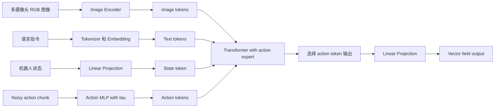
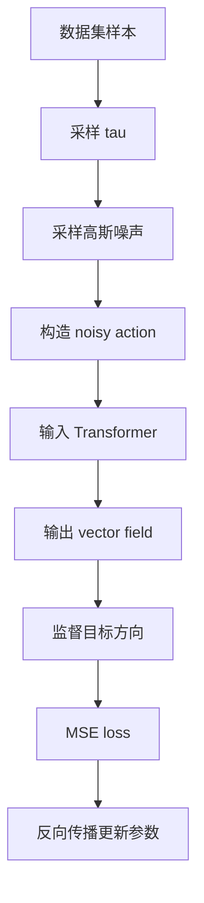
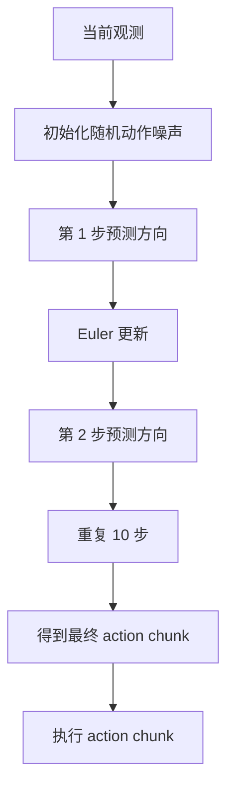

> 本笔记基于对话内容与论文截图整理，目标读者是假设“刚了解 Transformer”。重点解释 π₀ 的模型架构、动作表示、action expert、attention mask，以及 flow matching 的训练和推理过程。
---


## 0. 一句话总览

π₀ 可以理解为一个 **视觉-语言-动作模型**：

> 给定机器人当前看到的图像、语言指令和本体状态，模型一次性生成未来一小段连续动作轨迹。

它不是像语言模型那样一个 token 一个 token 地输出离散词，也不是简单回归一个动作向量，而是使用 **conditional flow matching**：

```text
随机动作噪声  →  逐步去噪  →  条件在当前观测下的合理动作 chunk
```

π₀ 的核心组合是：

```text
PaliGemma VLM backbone
+ 机器人状态 token
+ 动作 token
+ action expert
+ blockwise causal attention mask
+ conditional flow matching loss
```

---

## 1. 需要先区分两个“时间”

论文里同时出现两个时间概念，容易混淆。

| 符号 | 含义 | 例子 |
|---|---|---|
| $t$ | 机器人真实控制时间 | 当前第 $t$ 个控制周期 |
| $t'$ | action chunk 内的某个未来动作步 | $a_{t'}, t' \in [t, t+H-1]$ |
| $\tau$ | flow matching 的生成时间 / 去噪时间 | $\tau \in [0,1]$ |

也就是说：

- $a_t, a_{t+1}, \dots$ 是机器人真实时间上的动作；
- $A_t^\tau$ 是同一个 action chunk 在 flow matching 过程中的 noisy 版本；
- $\tau=0$ 表示接近纯噪声；
- $\tau=1$ 表示接近真实动作。

---

## 2. π₀ 要建模什么？

论文中要建模的是条件动作分布：

$$
p(A_t \mid o_t)
$$

其中：

$$
A_t = [a_t, a_{t+1}, \dots, a_{t+H-1}]
$$

$A_t$ 是一个 **action chunk**，也就是未来 $H$ 步动作。论文中常用：

$$
H = 50
$$

观测 $o_t$ 包括：

$$
o_t = [I_t^1, \dots, I_t^n, \ell_t, q_t]
$$

含义如下：

| 符号 | 含义 |
|---|---|
| $I_t^i$ | 第 $i$ 个摄像头的 RGB 图像 |
| $\ell_t$ | 语言指令，例如 “fold the shirt” |
| $q_t$ | 机器人本体状态，例如关节角、夹爪状态 |
| $A_t$ | 未来一段动作序列 |

所以 π₀ 学的是：

> 在当前图像、语言指令、机器人身体状态给定的情况下，未来一段动作应该如何分布。

---

## 3. 从 Transformer 角度理解 π₀

普通 Transformer 接收的是一个 token 序列：

$$
[x_1, x_2, \dots, x_n]
$$

每个 token 本质上是一个向量。

π₀ 的关键做法是：**把图像、语言、机器人状态、动作都组织成 token 序列**。

大致输入序列是：

```text
[图像 tokens, 语言 tokens, 机器人状态 token, noisy action tokens]
```

更具体地说：

| Block 1 | Block 2 | Block 3 |
|---|---|---|
| $[I_t^1, \dots, I_t^n, \ell_t]$ | $[q_t]$ | $[a_t^	au, \dots, a_{t+H-1}^	au]$ |
| 图像与语言 token | 机器人状态 token | noisy action tokens |

其中：

- 图像和语言 token 来自 VLM 的常规输入；
- 状态 $q_t$ 是新增的机器人状态 token；
- 动作 $A_t^\tau$ 是 flow matching 中的 noisy action tokens；
- 模型最后只取动作 token 对应的输出，用来预测 vector field。

---

## 4. 各类输入如何进入模型？

### 4.1 图像输入

每张 RGB 图像 $I_t^i$ 先经过 image encoder，变成 image tokens。

```text
RGB image → image encoder → image tokens → linear projection → Transformer embedding space
```

图像 token 会被投影到和语言 token 相同的 embedding 空间中。

### 4.2 语言输入

语言指令 $\ell_t$ 经过 tokenizer 和 embedding，变成 text tokens。

例如：

```text
"fold the shirt" → ["fold", "the", "shirt"] → text embeddings
```

### 4.3 机器人状态输入

机器人状态是连续向量：

$$
q_t = [\text{joint}_1, \text{joint}_2, \dots]
$$

π₀ 使用线性投影把它映射成 Transformer 可以处理的 embedding：

$$
q_t \rightarrow e_q
$$

这相当于新增一个 **state token**。

### 4.4 动作输入

动作不是离散 token，而是连续向量。

对于 action chunk 中每个未来动作 $a_{t'}$，π₀ 都构造一个对应的 **action token**。

在训练和推理时，输入模型的不是干净动作 $A_t$，而是 noisy action：

$$
A_t^\tau = [a_t^\tau, a_{t+1}^\tau, \dots, a_{t+H-1}^\tau]
$$

每个 noisy action token 会送入 action expert。

---

## 5. 为什么需要 action expert？

π₀ 基于 PaliGemma 这类视觉语言模型。PaliGemma 预训练时见过图像和文本，但没有见过：

- 机器人关节状态；
- 连续动作向量；
- action chunk；
- flow matching timestep。

如果直接把机器人状态和动作塞进原 VLM 权重，可能会破坏原有图文能力，也不一定适合连续控制。

因此 π₀ 增加了一个 **action expert**。

可以把整个模型理解成两个专家：

```text
VLM expert:     处理图像 token 和语言 token
Action expert:  处理机器人状态 token 和动作 token
```

token 路由方式大致是固定的：

| token 类型 | 路由到哪里 |
|---|---|
| 图像 token | VLM backbone |
| 语言 token | VLM backbone |
| 状态 token $q_t$ | action expert |
| noisy action token $A_t^\tau$ | action expert |

这有点像 Mixture-of-Experts，但这里不是动态选择专家，而是按照 token 类型固定分配。

重要的是：两个专家不是完全隔离的。它们通过 self-attention 交互。也就是说，action token 可以通过 attention 读取图像、语言和机器人状态信息。

---

## 6. π₀ 的整体架构图解



图中的 “Vector field output” 对应论文中的：

$$
v^\theta(A_t^\tau,o_t)
$$


---

## 7. Action token 如何融合 flow timestep $\tau$？

论文附录中给出了 action token embedding 的形式。对于每个 noisy action $a_{t'}^\tau$，输入 Transformer 前会经过一个 MLP：

$$
W_3 \cdot \operatorname{swish}\left(
W_2 \cdot \operatorname{concat}(W_1 \cdot a_{t'}^\tau, \phi(\tau))
\right)
$$

其中：

| 符号 | 含义 |
|---|---|
| $a_{t'}^\tau$ | flow matching 第 $\tau$ 阶段的 noisy action |
| $\phi(\tau)$ | 对 $\tau$ 的 sinusoidal positional encoding |
| $W_1, W_2, W_3$ | MLP 权重 |
| $\operatorname{concat}$ | 拼接动作特征和时间特征 |
| $\operatorname{swish}$ | MLP 中的激活函数 |

通俗理解：

用一句话写就是：

$$
	ext{action token}=\operatorname{MLP}(	ext{noisy action},	au)
$$

为什么要输入 $\tau$？

因为同一个 noisy action 数值，在不同去噪阶段含义不同：

- $\tau \approx 0$：当前动作几乎是纯噪声，需要大幅修正；
- $\tau \approx 1$：当前动作已经接近真实动作，只需要微调。

所以模型必须知道当前处于哪个 flow matching timestep。

---

## 8. Blockwise causal attention mask

π₀ 使用 3 个 block：

| Block | Tokens | Attention 作用 |
|---|---|---|
| Block 1 | $[I_t^1, \dots, I_t^n, \ell_t]$ | 图像与语言 token，来自 VLM 的常规输入 |
| Block 2 | $[q_t]$ | 机器人本体状态 token |
| Block 3 | $[a_t^	au, \dots, a_{t+H-1}^	au]$ | flow matching 中的 noisy action tokens |

attention 规则是：

| 当前 token 所在 block | 可以 attend 到哪些内容 |
|---|---|
| 图像/语言 block | 图像/语言 block 内部 |
| 状态 block | 图像/语言 + 状态 |
| 动作 block | 图像/语言 + 状态 + 所有动作 |

换句话说：

```text
图像/语言不能看状态和动作
状态不能看动作
动作可以看全部输入
```

### 8.1 为什么图像/语言不看后面的状态和动作？

因为图像和语言来自 PaliGemma 的预训练分布。让它们突然 attend 到机器人状态和动作，会造成分布偏移。论文中说这样做可以减少相对于 VLM 预训练分布的 shift。

### 8.2 为什么状态 $q_t$ 不看动作 block？

状态 $q_t$ 在一次 flow matching 推理的 10 个积分步中是不变的。如果状态不 attend 到动作 block，那么状态 token 对应的 key/value 可以缓存，推理更快。

### 8.3 为什么动作 block 内部是 full bidirectional attention？

因为未来 $H$ 步动作不是互相独立的。

例如抓杯子时：

```text
第1步靠近 → 第2步调整姿态 → 第3步闭合夹爪 → 第4步抬起
```

每一步都依赖整段轨迹。动作 token 之间使用双向 attention，可以让模型生成整体一致、平滑的 action chunk。

---

## 9. 为什么一次输出 action chunk？

很多策略只预测单步动作：

$$
a_t = \pi(o_t)
$$

π₀ 预测的是：

$$
A_t = [a_t, a_{t+1}, \dots, a_{t+H-1}]
$$

这样做有几个优点：

1. **动作更连贯**：机械臂控制需要平滑轨迹，而不是每一步孤立决策。
2. **能表达短期计划**：例如先伸手、再夹取、再抬起。
3. **降低推理频率**：一次生成 $H$ 步动作，不需要每个控制周期都跑一次大模型。
4. **适合高频控制**：机器人底层可以高速执行动作，而大模型周期性重新规划。

---

# Part II：Flow Matching 训练与推理

---

## 10. Flow matching 的基本直觉

π₀ 不直接输出动作 $A_t$，而是学习一个向量场：

$$
v_\theta(A_t^\tau, o_t)
$$

这个向量场回答的问题是：

> 给定当前观测 $o_t$，以及当前 noisy action chunk $A_t^\tau$，下一步应该往哪个方向移动，才能更接近真实动作分布？

类比图像生成：

```text
图像 diffusion / flow 模型：随机噪声 → 去噪 → 图片
π₀：随机动作噪声 → 去噪 → 机器人动作 chunk
```

区别是，π₀ 的生成过程被观测条件化：

```text
图像 + 语言 + 机器人状态 约束动作生成方向
```

---

## 11. 论文中的训练损失公式

论文写道，对于 action chunk $A_t$ 中每个动作 $a_{t'}$，都有一个对应的 action token，并使用 conditional flow matching loss 监督这些 action tokens。

损失形式为：

$$
L^\tau(\theta)
=
\mathbb{E}_{p(A_t|o_t), q(A_t^\tau|A_t)}
\left[
\left\|
 v_\theta(A_t^\tau,o_t) - u(A_t^\tau|A_t)
\right\|^2
\right]
$$

逐项解释：

| 项                        | 含义                                            |
| ------------------------ | --------------------------------------------- |
| $p(A_t\mid o_t)$         | 数据中的真实条件动作分布                                  |
| $q(A_t^\tau\mid A_t)$    | 人为定义的从真实动作到 noisy action 的概率路径                |
| $A_t^\tau$               | flow matching 第 $\tau$ 阶段的 noisy action chunk |
| $v_\theta(A_t^\tau,o_t)$ | 模型预测的向量场                                      |
| $u(A_t^\tau\mid A_t)$    | 训练目标向量场，也就是正确移动方向                             |
| $\|\cdot\|^2$            | MSE 损失，当然在方差后还要求期望得到均方差                       |

核心就是让模型预测的方向接近真实的去噪方向：

$$
v_\theta(A_t^\tau,o_t) \approx u(A_t^\tau\mid A_t)
$$

---

## 12. 概率路径：从噪声到真实动作

论文采用简单的 linear-Gaussian / optimal-transport 风格路径。截图中写作：

$$
q(A_t^\tau|A_t)=\mathcal{N}(\tau A_t,(1-\tau)I)
$$

实际实现采样写成：

$$
\epsilon \sim \mathcal{N}(0,I)
$$

$$
A_t^\tau = \tau A_t + (1-\tau)\epsilon
$$

这表示 noisy action 是真实动作和随机噪声的线性插值。

当 $\tau=0$：

$$
A_t^0 = \epsilon
$$

也就是纯噪声。

当 $\tau=1$：

$$
A_t^1 = A_t
$$

也就是真实动作。

中间例如 $\tau=0.3$：

$$
A_t^{0.3}=0.3A_t+0.7\epsilon
$$

它大部分还是噪声，但已经带有一部分真实动作的方向。

---

## 13. 目标向量场 $u$ 是什么？

由实现采样式：

$$
A_t^\tau = \tau A_t + (1-\tau)\epsilon
$$

对 $\tau$ 求导：

$$
\frac{dA_t^\tau}{d\tau}=A_t-\epsilon
$$

所以如果推理时从 $\tau=0$ 积分到 $\tau=1$，正确方向应当是：

$$
u(A_t^\tau|A_t)=A_t-\epsilon
$$

> 模型要学的是从当前 noisy action 指向真实动作方向的 vector field。

如果论文版本中符号写法不同，需要检查其 $\tau$ 方向、vector field 定义和 Euler 更新式是否采用了不同约定。对 π₀ 的生成直觉而言，核心是“从噪声积分到动作”。

---

## 14. Flow matching 训练流程

一次训练样本可以按以下步骤理解。

### Step 1：取真实数据

从机器人数据集中取一个观测和对应动作 chunk：

$$
(o_t,A_t)
$$

其中：

$$
A_t=[a_t,a_{t+1},\dots,a_{t+H-1}]
$$

### Step 2：采样 flow timestep

采样：

$$
\tau \in [0,1]
$$

π₀ 不是均匀采样 $\tau$，而是使用偏向低 $\tau$ 的 beta 分布。低 $\tau$ 对应更高噪声。

### Step 3：采样随机噪声

$$
\epsilon \sim \mathcal{N}(0,I)
$$

$\epsilon$ 的形状和 $A_t$ 相同。

如果：

$$
A_t \in \mathbb{R}^{H\times d}
$$

那么：

$$
\epsilon \in \mathbb{R}^{H\times d}
$$

### Step 4：构造 noisy action

$$
A_t^\tau=\tau A_t+(1-\tau)\epsilon
$$

### Step 5：输入模型

模型输入：

也就是输入：

$$
	ext{input}=\{o_t, A_t^\tau\}
$$

实际 token 序列是：

```text
[图像 tokens, 语言 tokens, 状态 token, noisy action tokens]
```

### Step 6：模型输出向量场

$$
v_\theta(A_t^\tau,o_t)
$$

它和动作 chunk 同形状：

$$
v_\theta(A_t^\tau,o_t) \in \mathbb{R}^{H\times d}
$$

### Step 7：计算目标方向

按正向从噪声到数据的理解：

$$
u(A_t^\tau|A_t)=A_t-\epsilon
$$

### Step 8：计算 MSE loss

$$
\left\|v_\theta(A_t^\tau,o_t)-(A_t-\epsilon)\right\|^2
$$

然后反向传播更新模型参数。

---

## 15. 训练伪代码

```python
# 输入：数据集中的一个样本 (o_t, A_t)
# o_t: 图像 + 语言 + 机器人状态
# A_t: 真实未来 H 步动作 chunk

# 1. 采样 flow timestep
τ = sample_beta_distribution()  # π₀ 偏向采样较低 τ

# 2. 采样高斯噪声
ε = normal_like(A_t)  # ε ~ N(0, I)

# 3. 构造 noisy action
A_noisy = τ * A_t + (1 - τ) * ε

# 4. 输入模型，预测 vector field
v_pred = model(o_t, A_noisy, τ)

# 5. 构造训练目标
u_target = A_t - ε

# 6. MSE 损失
loss = mean_squared_error(v_pred, u_target)

# 7. 反向传播
loss.backward()
optimizer.step()
```

注意：训练时不需要真的从 $\tau=0$ 积分到 $\tau=1$。训练只是随机抽一个中间 noisy point，问模型：

> 在这个 noisy action 状态下，你应该输出什么方向，才能继续朝真实动作走？

---

## 16. 推理过程：从随机噪声生成动作

推理时，真实动作 $A_t$ 不存在。模型只有当前观测：

$$
o_t
$$

所以从随机噪声开始：

$$
A_t^0 \sim \mathcal{N}(0,I)
$$

然后使用学到的向量场从 $\tau=0$ 积分到 $\tau=1$。

论文使用 forward Euler：

$$
A_t^{\tau+\delta}=A_t^\tau+\delta v_\theta(A_t^\tau,o_t)
$$

其中 $\delta$ 是积分步长。论文实验中使用 10 个积分步：

$$
\delta=0.1
$$

所以推理大致是：

| Flow timestep | 含义 |
|---|---|
| $A_t^0$ | 随机动作噪声 |
| $A_t^{0.1}$ | 走一步后的 noisy action |
| $A_t^{0.2}$ | 再走一步后的 noisy action |
| $\cdots$ | 继续 Euler 积分 |
| $A_t^1$ | 最终动作 chunk |

---

## 17. 推理伪代码

```python
# 输入：当前观测 o_t
# 输出：未来 H 步动作 chunk A_t

# 1. 初始化随机动作噪声
A = normal(shape=(H, action_dim))

# 2. 10 步 Euler 积分
num_steps = 10
δ = 1.0 / num_steps

for k in range(num_steps):
    τ = k / num_steps
    v = model(o_t, A, τ)
    A = A + δ * v

# 3. A 就是最终生成的 action chunk
execute(A)
```

---

## 18. 用 ODE 角度理解推理

π₀ 的推理可以写成常微分方程：

$$
\frac{dA_t^\tau}{d\tau}=v_\theta(A_t^\tau,o_t)
$$

初始条件：

$$
A_t^0 \sim \mathcal{N}(0,I)
$$

目标：

$$
A_t^1 \sim p(A_t|o_t)
$$

Euler 方法只是对这个 ODE 的数值近似：

$$
A_t^{\tau+\delta}=A_t^\tau+\delta v_\theta(A_t^\tau,o_t)
$$

所以 π₀ 的动作生成不是“一次 forward 直接输出动作”，而是：

```text
动作噪声
→ 模型预测方向
→ 沿方向走一小步
→ 再预测方向
→ 再走一小步
→ 得到动作 chunk
```

---

## 19. 为什么推理时可以缓存 attention key/value？

推理的 token 序列是：

```text
[图像 tokens, 语言 tokens, 状态 token, noisy action tokens]
```

在 10 次 flow matching 积分中，不变的是：

$$
o_t=[I_t^1,\dots,I_t^n,\ell_t,q_t]
$$

变化的是：

$$
A_t^\tau
$$

也就是说：

- 图像 token 不变；
- 语言 token 不变；
- 状态 token 不变；
- noisy action token 每一步都变。

因此可以先计算 observation prefix 的 attention keys 和 values，然后每个积分步只重新计算 action suffix。

这和语言模型生成文本时的 KV cache 类似，只是这里缓存的是观测前缀，而不是已经生成的文本前缀。

---

## 20. π₀ 的 timestep 采样为什么偏向低 $\tau$？

根据：

$$
A_t^\tau = \tau A_t + (1-\tau)\epsilon
$$

可知：

| $\tau$ | noisy action 状态 |
|---|---|
| $\tau \approx 0$ | 接近纯噪声，高噪声 |
| $\tau \approx 1$ | 接近真实动作，低噪声 |

π₀ 认为机器人动作预测和图像生成不同。

在图像生成中，给定文本 “a cat”，高噪声阶段可能只需要学大致的图像均值方向。

但在机器人控制中，观测 $o_t$ 非常强约束动作：

```text
杯子在左边还是右边？
夹爪当前开还是合？
机械臂离目标多远？
指令是抓取、推开还是折叠？
```

这些都会强烈决定动作。因此即使在高噪声阶段，模型也需要从观测中推断出正确动作模式。

所以 π₀ 使用偏向低 $\tau$ 的采样分布，让模型更多训练：

```text
从一团很乱的动作噪声中，结合观测找到正确动作方向
```

论文中还提到超过 cutoff $s$ 的 timestep 不采样，实验中：

$$
s=0.999
$$

---

## 21. 为什么 flow matching 比直接 MSE 回归动作更适合？

直接行为克隆常见形式是：

$$
\hat A_t=f_\theta(o_t)
$$

然后用：

$$
\|\hat A_t-A_t\|^2
$$

问题是机器人动作分布经常是多峰的。

例如同一个任务中：

- 可以从左侧抓杯子；
- 也可以从右侧抓杯子；
- 布料可以先拉左角；
- 也可以先拉右角。

这些动作都合理。但普通 MSE 容易预测平均动作。平均动作在连续控制中往往不可执行：既不像左抓，也不像右抓。

flow matching 的优势：

1. 保留连续动作空间，不需要把动作离散化成 token；
2. 可以表达多模态动作分布；
3. 从不同随机噪声出发，可以生成不同合理轨迹；
4. 一次生成完整 action chunk；
5. 适合高频、精细、连续的机器人控制。

---

## 22. π₀ 和普通语言模型的区别

| 项目 | 普通 decoder-only LM | π₀ |
|---|---|---|
| 输入 | 文本 tokens | 图像 + 文本 + 状态 + noisy actions |
| 输出 | 下一个离散 token 的概率 | 连续动作向量场 |
| loss | Cross entropy | Flow matching MSE |
| 生成方式 | 自回归逐 token 生成 | 从噪声 ODE 积分生成 action chunk |
| token 类型 | 离散语言 token | 图像、文本、状态、动作 token 混合 |
| 目标分布 | $p(x_{n+1}\mid x_{\le n})$ | $p(A_t\mid o_t)$ |

可以总结为：

```text
普通 LM：预测下一个词
π₀：给定观测，把随机动作噪声流动成未来动作轨迹
```

---

## 23. 一个二维例子理解 flow matching

假设动作只有两个维度：

$$
a=[\Delta x, \Delta y]
$$

真实动作是：

$$
A=[1,2]
$$

采样噪声：

$$
\epsilon=[-1,0]
$$

当：

$$
\tau=0.25
$$

noisy action 是：

$$
A^\tau=0.25[1,2]+0.75[-1,0]=[-0.5,0.5]
$$

正向目标方向：

$$
u=A-\epsilon=[1,2]-[-1,0]=[2,2]
$$

如果 Euler 步长是：

$$
\delta=0.1
$$

则更新：

$$
A^{\tau+\delta}=A^\tau+0.1u=[-0.5,0.5]+0.1[2,2]=[-0.3,0.7]
$$

这表示 noisy action 向真实动作方向移动了一小步。

---

## 24. 完整流程串联

### 训练时



### 推理时



---

## 25. 关键公式汇总

### 条件动作分布

$$
p(A_t\mid o_t)
$$

### Action chunk

$$
A_t=[a_t,a_{t+1},\dots,a_{t+H-1}]
$$

### 观测

$$
o_t=[I_t^1,\dots,I_t^n,\ell_t,q_t]
$$

### Noisy action 构造

$$
\epsilon\sim\mathcal{N}(0,I)
$$

$$
A_t^\tau=\tau A_t+(1-\tau)\epsilon
$$

### Conditional flow matching loss

$$
L^\tau(\theta)
=
\mathbb{E}_{p(A_t|o_t),q(A_t^\tau|A_t)}
\left[
\left\|v_\theta(A_t^\tau,o_t)-u(A_t^\tau|A_t)\right\|^2
\right]
$$

### 正向目标向量场

$$
u(A_t^\tau|A_t)=A_t-\epsilon
$$

### 推理 ODE

$$
\frac{dA_t^\tau}{d\tau}=v_\theta(A_t^\tau,o_t)
$$

### Forward Euler 更新

$$
A_t^{\tau+\delta}=A_t^\tau+\delta v_\theta(A_t^\tau,o_t)
$$

### π₀ 实验中的积分步数

$$
\delta=0.1,\quad \text{steps}=10
$$

---

## 26. 容易混淆的问题

### Q1：π₀ 输出的是动作吗？

严格说，单次 forward 输出的不是最终动作，而是 vector field：

$$
v_\theta(A_t^\tau,o_t)
$$

最终动作是从噪声开始，多步积分后得到的：

$$
A_t^1
$$

### Q2：训练时是否要跑 10 步积分？

不需要。训练时随机采样一个 $\tau$，构造一个 noisy action，然后监督模型在这个点的速度场。

10 步积分主要发生在推理阶段。

### Q3：为什么 action token 要互相双向 attention？

因为 action chunk 是一整段轨迹，未来动作之间有强耦合。双向 attention 能让整段动作整体协调。

### Q4：为什么不用语言模型那种 cross entropy？

因为机器人动作是连续值。把连续动作离散化会损失精度，并且不自然。flow matching 直接在连续动作空间中建模。

### Q5：为什么可以缓存 observation prefix？

因为在一次推理的 10 个 flow steps 中，图像、语言和状态不变，只有 noisy action tokens 变化。因此 observation prefix 的 key/value 可以复用。

### Q6：π₀ 是扩散模型吗？

它和扩散模型相似，都是从噪声生成样本。但 π₀ 这里使用的是 flow matching / ODE 风格的向量场学习。可以把它理解为“扩散生成思想在连续机器人动作上的一种实现”。

---

## 27. 最终心智模型

可以用下面这个心智模型记住 π₀：

```text
1. VLM backbone 理解图像和语言。
2. State token 告诉模型机器人身体当前在哪里。
3. Action expert 专门处理机器人状态和连续动作。
4. Action chunk 表示未来 H 步动作，而不是单步动作。
5. Flow matching 从随机动作噪声出发，逐步生成合理动作。
6. Transformer 每一步输出的不是动作，而是动作空间中的速度场。
7. 推理时用 Euler 积分 10 步，把噪声变成动作 chunk。
```

更短的总结：

> π₀ = 预训练视觉语言理解能力 + 机器人专用 action expert + 连续动作 flow matching 生成器。

---

## 28. 建议复习顺序

如果刚了解 Transformer，建议按以下顺序复习：

1. Transformer token、embedding、self-attention；
2. VLM 如何把图像 patch 变成 image tokens；
3. π₀ 如何新增 state token 和 action tokens；
4. action expert 为什么需要独立权重；
5. blockwise causal attention mask 如何限制信息流；
6. action chunk 为什么比单步动作更适合机器人；
7. flow matching 中 $A_t^\tau=\tau A_t+(1-\tau)\epsilon$ 的含义；
8. 训练 loss 为什么是 MSE vector field；
9. 推理时 Euler 积分如何从噪声得到动作。

---

## 29. 一页版总结

π₀ 要学的是：

$$
p(A_t\mid o_t)
$$

其中观测 $o_t$ 包含图像、语言和机器人状态；动作 $A_t$ 是未来 $H$ 步连续动作 chunk。

输入 Transformer 的 token 序列可以概括为：

$$
[	ext{image tokens},	ext{text tokens},	ext{state token},	ext{noisy action tokens}]
$$

模型结构上，图像/文本进入 PaliGemma VLM backbone，状态/动作进入 action expert，二者通过 self-attention 交互。

训练时：

$$
\epsilon\sim\mathcal N(0,I)
$$

$$
A_t^	au=	au A_t+(1-	au)\epsilon
$$

$$
v_	heta(A_t^	au,o_t)pprox A_t-\epsilon
$$

然后用 MSE 训练 vector field。

推理时：

$$
A_t^0\sim\mathcal N(0,I)
$$

$$
A_t^{	au+\delta}=A_t^	au+\delta v_	heta(A_t^	au,o_t)
$$

经过 10 步 Euler 积分，得到 $A_t^1$ 作为未来动作 chunk。
