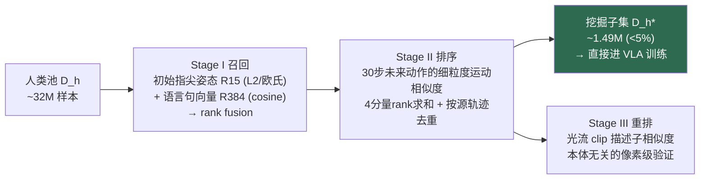
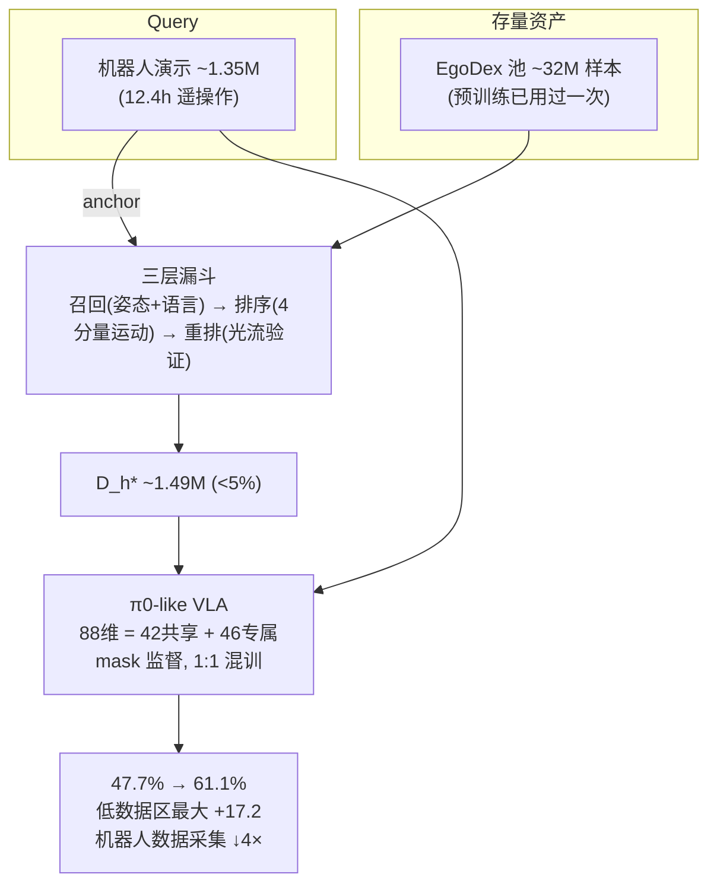

## SiMDex 精读笔记：用推荐系统思路挖掘任务相关的人类视频数据

> **abstract**
> SiMDex 不改模型、不改训练流程，只改一件事：**VLA 后训练时用哪些人类数据**。
>
> $$
> \text{机器人演示（anchor/query）}
> \xrightarrow{\text{召回} \to \text{排序} \to \text{重排}}
> \text{从 32M 人类样本池中挖出} \sim 1.49\text{M 任务相关样本}
> \xrightarrow{\text{1:1 混训}}
> \text{成功率 } 47.7\% \to 61.1\%
> $$
>
> 核心类比：**工业推荐系统**。人类第一视角视频池（EgoDex，~32M 帧级样本）相当于亿级商品目录，每条机器人演示相当于一个用户 query，三层漏斗（recall–ranking–re-ranking）以递增的计算代价逐层筛选。挖出的数据 <5% 池子规模，却打败了同等数量的随机采样。

相关笔记：[UniDex_精读学习笔记_Obsidian](../unidex/)（同样处理跨本体动作空间，思路对比见 §8）、[pi0_model_architecture_flow_matching_notes_obsidian_mermaid_fixed](../pi0-model-architecture-flow-matching-notes-obsidian-mermaid-fixed/)（基座模型是 π0-like flow matching）、[XL-VLA_精读学习笔记_Obsidian](../xl-vla/)。

---

## 1. 一句话理解 SiMDex

$$
\boxed{
\text{数据选择即推荐：与其把海量人类视频不加区分地喂给 VLA，}
\text{不如按动作级相似度为每条机器人演示"检索"最相关的人类经验。}
}
$$

它回答的问题不是"怎么造更多数据"，而是：**egocentric 数据池已经很大了，到底哪部分对我的灵巧操作任务有用？**

| 现有做法 | 问题 |
|---|---|
| 全量混训 / 随机采样人类数据 | 池子极度异构（做饭、社交、运动……），无关活动注入噪声，稀释任务相关监督 |
| 完全不用人类数据 | 浪费预训练学到的跨本体知识和泛化能力 |
| 已有 robot-data curation（CUPID、Re-Mix） | 只在机器人数据内部筛选/加权，不挖外部人类池 |
| 已有 human-video retrieval（R+X 等） | 池子小，检索结果作为辅助输入/in-context 样例，**需要改模型架构** |

SiMDex 填的空位：**任务感知、逐演示（per-demonstration）、千万级规模、基于细粒度动作相似度、直接进训练数据流、零架构改动**。

> **Important**
> 一个巧妙的立意
> SiMDex 挖的是**预训练用过的同一个 egocentric 语料库**——不采新数据，而是带着任务意识"重访"它。大规模采集因此产生两次收益：一次给广度（预训练），一次给精度（后训练）。

---

## 2. 前提：形态无关的统一动作表示

跨本体挖掘的前提是一个能抹平"人手 vs 机器人手"形态差异的表示。SiMDex 选了**指尖中心的几何表示**，只保留任务相关的接触结构，不关心关节级运动学。

### 2.1 腕部局部重定向（wrist-local retargeting）

设 $T_t \in \mathbb{R}^{4\times4}$ 为 $t$ 时刻腕部位姿，$q_t \in \mathbb{R}^3$ 为世界系下某指尖位置：

$$
q_t^{loc} = T_t^{-1} q_t \in \mathbb{R}^3
$$

把指尖表达到腕部坐标系下，**把"抓握的内在几何"与"工作空间位置"解耦**。

- 每只手的状态：5 个腕部局部指尖 → $p_t \in \mathbb{R}^{15}$
- 腕部动作 $d_t \in \mathbb{R}^6$：当前腕系下的局部增量，平移部分 $R_t^\top(o_{t+1}-o_t)$，旋转部分来自 $R_t^\top R_{t+1}$

### 2.2 共享动作空间（双手设定）

$$
a_t = (d_t^L,\; d_t^R,\; p_t^L,\; p_t^R) \in \mathbb{R}^{42}
$$

> **Note**
> 为什么这个表示能工作
> 指尖是腕部相对的笛卡尔坐标 → 对工作空间位置**不变**，且**不需要跨本体匹配运动学结构**（不用管人手 21 关节 vs 机器手 20 DoF 怎么对应）。这一个表示同时支撑了两件事：相似度挖掘（§3）和跨本体监督（§4）。

数据来源：
- **机器人侧**：双臂遥操作演示，正运动学恢复腕部+指尖状态
- **人类侧**：EgoDex 数据集（自带 wrist/fingertip transforms），转到身体中心坐标系去除 ego-motion，按手部可见性和速度过滤 + 时间平滑，然后走同一套重定向
- 每个 episode 切成帧级样本：当前观测 + 语言指令 + 30 步未来动作目标（~1 秒窗口）

---

## 3. 核心方法：三层挖掘漏斗

设机器人演示 $D_r=\{\tau_n\}_{n=1}^N$（anchors），人类池 $D_h=\{\tau_m\}_{m=1}^M$，$M \gg N$（32M 级）。目标是找到在**手型、语义、运动动力学**上最接近 anchors 的子集 $D_h^*$。穷举比较不可行 → 计算代价递增的三级级联：

| 阶段 | 信号 | 粒度 | 作用 |
|---|---|---|---|
| **I. Recall 召回** | ① 初始指尖状态 $\hat p \in \mathbb{R}^{15}$（ℓ2 归一化，欧氏最近邻）② 指令句向量 $e \in \mathbb{R}^{384}$（余弦相似）→ rank fusion | 粗：初始抓握姿态 + 任务语义 | 轻量、可扩到千万级，广撒网 |
| **II. Ranking 排序** | 未来动作序列的 4 个互补分量：腕平移波形 $r_{tr}$、腕旋转波形 $r_{rot}$（速度剖面，捕捉运动节奏）、指尖轨迹 $F_{fg}\in\mathbb{R}^{30\times15}$ 的 $r_{fg}$、腕轨迹 $F_{ee}\in\mathbb{R}^{31\times3}$ 的 $r_{ee}$；融合分 $r = r_{tr}+r_{rot}+r_{fg}+r_{ee}$ | 细：运动动力学 | 按源轨迹去重后，**其输出就是训练用的 $D_h^*$** |
| **III. Re-ranking 重排** | 稠密光流聚合成 clip 级描述子，按描述子相似度重打分 | 像素级运动模式 | **验证信号**：不依赖重定向精度、与手部形态无关 |

> **Warning**
> 一个容易读错的细节
> 进入 VLA 训练的挖掘子集来自 **Stage II 去重后的输出**；Stage III 的光流重排在论文中定位为 embodiment-agnostic 的**验证层**（并在可视化中展示它能纠正 Stage II 的错检），而非训练集的最终过滤器。原因见 §7 局限：光流计算代价不小（"non-trivial computational cost"）。

**为什么 Stage III 必要（机制）**：Stage I/II 全在共享动作空间里操作，依赖重定向的准确性。纯运动学数值恰好匹配、但视觉上手的位置/行为完全不同的样本会漏进来（可视化里的实例：检索到"drilling"片段但手几乎不动）。光流直接看像素运动，绕开了重定向误差。

---

## 4. VLA 训练：只改数据，不改模型

**基座**：GR-Dexter——π0-like flow-matching VLA（VL backbone 编码观测 $I_t$ + 指令 $l$，action decoder 预测 chunk $a_{t:t+H} \in \mathbb{R}^{H\times88}$，$H=30$）。作者明确说 backbone 可互换，**关键在动作空间而非具体模型**。

**88 维动作空间的拼接**：

$$
88 = \underbrace{42}_{\text{共享维（腕增量+指尖）}} + \underbrace{46}_{\text{机器人专属维（臂+手关节动作）}}
$$

**跨本体监督 = 一个二值 mask**：

- 机器人样本：全部 88 维都有监督
- 人类样本：只在 42 个共享维上监督，专属维填占位符，用 mask $m\in\{0,1\}^{88}$ 排除

Flow-matching 目标（masked MSE）：

$$
\mathcal{L} = \frac{\sum_{h,d} m_{h,d}\,\big(\hat u_{\tau,h,d} - u_{\tau,h,d}\big)^2}{\sum_{h,d} m_{h,d}}
$$

其中 $\hat u_\tau = f_\theta(x_\tau, I_t, l, s_t)$ 是预测速度场，$h$ 索引预测步、$d$ 索引动作维。

> **Tip**
> 工程上的干净之处
> 人类数据和机器人数据作为**两条独立加权的数据流**载入，一个 mask 解决跨本体监督——零架构改动、零训练流程改动。SiMDex 与 baseline 之间**唯一的差异**是人类数据怎么选的（其余超参完全一致），实验归因非常干净。

---

## 5. 实验设置

三个真实世界灵巧操作任务（严格顺序依赖，任一阶段失败即阻断后续；每子任务 0–1 计分，10 trials = 2 轮 × 5）：

| 任务 | 子任务 | 考察点 |
|---|---|---|
| **Drill**（满分 3） | 抓电钻 → 对准装配 → 按扳机 | 工具使用 + 多步协调 |
| **Flick Wheel**（满分 3） | 抓组件 → 两指捻转轮子 → 单指弹出 | **指尖精细协调最难** |
| **Pick & Place**（满分 4） | 4 个异构几何物体逐个放到指定位置 | 跨物体形状泛化 |

**数据**：
- 机器人：~1.35M 帧级样本（~12.4h 双臂遥操作）
- 人类池：**32,034,551** 帧级样本，来自 EgoDex（~300h @30fps，164,959 episodes，滑窗切成 ~1s/30 步样本）
- SiMDex 挖出 **~1.49M（<5%）**；baseline（GR-Dexter）随机采样**等量**人类数据
- 训练：robot:human = 1:1 混合，40K steps，超参全同

---

## 6. 结果

### 6.1 主结果（RQ1）：定向检索 > 等量随机采样

| 任务 | GR-Dexter (random) | SiMDex | Δ |
|---|---|---|---|
| Drill | **64.5%** | 54.5% | **−10.0** ⚠️ |
| Flick Wheel | 24.5% | **45.5%** | **+21.0** |
| Pick & Place | 54.0% | **83.4%** | **+29.4** |
| **Overall** | 47.7% | **61.1%** | **+13.4** |

- **Flick Wheel 接近翻倍**：baseline 在 Twist（0.13）和 Flick（0.00）两个阶段几乎全灭——说明随机人类数据**教不会精细手指技能，挖掘出的数据可以**。
- **Pick & Place 四个物体全面提升** → 几何泛化更强。
- **Drill 反而降了**（且方差大 ±.71）——不是被藏起来的坏消息，作者用 scaling 实验解释了机制（见下）。

### 6.2 数据缩放消融（RQ2）：低机器人数据下的"性能地板"

机器人数据从 0.25×（~3.1h）扫到 2×（~24.9h），挖掘的人类数据固定：

| robot 数据量 | baseline 趋势 | SiMDex 趋势 | Δ |
|---|---|---|---|
| 0.25× (~3.1h) | 低 | 高 | +6.8 |
| 0.5× (~6.2h) | 40.9% 附近 | ~57–58% | **+17.2（最大）** |
| 1× (~12.4h) | ↑ | ~57–58% | +12.8 |
| 2× (~24.9h) | 50.9% | ~57–58% | +6.1 |

> **Important**
> 最有实用价值的发现
> SiMDex 在 0.5×–2× 范围内维持 **~57–58% 的近恒定成功率**，而 baseline 随机器人数据减少从 50.9% 掉到 40.9%。挖掘的人类数据充当了**补偿机器人数据稀缺的锚**。
>
> 换算：**~6h 机器人演示 + SiMDex ≈ ~25h 演示的 baseline → 机器人数据采集量降 4×**。这就是这篇论文对实践者的核心卖点。

**Drill 异常的机制解释**：per-task 曲线显示 Drill 在低机器人数据时 SiMDex 领先（0.25× +8.9，0.5× +13.4），机器人数据充足时反超为负（1×、2×）。原因：**池子里高质量的"钻孔"演示本来就稀少**——机器人数据不足时这些稀缺样本还能被榨出价值；一旦机器人演示够用，少量挖掘样本注入的是方差而非信号。这恰好印证了论文的中心命题：**选择性挖掘在机器人数据是瓶颈时最有价值**。

### 6.3 逐阶段可视化（RQ3）

| 阶段 | 检索质量 |
|---|---|
| Recall | 只匹配粗糙线索：初始姿态相似、语言里有相关物体（"wheel"、"basket"），但动作常常不相关（平面抓取 ≠ 工具使用/捻转） |
| Ranking | 运动细节对齐：捏合/捻转模式、手指弯曲度、旋转方向接近 anchor；但缺视觉 grounding，运动学数值巧合匹配的远距离样本仍会混入 |
| Re-ranking | 光流解决上述问题：选出实际运动匹配的样本（左手稳定+右手对准工具、协同稳定-捻转、小物体顺序精抓），与机器人双手行为高度镜像 |

三个阶段各贡献互补信号，质量逐级递进。

---

## 7. 局限与未来方向（作者自述 + 我的标注）

1. **场景单一**：机器人数据只覆盖工业装配一个场景、3 个任务、12.4h。泛化性待验证。
2. **收益受池子覆盖度制约**（Drill 教训）：池子里没有目标技能的高质量演示时，检索无米下锅，机器人数据充足时甚至注入方差。→ *收益 = f(池子对目标技能的覆盖度, 机器人数据预算)*，这是使用这个方法前要先判断的两个变量。
3. **相似度纯运动学**（腕 6D + 指尖位置）：不含接触力、物体状态、交互语义 → ranking 会错检（"钻孔"片段但手几乎不动），re-ranking 能纠正但光流代价不小。

**未来**：从一次性离线检索 → **闭环自适应挖掘**。当前"检索什么"在训练前就定死了，但 scaling 分析表明最优人类数据取决于机器人数据预算和策略尚未掌握的技能 → 用训练中的失败模式引导后续检索，形成 data flywheel；再加上接触/物体状态等更丰富的相似度信号。

> **quote**
> 论文的愿景（值得记住的表述）
> 灵巧机器人不必通过昂贵遥操作从零学每个技能——只需少量在机演示，就能像推荐系统从亿级目录浮现相关商品一样，从庞大的 egocentric 池中检索最相关的人类经验，把"借来的经验"快速变成新技能。人类的日常第一视角视频成为共享的操作知识水库，每个机器人任务不再是新的数据采集负担，而是**对已有经验的一次查询**。

---

## 8. 我的理解与批判性思考

### 8.1 这篇论文真正的贡献在哪一层

方法本身没有任何"重"组件——没有学习的跨本体对齐模块，没有新架构，三个阶段用的都是最朴素的相似度（欧氏、余弦、rank 求和、光流描述子）。作者是有意为之：**在 32M 规模上，快而可靠的检索才是让任务感知挖掘变得可行的东西**。贡献在于：

1. **问题重构**（数据选择 → 推荐问题）——把 LLM/CV 领域已验证的"curation > 无脑 scale"（SemDeDup、DataComp、FineWeb）搬到 robot learning 的人类视频场景；
2. **让检索可行的表示设计**（§2 的 R42 空间）——这是真正的技术支点，腕部局部指尖坐标让跨本体最近邻搜索有意义;
3. **诚实的负结果**（Drill）——它划出了方法的适用边界，比三个全正的结果更有信息量。

### 8.2 与 [UniDex_精读学习笔记_Obsidian](../unidex/) 的对照

两篇都在处理"人类视频 → 灵巧手 VLA"的跨本体问题，但切的维度正交：

| | UniDex | SiMDex |
|---|---|---|
| 核心问题 | 异构灵巧手之间怎么**共享动作接口**（FAAS） | 海量人类数据里**哪些值得学** |
| 动作空间 | 功能-执行器对齐槽位 | 腕局部指尖笛卡尔坐标（R42） |
| 数据态度 | 把人类视频**转换**成机器人数据 | 把人类视频**筛选**后直接混训（mask 监督） |
| 改动位置 | 数据构造 + 接口 + 模型 | 只改数据源 |

两者可组合：SiMDex 的挖掘漏斗原则上可以嫁接到任何统一动作空间上。

### 8.3 值得追问的点

- **1:1 混合比固定**：挖掘数据的最优混合比是否也随机器人数据预算变化？论文没扫这个维度。
- **Stage III 没进训练闭环**：光流验证已被证明能纠错，但因计算代价只做验证/可视化。如果只对 Stage II 输出的 top-K 边界样本跑光流，代价可能可控——这是最容易想到的低垂果实。
- **与 EgoScale（Zheng et al.）的对比**：EgoScale 的 log-linear scaling law 需要**在机器人任务分布下对齐的 human-robot play 数据**（数据-任务对应是人工前提）；SiMDex 不需要任何对齐采集，直接对已有池子做任务感知重访。这两条路线代表了"为任务采数据" vs "从存量数据找任务相关子集"的分野，后者边际成本低得多。
- **检索的 anchor 是机器人演示本身** → 冷启动问题：一个全新任务如果连少量机器人演示都没有，漏斗就没有 query。愿景里"a handful of demonstrations"仍是硬前提。

### 8.4 一图记忆

---

## 参考锚点

- 基座模型：GR-Dexter (Wen et al., arXiv 2512.24210)，π0-like flow-matching VLA
- 人类数据源：EgoDex (Hoque et al., ICLR 2026)，~300h egocentric video with tracked hand transforms
- 方法学前身：SiMHand (Lin et al., ICLR 2025)——同一作者把"挖相似手"用于 3D 手势预训练，SiMDex 是其思路在 VLA 数据挖掘上的延伸
- 对照路线：EgoScale (arXiv 2602.16710)、CUPID (CoRL 2025)、Re-Mix (arXiv 2408.14575)、R+X (ICRA 2025)
