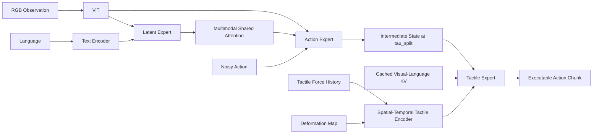

> **Summary**
> T-Rex 的核心不是简单地把触觉 token 拼接到视觉—语言策略中，而是把动作生成过程拆成两个时间尺度：
>
> $$
> \text{低频视觉语言全局规划}
> \;+\;
> \text{高频触觉闭环精修}
> $$
>
> Action Expert 负责 flow matching 的前半段去噪，Tactile Expert 负责后半段去噪。两者沿同一条生成轨迹接力，而不是分别生成两个动作再做加和。

---

## 1. 整体思想

T-Rex 使用一个 Mixture-of-Transformer-Experts（MoT）骨干，包含三个专家：

1. **Latent Expert**：预测未来视觉潜变量。
2. **Action Expert**：执行低频、全局的动作去噪。
3. **Tactile Expert**：执行高频、接触阶段的触觉精修。

总体思想：

$$
\boxed{\text{用慢视觉决定动作骨架，用快触觉决定动作落点}}
$$

T-Rex 同时利用：

- 视觉与语言进行任务语义理解和全局规划；
- 未来视觉 latent 提供时间上前瞻的上下文；
- 触觉力历史、当前力和形变图进行高频接触修正；
- KV cache 复用降低高频执行时的计算开销；
- 级联 flow matching 保证慢流和快流在同一生成轨迹上连续交接。

---

## 2. 四种容易混淆的“时间”

| 符号 | 含义 |
|---|---|
| $t$ | 真实机器人环境中的当前控制时刻 |
| $t+i$ | 动作 chunk 内第 $i$ 个未来控制时刻 |
| $\tau\in[0,1]$ | flow matching 的生成时间或噪声时间，不是物理时间 |
| $\delta\in\{0,4,8,12\}$ | 一个动作 chunk 内触觉快速更新的执行偏移 |
| $t-15:t$ | 当前时刻之前的 16 帧触觉力历史窗口 |

> **Important**
> $t$ 表示机器人真实执行时间；$\tau$ 表示动作从噪声变成干净动作的生成进度。二者不是同一个时间轴。

T-Rex 的异步设计发生在两个层面：

1. 在生成时间 $\tau$ 上，将去噪过程拆给 Action Expert 和 Tactile Expert。
2. 在物理时间 $t$ 上，以不同频率运行视觉规划和触觉修正。

---

## 3. 策略输入、上下文与输出

策略表示为：

$$
\pi_\theta
$$

其中：

- $\pi$：机器人策略；
- $\theta$：策略全部可训练参数。

当前时刻 $t$ 的输入包括：

$$
\mathbf o_t,\qquad
\ell,\qquad
\mathbf f_{t-H_f:t},\qquad
\mathbf d_t
$$

### 3.1 RGB 视觉观测

$$
\mathbf o_t
$$

表示时刻 $t$ 的 RGB 图像观测，可包含头部相机、腕部相机或其他多视角图像。

### 3.2 语言指令

$$
\ell
$$

表示自然语言任务描述，例如 `Apply toothpaste`。

### 3.3 触觉力历史

$$
\mathbf f_{t-H_f:t}
$$

表示从 $t-H_f$ 到 $t$ 的一段触觉力序列。论文具体使用：

$$
\mathbf f_{t-15:t}
$$

即包含 16 帧触觉历史。

### 3.4 当前触觉形变图

$$
\mathbf d_t
$$

表示当前时刻的触觉形变图，用于描述局部接触几何、剪切、边缘和滑动等空间模式。

### 3.5 多模态上下文

$$
\mathbf c_t
=
\{\mathbf o_t,\ell,\mathbf f_{t-H_f:t},\mathbf d_t\}
$$

其中 $\mathbf c_t$ 表示时刻 $t$ 的多模态条件上下文。

### 3.6 动作 chunk

策略输出：

$$
\mathbf A_{t:t+H}
$$

其中：

- $\mathbf A$：动作序列；
- $H$：预测时域；
- $\mathbf A_{t:t+H}$：从当前时刻开始的未来动作 chunk。

实现中使用：

$$
T_a=16
$$

表示动作 chunk 长度为 16。

---

## 4. 总体架构

三个专家通过 Multimodal Shared Attention 交换上下文。这里的 “Mixture” 更接近功能分工明确的 Transformer Experts，不应直接假定存在 Switch Transformer 式 top-$k$ router。

---

## 5. Latent Expert：未来视觉潜变量预测

Latent Expert 处理视觉与语言信息，并预测未来视觉 latent：

$$
\text{current vision + language}
\longrightarrow
\text{future visual latent}
$$

其输入包括：

- 当前 RGB 图像对应的视觉 token；
- 语言指令对应的文本 token；
- 预测查询 token。

总目标中包含：

$$
\mathcal L_{\text{future}}
$$

表示未来视觉预测或 latent 对齐损失。

Latent Expert 使动作模型能够形成“未来场景会如何变化”的预测式上下文，但 T-Rex 主体仍是 flow-based action generation，而不是完整视频世界模型。

---

## 6. Action Expert：低频全局动作规划

Action Expert 接收：

- 视觉上下文；
- 语言上下文；
- 未来视觉 latent；
- 噪声动作 token；
- 当前 flow 时间 $\tau$。

它负责：

$$
\tau:1\rightarrow\tau_{\text{split}}
$$

本文设置：

$$
\tau_{\text{split}}=0.4
$$

因此执行：

$$
1.0\rightarrow0.9\rightarrow0.8\rightarrow0.7
\rightarrow0.6\rightarrow0.5\rightarrow0.4
$$

共 6 个 Euler 更新。

它主要决定：

- 任务整体动作结构；
- 目标物体与操作对象；
- 手臂大尺度轨迹；
- 双手协同关系；
- 夹爪或灵巧手的大体姿态；
- 语言目标与视觉目标之间的对应关系。

---

## 7. Tactile Expert：高频接触精修

Tactile Expert 接收：

- 在 $\tau_{\text{split}}$ 处的中间动作状态；
- 缓存的视觉—语言 KV；
- 实时触觉 token；
- 当前 flow 时间 $\tau$。

它完成：

$$
\tau:\tau_{\text{split}}\rightarrow0
$$

即：

$$
0.4\rightarrow0.3\rightarrow0.2\rightarrow0.1\rightarrow0
$$

共 4 个 Euler 更新。

它主要处理：

- 接触是否已建立；
- 法向力是否过大或过小；
- 是否发生滑动；
- 是否存在切向剪切；
- 哪个手指先接触；
- 是否需要改变抓取力；
- 是否需要调整腕部微姿态；
- 是否需要停止、继续挤压或释放。

---

## 8. 条件流匹配基础

模型学习条件向量场：

$$
\mathbf v_\theta(\mathbf x_\tau,\tau\mid\mathbf c_t)
$$

其中：

- $\mathbf v_\theta$：参数为 $\theta$ 的向量场网络；
- $\mathbf x_\tau$：flow 时间 $\tau$ 下的动作状态；
- $\tau\in[0,1]$：噪声时间；
- $\mathbf c_t$：多模态上下文；
- 输出与动作 chunk 维度相同，表示沿生成轨迹的速度。

训练损失：

$$
\mathcal L_{\mathrm{FM}}(\theta)
=
\mathbb E
\left[
\left\|
\mathbf v_\theta(\mathbf x_\tau,\tau\mid\mathbf c_t)
-
(\mathbf x_1-\mathbf x_0)
\right\|^2
\right]
\tag{1}
$$

其中：

- $\mathcal L_{\mathrm{FM}}$：flow matching 损失；
- $\mathbb E[\cdot]$：对数据、噪声和时间采样取期望；
- $\|\cdot\|^2$：平方欧氏范数；
- $\mathbf x_0$：干净动作 chunk；
- $\mathbf x_1$：高斯噪声；
- $\mathbf x_1-\mathbf x_0$：目标速度。

定义：

$$
\mathbf x_0=\mathbf A_{t:t+H}
$$

$$
\mathbf x_1=\boldsymbol\epsilon,
\qquad
\boldsymbol\epsilon\sim\mathcal N(\mathbf 0,\mathbf I)
$$

---

## 9. 线性 flow 路径

给定示范动作和噪声：

$$
\mathbf A^{\mathrm{demo}},
\qquad
\boldsymbol\epsilon\sim\mathcal N(\mathbf 0,\mathbf I)
$$

定义：

$$
\mathbf x_\tau
=
(1-\tau)\mathbf A^{\mathrm{demo}}
+
\tau\boldsymbol\epsilon
\tag{3a}
$$

共享目标速度：

$$
\mathbf v^\star
=
\boldsymbol\epsilon
-
\mathbf A^{\mathrm{demo}}
\tag{3b}
$$

符号解释：

- $\mathbf A^{\mathrm{demo}}$：专家示范动作 chunk；
- $\mathbf x_\tau$：动作和噪声之间的线性插值；
- $\mathbf v^\star$：监督训练使用的目标向量场；
- 上标 $\star$：表示监督目标。

边界条件：

$$
\mathbf x_0=\mathbf A^{\mathrm{demo}}
$$

$$
\mathbf x_1=\boldsymbol\epsilon
$$

由于：

$$
\frac{\partial \mathbf x_\tau}{\partial \tau}
=
-\mathbf A^{\mathrm{demo}}+\boldsymbol\epsilon
=
\mathbf v^\star
$$

所以在线性路径上，目标速度是常量。

推理从噪声端反向积分：

$$
\tau:1\rightarrow0
$$

若预测完全准确：

$$
\mathbf x_0
=
\mathbf x_1+
\int_1^0\mathbf v^\star\,d\tau
=
\mathbf A^{\mathrm{demo}}
$$

---

## 10. $\tau_{\text{split}}=0.4$ 的直观含义

在线性插值下：

$$
\mathbf x_{0.4}
=
0.6\mathbf A^{\mathrm{demo}}
+
0.4\boldsymbol\epsilon
$$

直观上：

- 动作主体结构已经形成；
- 仍保留一定噪声和可塑性；
- 触觉条件仍能显著修改最终动作。

> **Note**
> “60% 动作、40% 噪声”只是线性插值系数的直观表达，不等同于严格信噪比。

---

## 11. 级联去噪推理

总 flow 步数：

$$
N=10
$$

慢流步数：

$$
K_{\text{slow}}=6
$$

快流步数：

$$
K_{\text{fast}}=4
$$

满足：

$$
K_{\text{fast}}=N-K_{\text{slow}}
$$

Euler 步长：

$$
\Delta\tau=-\frac1N=-0.1
$$

边界：

$$
\tau_{\text{split}}
=
1-\frac{K_{\text{slow}}}{N}
=
0.4
$$

### 11.1 Action Expert 上半段积分

$$
\widehat{\mathbf x}_{\tau_{\text{split}}}
=
\operatorname{Euler}
\left(
 f_\theta^{\mathrm{act}};
 \mathbf x_1,
 \tau:1\rightarrow0.4,
 K_{\text{slow}}=6
\right)
\tag{4}
$$

每一步：

$$
\mathbf x_{\tau+\Delta\tau}
=
\mathbf x_\tau
+
\Delta\tau\,
 f_\theta^{\mathrm{act}}
 (\mathbf x_\tau,\tau;\mathbf c^{\mathrm{vl}})
$$

其中 $\mathbf c^{\mathrm{vl}}$ 表示 vision-language context。

### 11.2 Tactile Expert 下半段积分

$$
\mathbf A_{t:t+T_a}
=
\operatorname{Euler}
\left(
 f_\theta^{\mathrm{tac}};
 \widehat{\mathbf x}_{\tau_{\text{split}}},
 \tau:0.4\rightarrow0,
 K_{\text{fast}}=4
\right)
\tag{5}
$$

完整条件形式：

$$
f_\theta^{\mathrm{tac}}
(
\mathbf x_\tau,
\tau;
\mathbf c^{\mathrm{tac}},
KV_{\tau_{\text{split}}}
)
$$

---

## 12. 为什么两个专家共享同一目标速度

两个专家都监督：

$$
\mathbf v^\star
=
\boldsymbol\epsilon-\mathbf A^{\mathrm{demo}}
$$

意义：

- Action Expert 学同一条 flow 的前段；
- Tactile Expert 学同一条 flow 的后段；
- 两者在 $\tau_{\text{split}}$ 处保持连续；
- Tactile Expert 接到的中间状态位于其熟悉的生成轨迹上。

因此 Tactile Expert 不是简单 residual policy，也不是直接学习 $\Delta\mathbf A$，而是在继续求解同一个生成 ODE。

---

## 13. 训练目标

### 13.1 Action Expert

$$
\mathcal L_{\mathrm{act}}
=
\mathbb E
\left[
\left\|
 f_\theta^{\mathrm{act}}
 (\mathbf x_{\tau_{\mathrm{act}}},
 \tau_{\mathrm{act}};
 \mathbf c^{\mathrm{vl}})
 -\mathbf v^\star
\right\|_2^2
\right]
\tag{8}
$$

### 13.2 Tactile Expert

$$
\mathcal L_{\mathrm{tac}}
=
\mathbb E
\left[
\left\|
 f_\theta^{\mathrm{tac}}
 (\mathbf x_{\tau_{\mathrm{tac}}},
 \tau_{\mathrm{tac}};
 \mathbf c^{\mathrm{tac}},
 KV_{\tau_{\text{split}}})
 -\mathbf v^\star
\right\|_2^2
\right]
\tag{9}
$$

### 13.3 总目标

$$
\mathcal L
=
\mathcal L_{\mathrm{act}}
+
\lambda_{\mathrm{tac}}\mathcal L_{\mathrm{tac}}
+
\lambda_{\mathrm{future}}\mathcal L_{\mathrm{future}}
\tag{7}
$$

其中：

$$
\lambda_{\mathrm{tac}}=1.0,
\qquad
\lambda_{\mathrm{future}}=0.5
$$

---

## 14. Beta 采样

### 14.1 定义

训练时不会固定某一个 flow 时间 $\tau$，而是随机采样：

$$
\tau_{\mathrm{act}}
\sim
\operatorname{Beta}(1.5,1.0)
$$

Beta 分布概率密度：

$$
p(\tau)
=
\frac{\tau^{\alpha-1}(1-\tau)^{\beta-1}}
{B(\alpha,\beta)},
\qquad 0<\tau<1
$$

其中：

- $\alpha,\beta$：控制分布形状；
- $B(\alpha,\beta)$：Beta 函数，负责归一化；
- $\tau$：被采样的 flow 时间。

代入：

$$
\alpha=1.5,
\qquad
\beta=1.0
$$

得到：

$$
p(\tau)=1.5\sqrt{\tau}
$$

该密度随 $\tau$ 增大而增大，因此训练更常采到高噪声状态。

### 14.2 $\tau$ 与噪声程度

$$
\mathbf x_\tau
=
(1-\tau)\mathbf A^{\mathrm{demo}}
+
\tau\boldsymbol\epsilon
$$

当 $\tau=0$：

$$
\mathbf x_0=\mathbf A^{\mathrm{demo}}
$$

当 $\tau=1$：

$$
\mathbf x_1=\boldsymbol\epsilon
$$

例如：

$$
\mathbf x_{0.2}
=
0.8\mathbf A^{\mathrm{demo}}
+
0.2\boldsymbol\epsilon
$$

动作较干净；而：

$$
\mathbf x_{0.8}
=
0.2\mathbf A^{\mathrm{demo}}
+
0.8\boldsymbol\epsilon
$$

状态主要仍是噪声。

因此，Beta 采样本质上是在随机采样“动作当前处于多大的噪声等级”。

### 14.3 为什么不用均匀采样

均匀分布等价于：

$$
\tau\sim\operatorname{Beta}(1,1)
$$

Beta$(1.5,1.0)$ 的均值：

$$
\mathbb E[\tau]
=
\frac{\alpha}{\alpha+\beta}
=
\frac{1.5}{2.5}
=
0.6
$$

相比均匀分布均值 $0.5$，它更偏向噪声端。

累积分布函数：

$$
P(\tau\le x)=x^{1.5}
$$

所以：

$$
P(\tau>0.5)
=
1-0.5^{1.5}
\approx0.646
$$

约 $64.6\%$ 的样本满足 $\tau>0.5$。

同时：

$$
P(\tau>0.8)
=
1-0.8^{1.5}
\approx0.284
$$

约 $28.4\%$ 的样本处于非常高噪声区域。

### 14.4 一次训练的具体流程

1. 取得示范动作：

   $$
   \mathbf A^{\mathrm{demo}}
   $$

2. 采样高斯噪声：

   $$
   \boldsymbol\epsilon\sim\mathcal N(\mathbf 0,\mathbf I)
   $$

3. 采样 flow 时间：

   $$
   \tau_{\mathrm{act}}
   \sim
   \operatorname{Beta}(1.5,1.0)
   $$

4. 构造带噪动作：

   $$
   \mathbf x_{\tau_{\mathrm{act}}}
   =
   (1-\tau_{\mathrm{act}})
   \mathbf A^{\mathrm{demo}}
   +
   \tau_{\mathrm{act}}
   \boldsymbol\epsilon
   $$

5. 输入 Action Expert：

   $$
   \mathbf x_{\tau_{\mathrm{act}}},
   \quad
   \tau_{\mathrm{act}},
   \quad
   \mathbf c^{\mathrm{vl}}
   $$

6. 监督目标：

   $$
   \mathbf v^\star
   =
   \boldsymbol\epsilon-\mathbf A^{\mathrm{demo}}
   $$

### 14.5 Tactile Expert 的缩放 Beta 采样

数学上一致的写法：

$$
u\sim\operatorname{Beta}(1.5,1.0)
$$

然后：

$$
\tau_{\mathrm{tac}}
=
\tau_{\text{split}}u
$$

若 $\tau_{\text{split}}=0.4$：

$$
\tau_{\mathrm{tac}}\in(0,0.4)
$$

均值：

$$
\mathbb E[\tau_{\mathrm{tac}}]
=
0.4\times0.6
=
0.24
$$

> **Warning**
> 原文截图中对 $\widetilde\tau$ 的区间描述与再次乘 $\tau_{\text{split}}$ 可能存在表述冗余。数学上应采用“先在 $(0,1)$ 采样再缩放”或“直接在 $(0,\tau_{\text{split}})$ 的缩放 Beta 分布中采样”之一。

---

## 15. Detached slow-stream cache

训练 Tactile Expert 时，慢流在 `torch.no_grad()` 下执行，得到：

$$
KV_{\tau_{\text{split}}}
$$

可理解为：

$$
\operatorname{sg}
\left(KV_{\tau_{\text{split}}}\right)
$$

其中 $\operatorname{sg}$ 表示 stop-gradient。

作用：

1. Tactile loss 不反向更新 Action Expert；
2. 不通过触觉分支更新视觉主干和 Latent Expert；
3. 保持专家功能分工；
4. 降低训练显存；
5. 模拟真实部署时的缓存使用方式。

---

## 16. 空间—时间触觉编码器

触觉 token 序列：

$$
\mathbf z_t^T
=
\left[
\operatorname{Emb}_{\mathrm{vq}}
\left(E_f(\mathbf f_{t-15:t})\right);
\operatorname{Proj}_f(\mathbf f_t);
\operatorname{Proj}_d
\left(E_d(\mathbf d_t)\right)
\right]
\tag{2}
$$

其中：

- 上标 $T$ 表示 Tactile，不是转置；
- 分号 $;$ 表示按 token 序列拼接；
- $E_f$：力历史编码器；
- $\operatorname{Emb}_{\mathrm{vq}}$：VQ code 的 token embedding；
- $\operatorname{Proj}_f$：当前力向量投影；
- $E_d$：形变图编码器；
- $\operatorname{Proj}_d$：形变特征投影。

整体包含：

$$
\text{历史力动态}
+
\text{当前瞬时力}
+
\text{当前空间形变}
$$

---

## 17. 历史力动态分支

历史力编码：

$$
\operatorname{Emb}_{\mathrm{vq}}
\left(E_f(\mathbf f_{t-15:t})\right)
$$

概念张量形状：

$$
\mathbf f_{t-15:t}
\in
\mathbb R^{B\times F\times16\times6}
$$

其中：

- $B$：batch size；
- $F$：指尖数量；
- $16$：时间长度；
- $6$：每帧六维力/力矩式观测。

编码器：

$$
E_f:\mathbb R^{16\times6}\rightarrow\mathbb R^{256}
$$

---

## 18. 当前瞬时力分支

$$
\operatorname{Proj}_f(\mathbf f_t)
$$

单独保留当前力，是因为 VQ-VAE 的时间压缩和离散化可能损失瞬时峰值。

它可保留：

- 突然碰撞；
- 接触建立瞬间；
- 力快速上升；
- 瞬时滑移；
- 高频冲击。

---

## 19. 空间形变分支

$$
\operatorname{Proj}_d
\left(E_d(\mathbf d_t)\right)
$$

形变图可提供：

- 接触位置；
- 点、边或面接触；
- 切向剪切方向；
- 局部滑动；
- 接触中心偏移；
- 物体边缘经过指腹的位置。

力向量更擅长描述“力有多大”，形变图更擅长描述“以什么几何结构接触”。

---

## 20. VQ-VAE 动态力编码器

### 20.1 网络结构

VQ-VAE 编码器是 1D temporal ConvNet，包含：

- 两个 strided block；
- 时间维下采样；
- temporal mean pooling；
- 256 维连续 embedding。

### 20.2 向量量化

Codebook 大小：

$$
K=64
$$

> **Warning**
> 这里的 $K$ 是 VQ codebook 大小，不要与 $K_{\text{slow}}$、$K_{\text{fast}}$ 混淆。

设连续编码为 $\mathbf h$，codebook 为：

$$
\{\mathbf e_1,\ldots,\mathbf e_{64}\}
$$

量化索引：

$$
q
=
\arg\min_{k\in\{1,\ldots,64\}}
\|\mathbf h-\mathbf e_k\|^2
$$

量化向量：

$$
\mathbf e_q
$$

### 20.3 离散化的意义

触觉力序列常见：

- 传感器漂移；
- 偏置；
- 高频噪声；
- 指尖个体差异；
- 大量无接触帧。

VQ 可将连续变化映射为有限接触模式，例如：无接触、轻接触、稳定压紧、切向剪切、冲击和滑动前兆。

### 20.4 EMA 更新

$$
\mathbf e_k
\leftarrow
m\mathbf e_k
+
(1-m)\bar{\mathbf h}_k
$$

其中：

- $m$：EMA 衰减系数；
- $\bar{\mathbf h}_k$：当前 batch 中分配到 code $k$ 的编码均值。

长期未使用的 code 会重新初始化，以避免 codebook collapse。

### 20.5 对称解码器

$$
D_f(\mathbf e_q)
\approx
\mathbf f_{t-15:t}
$$

### 20.6 幅值加权 MSE

$$
\mathcal L_{\mathrm{VQ-rec}}
=
\sum_s
w(\|\mathbf f_s\|)
\left\|
\widehat{\mathbf f}_s-\mathbf f_s
\right\|^2
$$

其中：

- $s$：时间索引；
- $w(\|\mathbf f_s\|)$：随力幅值增大的权重；
- $\widehat{\mathbf f}_s$：重建力；
- $\mathbf f_s$：真实力。

原文截图未给出 $w(\cdot)$ 的具体形式。

### 20.7 跨手指共享

概念上：

$$
\mathbf h_i
=
E_f
\left(
\mathbf f^{(i)}+
\mathbf e_{\mathrm{finger},i}
\right)
$$

其中 $\mathbf e_{\mathrm{finger},i}$ 表示第 $i$ 根手指的身份 embedding。

---

## 21. 触觉形变编码器

每个指尖输入：

$$
\mathbf d_t^{(i)}
\in
\mathbb R^{1\times H_d\times W_d}
$$

编码器基于轻量 ResNet-18，修改包括：

1. 输入 stem 改为单通道；
2. 只保留前三个 residual stage；
3. 每个 stage 后添加 $3\times3$ 卷积；
4. 统一投影到 128 个通道；
5. 展平空间特征；
6. 线性投影到策略 token 维度。

流程：

$$
\mathbf d_t
\overset{E_d}{\longrightarrow}
\mathbf h_d
\overset{\operatorname{flatten}}{\longrightarrow}
\mathbf h_d^{\mathrm{flat}}
\overset{\operatorname{Proj}_d}{\longrightarrow}
\mathbf z_d
$$

该编码器先自监督预训练，再在策略训练时冻结。

---

## 22. KV Cache 组成

$$
KV_{\tau_{\text{split}}}
=
\left[
KV^{\mathrm{lat}}
\mid
KV_{\tau_{\text{split}}}^{\mathrm{act}}
\right]
$$

其中：

- $KV^{\mathrm{lat}}$：视觉语言和未来 latent 对应的 key-value；
- $KV_{\tau_{\text{split}}}^{\mathrm{act}}$：边界动作状态对应的 key-value；
- $\mid$：沿 token 序列维拼接。

### 为什么重新编码动作 KV

初始动作：

$$
\mathbf x_1=\boldsymbol\epsilon
$$

慢流后：

$$
\widehat{\mathbf x}_{0.4}
$$

若仍使用在 $\mathbf x_1$ 上计算的动作 KV，触觉专家看到的会是纯噪声动作上下文。因此需要在边界处重新编码动作状态，并与视觉语言 KV 拼接。

---

## 23. 异步执行与 Delay Augmentation

动作 chunk 长度：

$$
T_a=16
$$

Tactile Expert 在偏移：

$$
\delta\in\{0,4,8,12\}
$$

处更新动作。

频率关系约为：

$$
\text{Action Expert}\approx5\text{ Hz}
$$

$$
\text{Tactile Expert}\approx20\text{ Hz}
$$

### 23.1 视觉缓存陈旧性

慢流在时刻 $t$ 计算：

$$
\mathbf c_t^{\mathrm{vl}}
$$

快流在时刻 $t+\delta$ 使用：

$$
\mathbf c_{t+\delta}^{\mathrm{tac}}
$$

实际条件是：

$$
\text{stale visual context}
+
\text{fresh tactile context}
$$

### 23.2 Delay Augmentation

训练时：

$$
\delta
\sim
\operatorname{Uniform}\{0,4,8,12\}
$$

使训练模拟：

$$
\mathbf c_t^{\mathrm{vl}}
+
\mathbf c_{t+\delta}^{\mathrm{tac}}
$$

而不是只训练严格同步的：

$$
\mathbf c_t^{\mathrm{vl}}
+
\mathbf c_t^{\mathrm{tac}}
$$

---

## 24. Algorithm 1：伪代码

## 25. Algorithm 1 逐步解释

### 25.1 共享内存

共享：
$$
\widehat{\mathbf x}_{\tau_{\text{split}}}
$$

表示中间动作状态；

$$
KV_{\tau_{\text{split}}}
$$

表示边界 KV cache；`lock` 表示线程同步锁。

### 25.2 Slow Stream

1. 计算视觉语言上下文：

   $$
   \mathbf c^{\mathrm{vl}}
   $$

2. 采样高斯噪声：

   $$
   \mathbf x_1\sim\mathcal N(\mathbf 0,\mathbf I)
   $$

3. 运行 $K_{\text{slow}}=6$ 步：

   $$
   \tau\leftarrow1-\frac{k-1}{N}
   $$

4. 预测速度：

   $$
   \mathbf v
   \leftarrow
   f_\theta^{\mathrm{act}}
   (\mathbf x_\tau,\tau;\mathbf c^{\mathrm{vl}})
   $$

5. Euler 更新：

   $$
   \mathbf x_{\tau+\Delta\tau}
   \leftarrow
   \mathbf x_\tau+\Delta\tau\mathbf v
   $$

6. 加锁并发布边界状态：

   $$
   \widehat{\mathbf x}_{\tau_{\text{split}}}
   \leftarrow
   \mathbf x_{\tau_{\text{split}}}
   $$

7. 刷新 KV：

   $$
   KV_{\tau_{\text{split}}}
   \leftarrow
   [KV^{\mathrm{lat}}\mid KV_{\tau_{\text{split}}}^{\mathrm{act}}]
   $$

### 25.3 Fast Stream

对每个：

$$
\delta\in\{0,4,8,12\}
$$

执行：

1. 读取实时触觉 $\mathbf c^{\mathrm{tac}}$；
2. 加锁复制共享 KV 和中间动作；
3. 解锁后运行四步触觉去噪；
4. 输出：

   $$
   \widehat{\mathbf A}_{t+\delta:t+\delta+T_a}
   \leftarrow
   \mathbf x
   $$

5. 执行更新后的动作 chunk。

---

## 26. “异步”不等于无限并行

T-Rex 的异步主要指：

- 慢流和快流频率不同；
- 视觉缓存和触觉数据时间戳不同；
- 快流在 chunk 内多次触发；
- 快流不重新运行视觉塔。

但真实机器人 runtime 使用 single-threaded request socket 和 execution lock，因此底层模型请求被串行化。

更准确的表述是：

$$
\text{asynchronous scheduling/data freshness}
$$

而不是：

$$
\text{unrestricted parallel neural execution}
$$

---

## 27. 计算摊销

传统高频 VLA 每一步都可能需要：

$$
\text{ViT}
+
\text{language/latent transformer}
+
\text{full action denoising}
$$

T-Rex 拆成：

### 慢 tick

- 视觉塔；
- Latent Expert；
- Action Expert 的 6 步；
- KV cache 构建。

### 快 tick

- 轻量触觉编码器；
- Tactile Expert 的 4 步；
- 读取缓存上下文。

高频成本近似为：

$$
K_{\text{fast}}
\times
C_{\text{tactile expert}}
$$

而不是：

$$
C_{\text{vision}}
+
N\times C_{\text{full action model}}
$$

---

## 28. “挤牙膏”任务中的执行过程

### 慢流

1. 相机观察牙刷、牙膏和双手；
2. 语言指令为“把牙膏挤到牙刷上”；
3. Latent Expert 预测未来视觉变化；
4. Action Expert 形成全局动作结构；
5. 去噪至 $\tau=0.4$；
6. 缓存中间动作和视觉语言 KV。

### 快流

Tactile Expert 根据实时触觉：

- 未接触时保持接近；
- 初次接触后增加适当夹持力；
- 剪切上升时抑制滑动；
- 法向力过大时降低挤压力；
- 软管压瘪时提前停止；
- 接触不对称时微调腕部姿态；
- 根据各指尖状态重新分配力。

---

## 29. 与相关工作谱系的关系

### 29.1 与 $\pi_0$ 类策略

共同点：动作 chunk、conditional flow matching、从高斯噪声反向积分、视觉—语言条件向量场。

T-Rex 的核心扩展：

$$
\text{将末端去噪交给实时触觉专家}
$$

### 29.2 与 RTC 类方法

共同问题：动作 chunk 生成后，执行期间环境发生变化，如何低延迟更新而不重新运行完整重模型？

T-Rex 的回答：缓存部分去噪状态与 KV，在 chunk 中间偏移处用新触觉继续去噪。

### 29.3 与 WAM / World Model

Latent Expert 提供未来视觉 latent，但重点仍是：

$$
\text{predictive latent context}
\rightarrow
\text{flow action generation}
\rightarrow
\text{tactile correction}
$$

### 29.4 与大规模 VLA 的关系

大型 VLA 更多解决任务泛化、语义理解和数据规模；T-Rex 更聚焦接触控制带宽、低延迟反馈、多速率部署和触觉闭环。

---

## 30. 关键优点

1. 高噪声区负责全局结构，低噪声区负责局部细节。
2. 触觉更新不需要重跑视觉塔。
3. 两个专家共享同一 flow target，保证中间状态可交接。
4. Delay augmentation 显式建模视觉 cache 陈旧性。
5. 历史力、当前力和形变互补。
6. Action Expert 保留完整动作生成能力。

---

## 31. 主要局限

### 31.1 快流不能处理新的全局视觉事件

Tactile Expert 不重新读取 RGB，难以处理目标移动、新障碍和大尺度场景变化。

### 31.2 固定 $\tau_{\text{split}}$

不同任务可能需要不同的视觉—触觉分工，固定 $0.4$ 未必最优。

### 31.3 固定偏移调度

$$
\delta\in\{0,4,8,12\}
$$

简单稳定，但不是事件驱动。可探索接触触发、滑动触发和不确定性调度。

### 31.4 VQ 离散化的信息损失

VQ 提高抗噪性，但可能将细微连续差异映射为同一个 token。直接加入 $\operatorname{Proj}_f(\mathbf f_t)$ 可部分缓解。

### 31.5 触觉表征依赖硬件

六维力、形变图和逐指 VQ token 与传感器形态强相关，迁移到其他硬件可能需要重新预训练。

### 31.6 串行化瓶颈

底层执行锁提高可靠性，但慢流耗时过长时，快流仍可能等待。

---

## 32. 最终抽象

### 慢流

$$
\mathbf c_t^{\mathrm{vl}}
=
\operatorname{VisionLanguageLatent}(\mathbf o_t,\ell)
$$

$$
\widehat{\mathbf x}_{0.4}
=
\operatorname{Euler}
\left(
 f_\theta^{\mathrm{act}},
 \boldsymbol\epsilon,
 1\rightarrow0.4;
 \mathbf c_t^{\mathrm{vl}}
\right)
$$

$$
KV_{0.4}
=
\operatorname{Cache}
\left(
\mathbf c_t^{\mathrm{vl}},
\widehat{\mathbf x}_{0.4}
\right)
$$

### 快流

$$
\mathbf z_{t+\delta}^T
=
\operatorname{TactileEncoder}
\left(
\mathbf f_{t+\delta-15:t+\delta},
\mathbf d_{t+\delta}
\right)
$$

$$
\widehat{\mathbf A}_{t+\delta:t+\delta+T_a}
=
\operatorname{Euler}
\left(
 f_\theta^{\mathrm{tac}},
 \widehat{\mathbf x}_{0.4},
 0.4\rightarrow0;
 \mathbf z_{t+\delta}^T,
 KV_{0.4}
\right)
$$

最终：

$$
\boxed{
\text{T-Rex 将 flow 生成时间、真实执行时间、模态采样频率和 KV 缓存统一为多速率触觉闭环架构}
}
$$

---

## 33. 符号速查表

| 符号 | 含义 |
|---|---|
| $\pi_\theta$ | 参数为 $\theta$ 的策略 |
| $\theta$ | 模型参数 |
| $t$ | 真实控制时刻 |
| $\tau$ | flow matching 噪声时间 |
| $\delta$ | chunk 内触觉更新偏移 |
| $\mathbf o_t$ | RGB 视觉观测 |
| $\ell$ | 语言指令 |
| $\mathbf f_{t-H_f:t}$ | 触觉力历史 |
| $\mathbf f_t$ | 当前触觉力 |
| $\mathbf d_t$ | 当前触觉形变图 |
| $\mathbf c_t$ | 完整多模态上下文 |
| $\mathbf c^{\mathrm{vl}}$ | 视觉—语言上下文 |
| $\mathbf c^{\mathrm{tac}}$ | 触觉上下文 |
| $\mathbf A_{t:t+H}$ | 动作 chunk |
| $T_a$ | 动作 chunk 长度 |
| $\mathbf x_\tau$ | flow 时间 $\tau$ 下的动作状态 |
| $\mathbf x_0$ | 干净动作 |
| $\mathbf x_1$ | 纯噪声动作 |
| $\boldsymbol\epsilon$ | 高斯噪声 |
| $\mathbf v_\theta$ | 模型预测向量场 |
| $\mathbf v^\star$ | 监督目标速度 |
| $f_\theta^{\mathrm{act}}$ | Action Expert |
| $f_\theta^{\mathrm{tac}}$ | Tactile Expert |
| $\tau_{\text{split}}$ | 慢流与快流交接时间 |
| $N$ | 总 Euler 步数 |
| $K_{\text{slow}}$ | Action Expert 步数 |
| $K_{\text{fast}}$ | Tactile Expert 步数 |
| $\Delta\tau$ | Euler 步长 |
| $KV_{\tau_{\text{split}}}$ | 边界 KV cache |
| $\mathbf z_t^T$ | 触觉 token 序列 |
| $E_f$ | 力历史编码器 |
| $E_d$ | 形变图编码器 |
| $\operatorname{Emb}_{\mathrm{vq}}$ | VQ token embedding |
| $\operatorname{Proj}_f$ | 当前力投影 |
| $\operatorname{Proj}_d$ | 形变特征投影 |
| $\mathcal L_{\mathrm{act}}$ | Action Expert 损失 |
| $\mathcal L_{\mathrm{tac}}$ | Tactile Expert 损失 |
| $\mathcal L_{\mathrm{future}}$ | 未来视觉预测损失 |
| $\lambda_{\mathrm{tac}}$ | 触觉损失权重 |
| $\lambda_{\mathrm{future}}$ | 未来视觉损失权重 |

---

## 34. 一句话复习

> **quote**
> T-Rex 使用低频视觉语言专家生成动作骨架，在 flow 的中间边界缓存动作状态与 KV，再由高频触觉专家使用实时力和形变信息完成最后阶段去噪，从而实现低延迟、接触敏感的灵巧操作。
