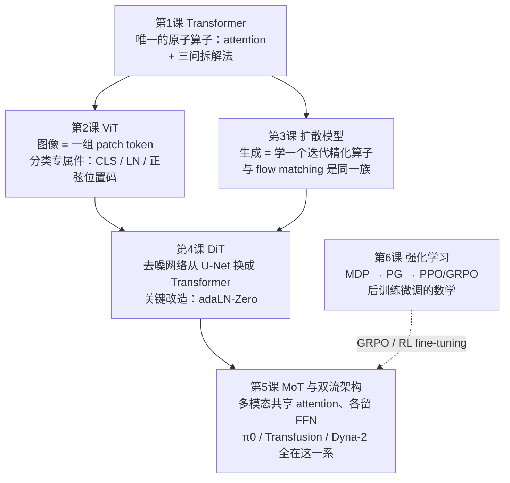
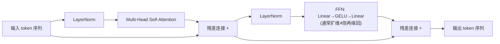
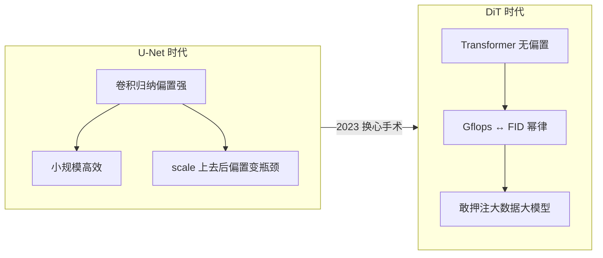
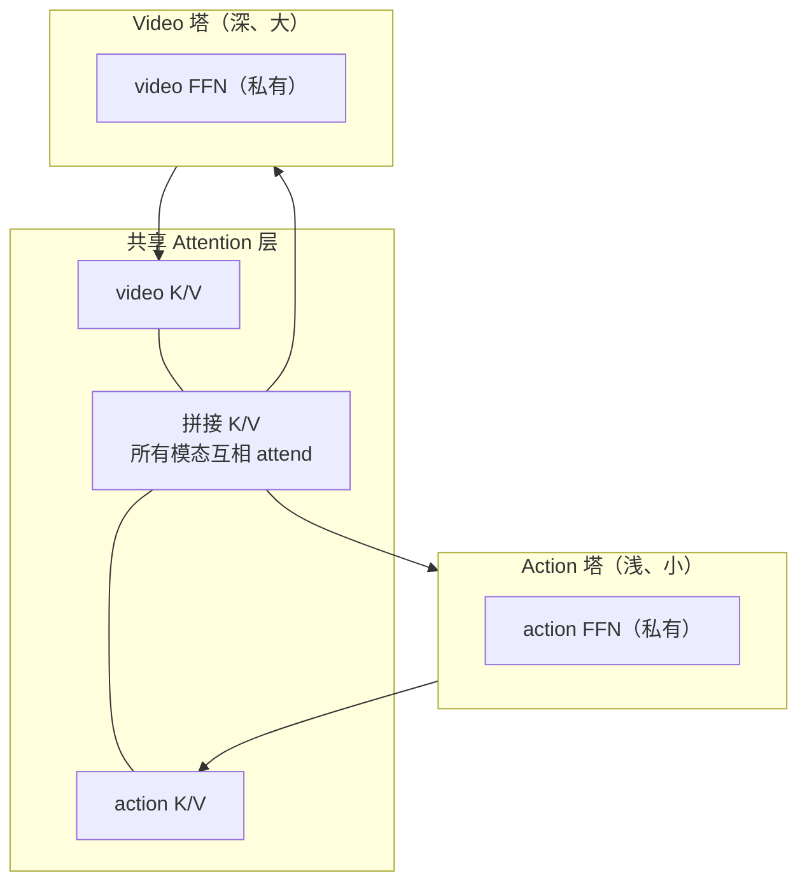
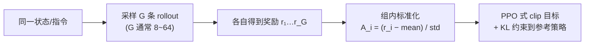

## 具身智能私教课：从 Transformer 到 DiT/MoT/RL

> 本笔记是给"做灵巧手、retargeting、VLA，但没有 CV / 视频生成 / RL 背景"的读者写的入门课。起点是读者已经熟悉的领域（灵巧操作、π0 的 flow matching、Dyna-2 精读），终点是能独立读任何一篇 WAM / VLA+RL 论文的架构部分。
> 核心方法论：**这五个主题不是五门课，而是"一个算子 + 两种生成范式 + 一条优化主线"的组合。**

---

## 0. 全课地图：先看清骨架再填肉



一句话骨架：

> **quote**
> 全课只有三句话
> 1. **Transformer 只有一个算子**（attention 加权混合），剩下全是工程细节；
> 2. **扩散和 flow matching 是同一种生成哲学**（学一个"精化算子"，多走几步），DiT 只是把这个算子的载体从 U-Net 换成 Transformer；
> 3. **RL 是"模仿学习之外"的那一半**——当示范数据不够用、必须用 reward 驱动自我改进时的优化框架。

| 课 | 一句话回答 | 在你领域的落点 |
|---|---|---|
| 1. Transformer | 所有 token 互相 attend 的全连接"路由 + 混合" | 读懂一切架构图 |
| 2. ViT | 图像切块当 token，几乎没有视觉专属设计 | 认出视频 DiT 改掉了 ViT 的哪三件"私货" |
| 3. 扩散模型 | 生成 = 多步精化，不是一步到位 | 和你已懂的 flow matching 互为镜像 |
| 4. DiT | 扩散的去噪网络换成 Transformer，换来 scaling law | Dyna-2 能押注 1M 小时的架构前提 |
| 5. MoT / 双流 | 共享 attention、私有 FFN 的模态分工 | π0 的 action expert、Dyna-2 的 video/action 塔 |
| 6. 强化学习 | reward 替代示范后的策略优化数学 | RLT、VLA+RL 后训练、GRPO 微调 |

---

## 1. Transformer：一次讲透，以后全是换皮

### 1.1 注意力：一个"软路由"算子

把每个 token 想成会议里的一个人。注意力机制里每个人手里有三张牌：

- **Query（Q）**："我想找什么信息"——一个查询向量；
- **Key（K）**："我身上贴着什么标签"——被别人检索用的索引；
- **Value（V）**："我实际携带的内容"——真被拿走的那部分。

查询和所有人的标签算匹配分（点积），归一化成权重，然后**按权重把所有人的内容加权混合**：

$$
\mathrm{Attention}(Q,K,V) = \mathrm{softmax}\!\left(\frac{QK^\top}{\sqrt{d_k}}\right) V
$$

> **Info**
> 为什么除以 $\sqrt{d_k}$
> $QK^\top$ 是 $d_k$ 维向量的点积，其方差随 $d_k$ 线性增长。softmax 是指数函数，输入尺度大一倍，输出分布就尖锐一个量级——训练初期梯度会消失。除以 $\sqrt{d_k}$ 把分数的方差压回 $\mathcal{O}(1)$，纯粹是数值稳定技巧，没有更深的语义。

这个算子做一次叫一个 **head**。每个 head 的 Q/K/V 由**各自独立的线性投影**产生（$W^Q, W^K, W^V$ 是学习参数）。一个 head 只能学一种"匹配模式"（比如"动词找它的宾语"），所以实际用 $h$ 个 head 并行、把结果拼接后再投影一次——这就是 **Multi-Head Attention（MHA）**。你可以把它理解成$h$ 个独立的软路由在同时工作，各自负责一种"谁该看谁"的模式。

### 1.2 一个 Transformer block 的全部成分



逐件问"它解决什么问题"：

| 成分 | 解决什么问题 | 如果没有它 |
|---|---|---|
| Attention | token 之间交换信息 | 每个 token 孤立，无法建模关系 |
| 残差连接 $x + f(x)$ | 让梯度有"高速公路"直达浅层 | 几十层堆叠后梯度消失，训不动 |
| LayerNorm | 把每个 token 的特征分布拉回标准尺度 | 深层网络激活值漂移，训练发散 |
| FFN（两层 MLP） | 给每个 token **独立**做非线性变换 | 网络只有线性混合，表达力不足 |

> **Tip**
> 一个关键的分工直觉
> **Attention 负责"跨 token 通信"，FFN 负责"每个 token 内部的计算"。** 这个分工直觉到第 5 课会起大作用：MoT 的本质就是"共享通信信道、私有计算单元"。

### 1.3 三问拆解法：终身受用的读图工具

任何一个 Transformer block，无论它出现在语言模型、ViT、DiT 还是 VLA 里，只有三个位置可以动：

> **success**
> 三问拆解法（本课最重要的一张卡片）
> 1. **谁 ATTEND 谁？**（Q 来自哪个 token 集合，K/V 来自哪个 token 集合）
> 2. **注意力掩码是什么？**（允许看未来吗？允许跨模态看吗？）
> 3. **条件信息从哪个门进来？**（拼成额外 token？cross-attention？还是调制 LayerNorm？）

整个第 2–5 课都只是这三问的不同答案：

| 架构 | 谁 attend 谁 | 掩码 | 条件入口 |
|---|---|---|---|
| GPT 式语言模型 | token attend 同序列 | 因果（不许看未来） | 无外部条件 |
| ViT（第2课） | patch 互相 attend | 无（全双向） | CLS token 汇总 |
| DiT（第4课） | latent patch 互相 attend | 无 | adaLN 调制 LayerNorm |
| π0（第5课） | 图像/文本/状态/动作全拼接 | 分块因果 | 拼成额外 token |
| Dyna-2（第5课） | 两塔在 attention 层互相 attend | video 因果 + action 双向 | attention 通路 |

你现在回头看 [π0 笔记](../pi0-model-architecture-flow-matching-notes-obsidian-mermaid-fixed/)里的 blockwise causal mask，就是三问里第 1、2 问的一个具体答案：图像和文本 token 双向、动作 token 只能看前面的观测，防止未来动作泄漏给当前的生成。

### 1.4 位置编码：注意力本身"看不见顺序"

注意力对输入序列做的是一个**置换不变**的操作——把 token 打乱顺序，输出只是相应打乱，数值完全不变。但语言、视频、动作序列的顺序恰恰携带核心信息。所以必须人为把位置信息注入 token：给每个位置 $i$ 的 token 加上一个位置向量 $p_i$（或像 RoPE 那样旋转 Q/K）。

> **example**
> 在具身智能里，"位置"可以是很多东西
> - 动作 chunk 内的步号 $t' \in [t, t+H-1]$（π0 的 $H=50$ 个动作 token 靠位置编码区分先后）
> - 图像 patch 的二维网格坐标（ViT）
> - 视频的**时空**坐标：第几帧 × 帧内第几块（视频 DiT，第4课）
> 后面所有"spacetime patch"的说法，根子都在这一件小事上。

---

## 2. ViT：图像怎么变成 token，以及视频 DiT 家族改掉了什么

### 2.1 把图像"拍平"成序列

CNN 靠卷积核的局部滑动提取特征，天然带"邻近像素相关"的归纳偏置。Vision Transformer（Dosovitskiy et al., 2020）的做法激进得多：**不做任何视觉专属设计，把图像变成序列后直接套标准 Transformer**：

```text
224×224 图像
  → 切成 14×14 = 196 个 patch（每个 16×16 像素）
  → 每个 patch 展平后过一个线性层 → 196 个 token
  → 加上位置编码
  → 标准 Transformer encoder（双向自注意力）
```

### 2.2 ViT 的全部"私货"只有三件

1. **CLS token**：在序列最前面拼一个可学习的特殊 token，它通过注意力"读"遍所有 patch，最后的分类头只接在它上面。它是"全图摘要"的载体。
2. **LayerNorm + 残差**：如前所述，纯为稳定深层训练。
3. **正弦位置编码**：固定（不学习）的二维位置向量，告诉每个 patch 它在网格里的坐标。

### 2.3 视频 DiT 家族对 ViT 三件私货的"标准改造"

视频 DiT（Sora 一系、以及 Dyna-2 这类 video-diffusion backbone）是在 ViT 的"图像 → patch → token"流水线上长出来的，但三件事几乎总是被改掉：

| ViT 的默认件 | 视频 DiT 家族为什么改 | 通常换成什么 |
|---|---|---|
| CLS token | 不做分类、要做生成，没有"全图摘要"的用武之地 | 不需要 |
| 裸 LayerNorm | 去噪网络必须知道噪声步 $t$ 和条件，归一化要随条件自适应 | adaLN-Zero 调制（第4课） |
| 固定/learned 位置码 | 要编码的是**时空**坐标且视频长度可变 | 时空 RoPE 等 |

> **Warning**
> 证据边界：Dyna-2 原文并没有逐项确认这三处替换
> Dyna-2 架构节对 tokenize 只说了一句 "each input modality … is tokenized individually"，**没有公开 video tokenizer 的具体结构**（VAE 类型、patch 尺寸、位置编码方案都没写）。上表是视频 DiT **家族**的通行做法——你自己的 [Dyna-2 笔记](../dyna-2/)里"3D VAE 压缩成时空 latent、切成 spacetime patch"就是按家族共性写的合理补全。读公司技术报告（而非完整论文）时这是常态：**架构主干公开，tokenizer 等细节留白，按家族默认推断、并标注这是推断**。

> **quote**
> 这就是"三问拆解法"+"认识标准件"的威力
> 读架构论文的恐惧感，90% 来自不认识"标准件"。认出了 ViT 的三件私货，看到任何变体时你问的就从"这些术语是什么"变成了"**它把哪几件换掉了、换成什么、为什么**"——后者是设计决策，前者只是词汇表。

---

## 3. 扩散模型：和你已懂的 flow matching 是同一族

### 3.1 先建立哲学，再碰公式

你已经熟悉 flow matching，所以先讲最重要的对照——**扩散模型和 flow matching 属于同一生成范式**：

> **quote**
> 生成的两种哲学
> - **一步到位**：学一个映射 $f(\text{条件}) \to \text{样本}$，一次前向直接吐出结果（VAE 解码器、GAN、普通回归）。
> - **迭代精化**：学一个"精化算子" $f(\text{当前状态}, \text{条件}) \to \text{更好的状态}$，从噪声出发**反复调用它**，逐步把噪声打磨成样本（扩散、flow matching）。

第二种哲学赢了（在图像/视频/动作生成上），原因是统计意义上的：一步到位要求网络把整个数据分布"一口吞下"，而迭代精化把问题切成一连串**局部的、近乎简单**的修正任务——每一步只需要回答"往哪个方向挪一点更像数据"。这也是为什么它能 scale：任务难度不随模型变大而爆炸。

### 3.2 扩散的前向与反向

**前向过程（加噪，固定、无需学习）**：把干净数据 $x_0$ 逐步混入高斯噪声，$T$ 步后变成接近纯噪声：

$$
q(x_t \mid x_0) = \mathcal{N}\!\left(\sqrt{\bar\alpha_t}\, x_0,\; (1-\bar\alpha_t) I\right)
$$

其中 $\bar\alpha_t$ 是预设的噪声日程（$t$ 越大噪声越多）。**注意这是个封闭公式**——任意 $t$ 步的加噪样本可以一步采样出来，不用真的迭代。这一点对训练效率至关重要。

**反向过程（去噪，需要学习）**：学一个网络 $\epsilon_\theta(x_t, t)$ 预测 $x_t$ 里混入的噪声，训练目标就是简单的回归：

$$
\mathcal{L}_{\text{simple}} = \mathbb{E}_{x_0,\, \epsilon,\, t}\left\| \epsilon - \epsilon_\theta\!\left(\sqrt{\bar\alpha_t}\,x_0 + \sqrt{1-\bar\alpha_t}\,\epsilon,\; t\right) \right\|^2
$$

推理时从纯噪声 $x_T \sim \mathcal{N}(0,I)$ 出发，一步步用 $\epsilon_\theta$ 估计噪声、减去一部分，$T$ 步后得到样本。

### 3.3 与 flow matching 的精确对照

你在 π0 里已经熟悉：学一个向量场 $v_\theta(A^\tau, \tau \mid o)$，沿 ODE 从 $\tau{=}0$（噪声）积分到 $\tau{=}1$（动作）。两者逐条对照：

| | 扩散模型 | Flow matching（你已知） |
|---|---|---|
| 过程类型 | 随机（SDE）：每步注入新噪声 | 确定（ODE）：沿向量场直线流动 |
| 学什么 | 噪声 $\epsilon$（等价于 score） | 速度场 $v = x_1 - x_0$ |
| 插值路径 | 方差随 $t$ 非线性变化的弯路径 | 直线插值 $x_\tau = \tau x_1 + (1-\tau) x_0$ |
| 训练目标 | 噪声回归 | 速度回归 $\|v_\theta - (x_1-x_0)\|^2$ |
| 推理 | 多步去噪（或 DDIM 确定性化） | ODE 求解器积分（欧拉/Heun） |

> **success**
> 数学上可以互相改写
> 这两个框架是**同一族连续时间生成过程的不同参数化**——选不同的噪声日程和插值路径，扩散目标可以改写成 flow matching 目标，反之亦然。flow matching 的直线插值等价于一种特定的"最优传输"路径选择，往往让 ODE 更直、更好积分，所需步数更少。
>
> **给你的实用结论**：以后再看到"diffusion policy""diffusion VLA"，直接把它脑内翻译成"和 π0 一样的迭代精化生成，只是学噪声而不是学速度"。剩下的差异全是采样器工程（几步、什么求解器），不是范式差异。

> **example**
> 桥：π0 为什么选 flow matching 而不是扩散
> π0 要在 3B VLM 上高频输出 50 步动作 chunk。flow matching 的直线路径意味着用很少的积分步数（π0 推理默认 10 步）就能得到高质量动作——在实时控制预算下，"步数"就是延迟，就是 [RTC](../rtc-realtime-constraint-summary/) 笔记里讨论的硬约束。Dyna-2 第 5 节蒸馏"一步学生"也是同一个动机。

---

## 4. DiT：让扩散模型能 scale 的那次换心手术

### 4.1 手术内容：把 U-Net 换成 Transformer

2023 年之前的扩散模型（Stable Diffusion 1/2、DDPM 系列）去噪网络清一色用 **U-Net**：一种"下采样—上采样、带跨层跳连"的卷积结构。DiT（Peebles & Xie, *Scalable Diffusion Models with Transformers*, ICCV 2023）做的事情一句话说完：

> **Info**
> DiT = Diffusion Transformer
> 把扩散模型里负责去噪的网络从 U-Net 换成标准 Transformer。输入不再是像素，而是 **VAE 压缩后的 latent**，切成 patch 当 token。出处即 Dyna-2 的 ref [27]；Sora、Stable Diffusion 3、以及现在几乎所有视频生成模型都是 DiT 架构。

### 4.2 唯一的实质改造：adaLN-Zero

普通 Transformer block 和 DiT block 的差别**只有一处**：去噪网络必须知道"当前噪声有多大"（扩散步 $t$），以及条件是什么（文本、观测）。DiT 的做法不是把 $t$ 拼成 token，而是**调制每一层的 LayerNorm**：

> **Note**
> adaLN-Zero（adaptive LayerNorm, Zero-initialized）
> 把 $t$（及条件向量 $c$）过一个小 MLP，**回归出每个 block 的六组调制参数**：两处 LayerNorm 的缩放 $\gamma$、平移 $\beta$，和两个残差分支的门控 $\alpha$：
>
> $$\mathrm{adaLN}(x, c, t) = \gamma(c,t) \odot \mathrm{LN}(x) + \beta(c,t)$$
>
> "Zero" 指门控 $\alpha$ **初始化为 0**——于是每个 block 开训时是恒等映射，深层网络从头训也稳定。除此之外就是普通的 self-attention + FFN 堆叠。

这就是第 1 课"三问"里第 3 问（条件从哪个门进来）的另一种答案：不拼 token、不走 cross-attention，而是**拧 LayerNorm 的旋钮**。直觉：条件信息不作为一个"待阅读的内容"，而是作为"全局工况设定"渗透到每一层的归一化里。

### 4.3 为什么换掉 U-Net 是范式级事件

U-Net 的卷积归纳偏置（局部性、尺度层级）在小规模上是优点，但它和"算力换质量"的关系不干净。DiT 论文的核心实验发现：**换成 Transformer 后，算力（Gflops）与生成质量（FID）出现干净的幂律关系**——模型越大、数据越多，质量平滑上升，没有饱和迹象。



> **Warning**
> 这条因果链直接通向你的领域
> Dyna-2 敢把模型押到 **100 万小时**人类视频上而不饱和，这个决策的架构前提就是 DiT 的可扩展性。"架构能吃下 1M 小时"本身就是建立在 DiT scaling law 上的结论——你在 [Dyna-2 笔记](../dyna-2/)里看到的 scaling 曲线，2019 年的 U-Net 架构是画不出来的。

### 4.4 视频 DiT：从 patch 到 spacetime patch

图像 DiT：图像 → VAE latent → 切 2D patch → token 序列。
视频 DiT 只是每步都加上时间轴：

```text
视频 (T 帧 × H × W × 3)
  → 3D VAE（时空联合压缩）→ latent (T' × H' × W' × C)
  → 切成 3D spacetime patch（例如 2×16×16）→ token 序列
  → DiT 堆去噪，位置编码用时空 RoPE
```

> **example**
> 桥：Dyna-2 的 $z_t$ 就是这个加噪的视频 latent
> Dyna-2 笔记里反复出现的 $z_t$（加噪视频 latent）**不是像素**——是 3D VAE 压缩后、切 patch 之前的那个张量的加噪版本。理解了"VAE 压缩 → patch 化 → DiT"这条流水线，Dyna-2 架构图左半边就没有任何陌生部件了。

---

## 5. MoT 与双流架构：谁 ATTEND 谁的工业级答案

### 5.1 问题：一个模型怎么处理两个差异巨大的模态？

视频 token 有几千个、高维、稠密、时空结构强；动作 token 只有几十个（π0 是 50 步 × 动作维度）、低维、对精度敏感。**用同一套权重处理两者是浪费甚至有害的**——视频需要大量容量做时空推理，动作需要精确的数值输出。

### 5.2 两种历史方案，以及它们的合体

| 方案 | 做法 | 代价 |
|---|---|---|
| **全拼接**（GPT 式，Transfusion 是变体） | 所有模态 token 拼成一个序列，一套权重从头 attend 到尾 | 视频 token 占满序列长度，计算量爆炸；模态间没有专门化 |
| **双塔独立**（CLIP 式） | 两个 encoder 各编各的，只在最后点积交互 | 交互太浅，无法做细粒度条件生成 |
| **MoT / 双流**（合体） | 每个模态一套私有层，**在 attention 层互相 attend** | 既专门化又深度交互 |

### 5.3 Mixture-of-Transformers 的精确定义

> **Info**
> MoT（Mixture-of-Transformers）
> 名字借自 MoE（Mixture-of-Experts），但**不是路由器选专家**——而是**按模态静态分流**：每个模态有自己独立的 FFN（和/或整套层），但在 attention 处把 K/V 拼到一起，让所有模态的 Q 都能 attend 到所有模态。
>
> 用第 1 课的分工直觉说：**通信信道（attention）共享，计算单元（FFN）私有。**



### 5.4 三个实例：同一思想的三个参数点

> **example**
> π0：PaliGemma + action expert（复习，你已经会了）
> 图像/文本走 PaliGemma 的 3B 权重，状态和动作走一个约 300M 的 **action expert**。所有 token 拼在一个序列里、用 blockwise causal mask，但 FFN 权重按模态分开——这就是 MoT 的"共享注意力、私有 FFN"实现。梯度上 action loss 只回流 action expert，VLM 主塔可以在预训练权重上保持不动。

> **example**
> Dyna-2：深度不对称的 MoT
> Dyna-2 架构节原文（§2）值得逐句精读，它只有四句话：
>
> 1. "each input modality, including video and action, is tokenized individually and has a distinct set of DiT layers that can attend to each other via attention operations" → video 塔和 action 塔**各有一整套 DiT 层**（不共享），只在 attention 处交互；
> 2. "proprioception is tokenized and fed directly as input to the action transformer" → 本体感觉**直接进 action 塔**，不经过 video 塔；
> 3. "Video tokens use causal masking; action tokens use bidirectional self-attention (no causal mask) and attend to the video tokens of the observed context" → 三问之第 1、2 问的答案；
> 4. "Video tokens cross-attend to text tokens; **text does not directly influence action tokens**" → 容易漏读的关键设计：指令的信息通路是 **文本 →(cross-attn)→ video →(attention)→ action**。动作是被"想象出的未来视频"间接条件化的——这正是 WAM 区别于 VLA 的范式主张：语言先改变模型对未来的预测，预测再决定动作。
>
> 深度不对称：基于一个重要发现——视频 DiT 的**时序推理能力集中在早期层**（ref: *Causality in Video Diffusers is Separable from Denoising*）——所以 action 塔**做得更浅，只接入 video 流的早期层**：
>
> ```mermaid
> flowchart LR
>     subgraph VT["Video DiT 塔（全深度）"]
>         V1["早期层<br/>时序推理集中于此"] --> V2["后期层<br/>纹理/细节精化"]
>     end
>     subgraph AT["Action DiT 塔（浅）"]
>         A1["action 层"]
>     end
>     V1 <-->|"attention 互看"| A1
>     AT -->|"输出未来动作"| OUT["â"]
>     VT -->|"输出未来视频"| OUTV["ẑ"]
> ```
>
> **收益**：action 前向只走浅层，实时推理延迟显著下降，且不牺牲性能——和 RTC 的实时性约束直接呼应。这是"读懂架构 = 读懂设计决定的理由"的典型案例：不对称深度不是炫技，是拿时序推理的层定位发现换来的延迟预算。

> **example**
> Transfusion：MoT 谱系的另一个端点
> 单序列、单套权重，但不同模态用**不同的目标函数**（文本用离散 next-token，图像用连续扩散）。Dyna-2 把它和 π0 并列为 MoT 的思想来源——你可以把这三者看成"模态分工"这个旋钮的三个挡位：Transfusion（共享一切，只分损失）→ π0（分 FFN，共享注意力与层堆）→ Dyna-2（分整套层，只共享注意力通路）。

> **Tip**
> 用三问拆解法收尾
> 回到第 1 课的三问：
> 1. **谁 attend 谁**：π0 全拼接互 attend；Dyna-2 两塔在 attention 层互 attend；
> 2. **掩码**：π0 分块因果；Dyna-2 是 **video 因果 + action 双向**（动作块内部互相可见，因为 50 步动作是联合去噪的，不存在"未来泄漏"问题）；
> 3. **条件入口**：两者都走 attention 通路而非 adaLN（注意：DiT 内部的噪声步条件仍走 adaLN）。
>
> 三个问题答完，这两篇论文的架构部分就只剩实现细节了。

---

## 6. 强化学习：VLA 后训练的数学，从 MDP 到 GRPO

### 6.1 为什么 VLA 需要 RL：模仿学习的天花板

你目前做的都是**行为克隆（BC）**：最大化 $\log \pi_\theta(a \mid s)$，让策略模仿示范。BC 有三个结构性天花板：

1. **协变量偏移**：策略小误差累积，把自己带到示范数据没覆盖的状态，然后不知所措（你没有"从错误中恢复"的示范）；
2. **目标错位**：BC 优化"像专家"，但任务真正要的是"成功"——递瓶子时像不像人不重要，瓶子不掉才重要；
3. **人类视频无动作标签**：Dyna-2 用 1M 小时人类视频预训练，但这些视频**没有机器人动作标注**——想变成可执行策略，需要别的监督来源。RL 用 reward 填补这个空缺。

> **quote**
> 一句话定位
> **BC 让策略进入"大致正确的区域"，RL 负责"精确地做好"。** 这就是"VLA + RL 后训练"范式的存在理由。

### 6.2 MDP：把机器人问题写成五元组

强化学习把交互建模为马尔可夫决策过程 $(\mathcal{S}, \mathcal{A}, P, r, \gamma)$：

| 成分 | 灵巧操作里的具体含义 |
|---|---|
| 状态 $s$ | 图像观测 + 本体感觉（关节角、力/触觉）+ 语言指令 |
| 动作 $a$ | 一个控制周期的关节目标（或整个 action chunk，见 RLT） |
| 转移 $P(s'\mid s,a)$ | 物理世界——未知，只能通过执行动作采样 |
| 奖励 $r(s,a)$ | 任务是否成功、物体移动距离、手物接触质量…… |
| 折扣 $\gamma \in [0,1)$ | 远期奖励打折扣，$\gamma$ 越近视越短 |

目标是学策略 $\pi_\theta(a\mid s)$ 最大化期望折扣回报：

$$
J(\theta) = \mathbb{E}_{\tau \sim \pi_\theta}\left[\sum_{t=0}^{T} \gamma^t r_t\right]
$$

> **Note**
> 马尔可夫性
> "给定当前状态，未来与过去无关"。真实机器人观测（单帧图像）往往不满足——物体被遮挡就丢了信息。所以工程上常堆叠几帧观测或加本体历史，凑近似马尔可夫状态。

### 6.3 价值函数：给"长远后果"定价

两个核心量，互为递归：

$$
V^\pi(s) = \mathbb{E}\left[\sum_{t}\gamma^t r_t \,\Big|\, s_0 = s\right], \qquad
Q^\pi(s,a) = \mathbb{E}\left[\sum_{t}\gamma^t r_t \,\Big|\, s_0{=}s, a_0{=}a\right]
$$

**直觉**：$Q$ 回答"在 $s$ 做 $a$，长远来看值多少分"；$V$ 回答"在 $s$ 按当前策略走下去，值多少分"。有了 $Q$ 就有贪心改进：选 $Q$ 大的动作，策略就变好一点——这是几乎所有 RL 算法的引擎。

### 6.4 策略梯度：最直接的优化路径

不维护价值函数，直接对 $J(\theta)$ 求梯度。REINFORCE 给出的经典结果：

$$
\nabla_\theta J = \mathbb{E}_{a \sim \pi_\theta}\left[ \nabla_\theta \log \pi_\theta(a\mid s) \cdot \hat{A}(s,a) \right]
$$

逐件翻译：

- $\nabla_\theta \log \pi_\theta(a\mid s)$ ——"把动作 $a$ 的概率往上推"的方向（和 BC 的梯度同方向！）；
- $\hat{A}(s,a)$ ——**优势函数**：这个动作比平均水平好多少。

> **success**
> BC 与 RL 的统一视角（对你最重要的一行）
> 行为克隆的梯度是 $\nabla \log \pi_\theta(a_{\text{专家}}\mid s)$ —— 相当于"示范动作的 $\hat{A}$ 恒为 1"。
> 策略梯度的梯度是 $\nabla \log \pi_\theta(a\mid s)\cdot \hat{A}$ —— **用实际后果给每个动作打分，好的推上去、差的压下来**。
> 所以 RL 后训练 = "带打分的 BC"。你的 BC 训练管线在形式上已经可以装下 RL，缺的只是 $\hat{A}$ 从哪来。

纯 REINFORCE 的 $\hat{A}$ 用整条轨迹的回报，方差极大（几十步的噪声全算在一个动作头上）。降低方差的两大件：

- **baseline**：减去 $V(s)$，只奖励"超出预期"的部分，这就是优势 $A = Q - V$ 的由来；
- **critic**：单独学一个网络 $\hat{V}_\phi(s)$ 当 baseline——**actor-critic** 架构（actor = 策略，critic = 价值估计）。

### 6.5 PPO：让每步更新"不失控"

策略梯度是**同策略（on-policy）**算法：梯度只在"数据来自当前策略"时无偏。更新一大步，数据就"过期"了，继续用会跑偏。PPO 的解法是给更新幅度上夹：

$$
\mathcal{L}_{\text{clip}} = \mathbb{E}\left[\min\left( \rho_t \hat{A}_t,\; \mathrm{clip}(\rho_t,\, 1-\epsilon,\, 1+\epsilon)\, \hat{A}_t \right)\right], \qquad \rho_t = \frac{\pi_\theta(a_t\mid s_t)}{\pi_{\theta_{\text{old}}}(a_t\mid s_t)}
$$

- $\rho_t$ 是新旧策略对该动作的概率比——衡量"这一步改了多大"；
- 比值超出 $[1-\epsilon, 1+\epsilon]$（常取 $\epsilon{=}0.2$）就截断，**优势不再能驱动更大的参数更新**；
- 效果：允许在同一批数据上做好几步小更新（省样本），又不会一步跨出信任区把策略训崩。

### 6.6 GRPO：扔掉 critic 的组内相对打分

PPO 的痛点：critic $\hat{V}_\phi$ 得和策略一样大，训它本身又是个 RL 子问题。GRPO（DeepSeekMath, 2024；随 DeepSeek-R1 在 LLM 后训练中流行）的做法干脆利落：**不要 critic，用"组内对比"当 baseline**。



- 对同一个状态采 $G$ 条轨迹，奖励分别是 $r_1, \dots, r_G$；
- 每条轨迹的优势就是**它在组内的标准化排名**：$A_i = (r_i - \bar r)/\sigma_r$；
- 比组平均好的动作推上去，差的压下来——baseline 由组平均免费提供；
- 再加一个 KL 惩罚把策略拴在参考策略（SFT 模型）附近，防止 reward hacking 跑飞。

> **example**
> 为什么 GRPO 在 VLA 圈迅速流行
> 三个原因都长在具身场景的骨头上：
> 1. **省掉 critic**：VLA 本身已经几 B 参数，再训一个同尺寸 critic 的显存和工程代价翻倍，GRPO 直接砍掉；
> 2. **天然匹配"同任务多次尝试"**：机器人评测本来就跑 N 次同一任务取成功率——这 N 次 rollout 恰好就是 GRPO 的组；
> 3. **奖励可以很稀**：组内标准化只在乎相对排名，不要求奖励函数稠密可调——任务成功/失败的 0-1 奖励就能用。

### 6.7 语言模型 RL 与机器人 RL 的微妙差异

| | LLM 后训练（GRPO 的发源地） | 机器人 RL |
|---|---|---|
| 一次 rollout | 生成一段文本，毫秒级 | 物理执行，几十秒；仿真则受限于物理引擎 |
| 奖励 | 可编程验证（数学答案对不对） | 需要人工设计或学习得到（reward model / 成功检测器） |
| 并行 | 千路并发采样 | 真机并行昂贵，主要靠并行仿真（Isaac Gym 类） |
| 风险 | 输出变难看而已 | 动作可能损坏硬件 |

> **Warning**
> 为什么 Sim2Real 又绕回来了
> 真机 rollout 又慢又贵又有损耗，而 GRPO 每组要 $G$ 条轨迹、PPO 要反复重采——**样本效率直接决定 VLA+RL 的可行性**。这就是高并行 GPU 仿真重新成为基础设施的原因，也是 world model（学完 Dyna-2 你应该想到的：既然模型能生成"执行动作后的未来视频"，它原则上就能**在想象里 rollout**）被视为 RL 下一站的原因。WAM 不只是策略预训练，还是潜在的"可微分/可采样的环境"。

### 6.8 桥：回看你已读的 RLT

[RLT 笔记](../rlt-rl-token/)里的设计现在可以逐件归位：

| RLT 的部件 | 本课对应 |
|---|---|
| 把 action chunk 当作 RL 的"动作" | 动作空间的重新定义：一个"动作"= 一段 $C$ 步轨迹，降低决策频率、拉长信用分配视界 |
| 执行 chunk、收 reward、存 replay buffer | 标准 off-policy 数据收集（与 PPO/GRPO 的 on-policy 相对，Q-learning 一系允许旧数据复用） |
| critic 受 sparse reward / bootstrap bias 之苦 | 6.4–6.6 讲的方差与偏差问题在 chunk 级动作上的复现 |
| "关心动作是否像专家，不直接最大化 reward" | BC 正则与 RL 目标的混合——后训练里常见的 BC-anchor 技巧 |

> **quote**
> 一条看清 VLA+RL 论文的公式
> 绝大多数 "VLA + RL" 论文可以一句话归档：
> **$\nabla \log \pi_\theta(a\mid s) \cdot \hat{A}$，区别只在 $\hat{A}$ 怎么估（critic / 组内对比 / 成功检测器）、rollout 在哪采（真机 / 仿真 / world model 想象）、以及用什么正则拴住预训练策略（KL / BC anchor / clip）。**

---

## 7. 全课收束：回到 Dyna-2 那段话，逐词破译

把 Dyna-2 架构节那段（[你的精读笔记](../dyna-2/)第 74–102 行附近）再读一遍，每个术语现在都能对号入座：

| 原文术语 | 本课落点 |
|---|---|
| "video-diffusion backbone" | 第 3 课：生成 = 迭代精化，第 4 课：去噪网络是 DiT |
| "Following the standard flow-matching setup … along a straight path"（§2 原文） | 第 3 课：Dyna-2 的训练目标其实就是你熟的 **flow matching**，不是 DDPM——架构自称 "video-diffusion"，目标函数是 FM，正好印证 §3.3 的"同族"论断 |
| "mixture-of-transformers" | 第 5 课：模态各留私有层、attention 共享 |
| "each input modality … is tokenized individually and has a distinct set of DiT layers" | 第 4 课：各自 tokenize；独立 DiT 层 = Dyna-2 挡位的 MoT（tokenizer 细节原文未公开，见 §2.3 证据边界） |
| "Video tokens use causal masking; action tokens use bidirectional self-attention" | 第 1 课三问之第 2 问；动作块联合去噪所以双向无泄漏 |
| "action tokens … attend to the video tokens of the observed context" | 三问之第 1 问：Q 来自 action，K/V 来自 context video |
| "Video tokens cross-attend to text tokens; text does not directly influence action tokens" | 三问之第 1 问的另一半：指令通路是 文本→视频→动作，见 §5.4 |
| "时序推理集中在早期层，action 塔只在早期层接入" | 第 5.4 课：拿层定位发现换延迟预算 |
| "adaLN-Zero" | 第 4 课：条件从 LayerNorm 调制门进来，零初始化保稳定 |

### 7.1 毕业自测（能答出就算入门完成）

1. 为什么 Transformer 里要除以 $\sqrt{d_k}$？（§1.1）
2. 视频 DiT 家族通常替换掉的 ViT 三件私货，各自原本是干嘛的？（§2.2–2.3）
3. 用一句话向同事解释扩散与 flow matching 的关系。（§3.3）
4. DiT block 与普通 Transformer block 的唯一实质差别是什么？（§4.2）
5. π0 / Transfusion / Dyna-2 在"模态分工"旋钮上各在什么挡位？（§5.4）
6. 为什么 GRPO 不需要 critic，它用什么当 baseline？（§6.6）
7. 从样本效率角度解释：为什么 world model 被看作机器人 RL 的下一站？（§6.7）

### 7.2 进阶阅读顺序（按依赖关系排）

| 顺序 | 材料 | 带着本课的什么去读 |
|---|---|---|
| 1 | *Attention Is All You Need* (2017) | §1 三问拆解法，验证它只有三处可动 |
| 2 | *An Image is Worth 16×16 Words* (ViT, 2020) | §2：数一数它有几件"私货" |
| 3 | *Scalable Diffusion Models with Transformers* (DiT, 2023) | §4：重点看 adaLN-Zero 和 Gflops–FID 幂律图 |
| 4 | *Transfusion* (2024) + π0 论文架构节 | §5：MoT 三个挡位互相对照 |
| 5 | *DeepSeekMath* (GRPO, 2024) 的 RL 节 | §6.5–6.6：clip 目标与组内标准化 |
| 6 | Dyna-2 全文重读 | 全部：这次应该没有黑话残留 |

### 7.3 与你研究方向的接驳点

- **Retargeting ↔ 视频预训练**：Dyna-2 用人类视频学世界模型，恰好绕开了"人→机器人动作映射"的难题——但**动作从哪来**的问题被推迟到了下游（动作塔仍需要机器人数据或 retargeting）。你的工作（如 [XL-VLA](../xl-vla/) 式的隐空间 retargeting）正好是"给 WAM 补动作标签"的技术路线之一。
- **灵巧手 ↔ 动作塔的容量问题**：Dyna-2 的 action 塔故意做浅——但五指灵巧手的动作维度远高于单臂（13 分钟学拧瓶盖的案例用的就是五指手）。**浅 action 塔对高维灵巧动作是否够用，目前无公开证据**，这可能是值得你自己做实验的缝隙。
- **VLA+RL ↔ 仿真基础设施**：GRPO 组内 rollout 的需求（同任务 $G$ 次尝试）决定了并行仿真是硬门槛，搭建高并行灵巧操作仿真环境的投资回报率会随着 VLA+RL 流行持续上升。

---

## 附：术语速查表
| 缩写 | 全称 | 一句话 |
|---|---|---|
| MHA | Multi-Head Attention | $h$ 个独立软路由并行工作（§1.1） |
| FFN | Feed-Forward Network | 每个 token 内部的两层 MLP，Transformer 的"计算单元"（§1.2） |
| CLS token | Classification token | ViT 的全图摘要载体，生成模型不需要（§2.2） |
| VAE | Variational Autoencoder | 把像素压缩成 latent，扩散模型在 latent 上做（§4.4） |
| DiT | Diffusion Transformer | 去噪网络换成 Transformer 的扩散模型（§4.1） |
| adaLN(-Zero) | adaptive LayerNorm | 用条件调制 LayerNorm，零初始化门控（§4.2） |
| MoT | Mixture-of-Transformers | 共享 attention、私有 FFN/层 的模态分工（§5.3） |
| MoE | Mixture-of-Experts | 路由器选专家的稀疏激活（MoT 名字的由来，≠ MoT） |
| MDP | Markov Decision Process | RL 的问题形式化：状态/动作/转移/奖励/折扣（§6.2） |
| PG | Policy Gradient | $\nabla\log\pi \cdot \hat{A}$，带打分的 BC（§6.4） |
| PPO | Proximal Policy Optimization | 给策略更新幅度上夹的 actor-critic（§6.5） |
| GRPO | Group Relative Policy Optimization | 组内相对排名当优势，免 critic（§6.6） |
| BC | Behavior Cloning | 模仿学习，$\hat{A}\equiv1$ 的特例（§6.4） |
| NFE | Number of Function Evaluations | 采样步数 = 延迟预算（§3.3 桥） |

---

## 修订记录

- **2026-08-12**：初版 §2.3 曾把一句拼接的话误标为 Dyna-2 原文引文（"no CLS token, no LayerNorm, no learned positional embedding"）。与 dyna.co/dyna-2 全文核对后确认**原文不存在该句**——"causal masking" 为原文所有，"3D VAE + spacetime patch" 来自本库 Dyna-2 精读笔记的家族共性补全，"no CLS/LN/位置码" 三件为初版撰写时的错误虚构。已改写为 §2.3 现版（家族共性 + 证据边界），并据原文补充 §5.4 的四句逐句精读与 §7 的 flow-matching 目标一行。教训：**引用原文必须逐字核对，家族共性必须标注为推断。**
