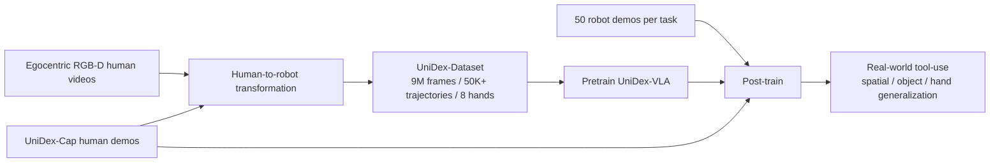
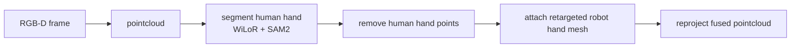
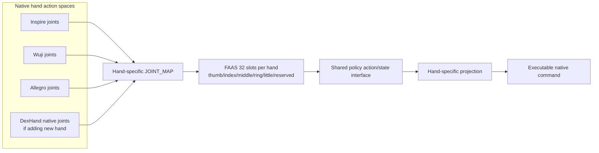
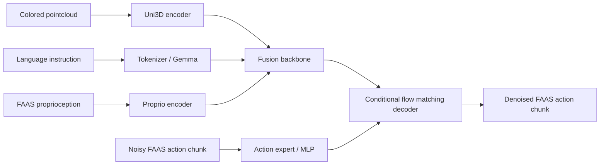
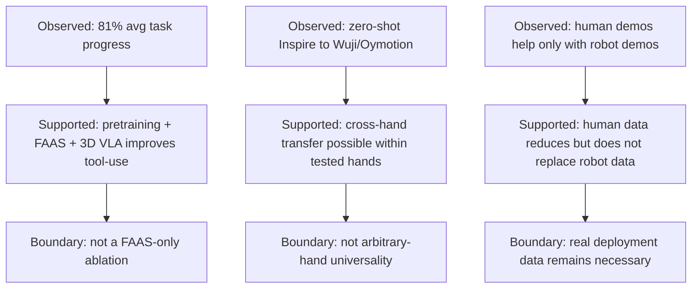
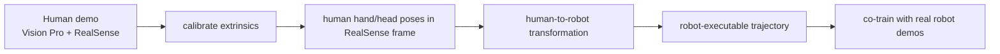
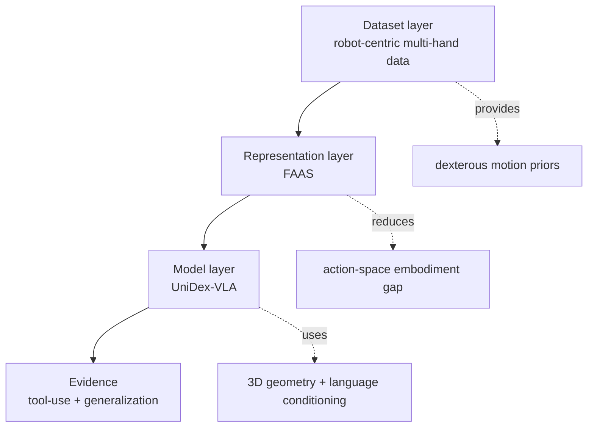
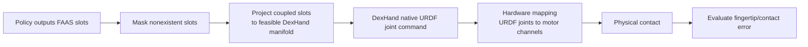

> **abstract**
> UniDex 的核心不是单独提出一个 VLA 模型，而是提出一套面向异构灵巧手的 foundation suite：
>
> $$
> \text{egocentric human videos}
> \rightarrow
> \text{robot-centric multi-hand dataset}
> \rightarrow
> \text{FAAS 统一动作空间}
> \rightarrow
> \text{3D VLA policy}
> \rightarrow
> \text{真实工具使用 + 跨手迁移}
> $$
>
> 最关键的机制是 **FAAS（Function–Actuator–Aligned Space）**：把不同灵巧手中功能相似的 actuator 映射到共享坐标槽位，使策略不再绑定某一只手的 URDF joint index。

相关笔记：[T-Rex_学习笔记_Obsidian](../t-rex/)、[pi05_architecture_learning_notes_obsidian](../pi05-architecture-learning-notes/)、[pi0_model_architecture_flow_matching_notes_obsidian_mermaid_fixed](../pi0-model-architecture-flow-matching-notes-obsidian-mermaid-fixed/)。

---

## 1. 一句话理解 UniDex

$$
\boxed{
\text{把人类第一视角操作视频转成多种机器人灵巧手可执行数据，}
\text{再用功能对齐动作空间训练跨手 VLA。}
}
$$

它同时处理三个瓶颈：

| 瓶颈 | 具体问题 | UniDex 的干预 |
|---|---|---|
| 数据瓶颈 | 真实灵巧手遥操作数据贵、慢、规模小 | 从 egocentric RGB-D human videos 构造 robot-centric trajectories |
| 本体异构 | 灵巧手 DoF、形态、关节布局差异大 | FAAS：按 actuator 功能角色对齐动作坐标 |
| 高维控制 | dexterous tool-use 需要多指协调 | 3D pointcloud VLA + conditional flow matching action chunks |

> **Important**
> 这篇工作的野心不是让 gripper VLA 多输出几个手指维度，而是把 **数据构造、动作接口、模型结构、后训练采集** 做成一个闭环。

---

## 2. 为什么 gripper-centric VLA 不够

现有 robot foundation policies 主要围绕 parallel-jaw gripper。论文指出，日常工具使用中很多动作天然要求多指灵巧控制：

- scissors：手指插入剪刀孔并开合；
- spray bottle：抓住瓶身后用拇指按压扳机；
- mouse：手指放在鼠标上拖拽、点击；
- kettle / sweeper：需要稳定抓握并控制工具姿态。

灵巧手 foundation model 的三个困难：

1. **数据难收集**：真实灵巧手遥操作比 gripper 更难，且每种手都要采一套数据。
2. **本体差异大**：不同手在 DoF、形态、运动学、外观上差异巨大，数据和策略迁移困难。
3. **动作维度高**：多指动作空间高维，控制语义复杂。

> **Note**
> UniDex 的核心判断是：跨灵巧手泛化不能只靠更大模型，必须同时处理 **数据域 gap**、**视觉 gap** 和 **action space gap**。

---

## 3. 总体框架：一个 suite，而不是单个模型

UniDex 由三部分组成：



- **UniDex-Dataset**：从 H2O、HOI4D、HOT3D、TACO 等 RGB-D egocentric datasets 转换；>50K trajectories、9M paired image-pointcloud-action frames、8 hands、6–24 active DoFs、30fps。
- **UniDex-VLA**：3D VLA，输入 pointcloud + language + proprioception，输出 FAAS action chunk。
- **UniDex-Cap**：Apple Vision Pro + RealSense L515 + 3D-printed mount 的便携采集系统，把人类 demo 转成 robot-executable trajectory，用于 human-robot co-training。

---

## 4. Human-Robot Transformation：把人手视频变成机器人手数据

这一部分是 UniDex 最重要但容易被忽略的机制。论文不直接拿 human hand trajectory 训练，而是先把人手数据转成 robot-centric data。

### 4.1 两个 gap

| gap | 机制 | UniDex 处理方式 |
|---|---|---|
| kinematic gap | 人手与机器人手的骨架、长度、DoF、关节限制不同 | fingertip IK + dummy base offset + human-in-the-loop retargeting |
| visual gap | 视频里是人手，不是机器人手 | mask human hand，再 attach robot hand mesh 到 pointcloud |

### 4.2 Kinematic Retargeting 的目标

论文假设 fingertip 是人—物交互中最主要的接触点，因此 retargeting 首先对齐 fingertips。

给定人手指尖目标：

$$
X^\star = [x^\star_1, \ldots, x^\star_m] \in \mathbb{R}^{3\times m}
$$

机器人第 $i$ 个指尖位置：

$$
x_i(q; T_{offset}) = \text{Trans}(T^{dummy}_{world} T_{offset} T_i(q)) \in \mathbb{R}^3
$$

- $q$：机器人手关节配置；
- $T_i(q)$：从机器人 base 到第 $i$ 个 fingertip 的 forward kinematics；
- $T_{offset}$：dummy base 到真实机器人 base 的 6-DoF alignment offset；
- $T^{dummy}_{world}$：dummy base 在世界坐标系中的位姿，论文设为人手全局位姿 $T_{hand}$。

IK residual：

$$
e(q, T_{offset}) =
\begin{bmatrix}
x_1(q;T_{offset}) - x_1^\star \\
\vdots \\
x_m(q;T_{offset}) - x_m^\star
\end{bmatrix}
\in \mathbb{R}^{3m}
$$

> **Note**
> 论文不是直接把人手关节角当成机器人动作，而是抓住“指尖作为主要接触点”的几何约束，并允许整体手基座微调以保证更合理的 contact。

### 4.3 Mimic joints 的处理

对含 mimic joints 的手（Inspire、Oymotion、Ability 等），先解主 IK，再按 mimic constraint 迭代修正：

$$
q_{j_s} = k\, q_{j_m} + c
$$

这说明 UniDex 的 retargeting 并不假设所有 URDF joints 都独立可控。

### 4.4 Human-in-the-loop 的意义

retargeting 分两阶段：

1. **Automatic stage**：给定初始 $T_{offset}$，用 PyBullet multi-end-effector IK 解 fingertips。
2. **Interactive stage**：用户通过 GUI 调整 $T_{offset}$ 的 6 个自由度和 IK 参数，重点修正 contact-rich frames。

> **Important**
> 人工介入不是标注所有帧，而是校准/修正少数接触关键片段，使大规模转换可行。

### 4.5 Visual Alignment



关键是让模型预训练时看到的是 **机器人手在场景中的点云**，而不是人手。这降低了 pretraining 与 real-robot fine-tuning 之间的 visual gap。

---

## 5. UniDex-Dataset：robot-centric human video data

UniDex-Dataset 的关键不是“数据大”，而是数据形式变成了 robot-centric：

```text
human videos
→ robot hand kinematics
→ robot hand geometry in pointcloud
→ FAAS action/state
```

论文批评了一些方法：先预训练人手运动，再在 post-training 中用额外 alignment trick 对齐机器人动作，容易 brittle。UniDex 选择在预训练数据阶段就把监督信号转为机器人手。

> **quote**
> 预训练数据不再是原始人类视频，而是经 retargeting 和 visual replacement 后的 robot-centric embodiment-conditioned data。

支持的手：`Inspire, Leap, Shadow, Allegro, Ability, Oymotion, Xhand, Wuji`。

---

## 6. FAAS：Function–Actuator–Aligned Space

FAAS 是论文最关键的 action representation。

### 6.1 为什么需要 FAAS

如果每只手都用自己的 native joint vector：

```text
Inspire: 6 active / 12 full DoF
Wuji: 20 active DoF
Oymotion: 6 active / 11 full DoF
Shadow: high-DoF hand
```

模型会遇到两个问题：

1. action dimension 不一致；
2. 相同 index 在不同手上语义不同。

FAAS 的基本思想：

$$
\boxed{
\text{把功能相似的 actuator 映射到同一坐标槽位。}
}
$$

功能 primitives 包括：thumb-index pinch、finger curling around handles、lateral ab-/adduction for stabilization。

### 6.2 FAAS 的维度结构

```text
82D = 18D wrist + 64D hand joints
    = 2 hands × 9D pose + 2 hands × 32D slots
```

每只手 32D slots：

| slot range | meaning |
|---|---|
| 0–4 | thumb |
| 5–9 | index |
| 10–14 | middle |
| 15–19 | ring |
| 20–24 | little |
| 25–26 | Shadow extra wrist joints |
| 27–31 | unused / reserved for new hands |

代码实现：`config/model/unidex.yaml` 中 `action_dim: 82`；`src/assets/utils/hand_utils.json` 中 `mapped_joint_dim=32`；`src/dataset/base.py::_apply_action_map` 按 `JOINT_MAP[hand_type]` 把 native joint vector 填入 32D slots，未用槽位置零。

### 6.3 FAAS 的真实边界

FAAS 是 **function-actuator aligned**，不是 **task-space aligned**。

它对齐的是 actuator role / joint-channel semantic slot / functional finger motion。

它没有直接对齐 fingertip position、contact patch normal、desired force、friction state、object motion。

> **Warning**
> FAAS 不是万能 retargeter。它是一种动作坐标协议，不是一个自动把任意动作变成任意手可执行命令的控制器。

我的层级理解：

```text
source-hand joint canonical
  < FAAS function-actuator canonical
    < fingertip/contact task-space canonical
```

FAAS 比绑定某只手的 joint space 更合理，但还没有上升到真正的接触任务空间。

### 6.4 FAAS 概念图



---

## 7. UniDex-VLA 模型结构

### 7.1 输入与输出

模型输入：

$$
o_t = [P_t, \ell_t, q_t]
$$

- $P_t$：single-view colored pointcloud；
- $\ell_t$：language instruction；
- $q_t$：robot proprioceptive state，也在 FAAS 中表示。

输出未来 action chunk：

$$
A_t = [a_t, \ldots, a_{t+H-1}], \qquad p(A_t \mid o_t)
$$

每个 $a_t$ 也在 FAAS 中表示。

### 7.2 Wrist pose 表示

- state 中 wrist 使用 absolute pose；
- action 中 wrist 使用相对于 action chunk 第一帧的 relative pose，跟随 UMI；
- dexterous-hand joints 在 state 和 action 中都使用 FAAS abstracted representations。

### 7.3 Architecture



关键点：用 Uni3D 替换 PaliGemma 里的 SigLIP 2D vision encoder；pointcloud 提供 3D geometry-sensitive representation；action chunk 通过 conditional flow matching 生成。

> **Note**
> Pointcloud 不是装饰。灵巧工具使用依赖细粒度 3D 几何和 contact affordances，2D 图像很难稳定表达剪刀孔、扳机、把手等结构。

---

## 8. Conditional Flow Matching 训练目标

采样：

$$
A_t^\tau = \tau A_t + (1-\tau)\epsilon,\qquad \epsilon \sim \mathcal{N}(0,I),\qquad \tau \in [0,1]
$$

目标 conditional vector field：

$$
u(A_t^\tau \mid A_t)= A_t - \epsilon
$$

模型学习：

$$
v_\theta(A_t^\tau, o_t) \approx u(A_t^\tau \mid A_t)
$$

推理时 forward Euler 积分：

$$
A_t^{\tau+\delta}=A_t^\tau + \delta\, v_\theta(A_t^\tau,o_t),\qquad \delta = 0.1,\quad A_t^0 \sim \mathcal{N}(0,I)
$$

训练资源：

- Pretraining：8 × H800，batch 128，3 epochs ≈ 30k steps，≈24h，AdamW lr=1e-4 cosine。
- Post-training：2 × H800 per task，batch 8，50 epochs ≈ 3k steps，≈4h，AdamW lr=2.5e-5。

> **Important**
> Flow matching 在这里不是论文最独特的贡献。它的作用是让高维 FAAS action chunk 可以作为连续生成对象被建模。真正的 novelty 更集中在 robot-centric multi-hand pretraining data + FAAS action interface + 3D pointcloud conditioning。

---

## 9. 实验设置

### 9.1 硬件平台

| component | details |
|---|---|
| arm | 7-DoF Franka Panda |
| hands | Inspire, Wuji, Oymotion |
| camera | Intel RealSense L515 |

手的 DoF：

```text
Inspire:  6 active, 12 full DoFs
Wuji:     20 active DoFs
Oymotion: 6 active, 11 full DoFs
```

### 9.2 五个真实工具使用任务

| task | hand | stages |
|---|---|---|
| Make Coffee | Inspire | grasp kettle → pour water |
| Sweep Objects | Inspire | grasp sweeper → sweep into dustpan |
| Water Flowers | Wuji | grasp spray bottle → press trigger |
| Cut Bags | Wuji | insert fingers into scissors → cut bag |
| Use Mouse | Wuji | drag file → click mouse |

每任务只收 **50 demonstrations**。

### 9.3 Baselines

DP、DP3、π0、UniDex-VLA (No Pretrain)、UniDex-VLA。论文说明 π0 和 UniDex-VLA No Pretrain 也采用 FAAS；DP/DP3 保持低维输出。

---

## 10. 实验结果

### 10.1 主结果

Fig. 11：

| model | Average Task Progress | Final Success Rate |
|---|---:|---:|
| DP | 29.0 ± 19.9% | 22.0 ± 22.5% |
| DP3 | 35.0 ± 17.1% | 30.0 ± 18.7% |
| π0 | 38.0 ± 7.4% | 35.0 ± 10.0% |
| UniDex-VLA No Pretrain | 32.5 ± 18.5% | 23.0 ± 12.0% |
| UniDex-VLA | **81.0 ± 12.1%** | **76.0 ± 17.8%** |

> **Important**
> 这里支持的结论不是“FAAS 单独有效”，而是 “FAAS + 多手预训练 + 3D VLA” 的组合显著有效。No Pretrain 与 full 的差距显示 UniDex-Dataset pretraining 提供了 dexterous motion priors。

### 10.2 Spatial Generalization

Make Coffee 中，对 kettle 和 dripper 的 pointcloud 做几何编辑，平移到训练分布外位置，再用 TAMP/DemoGen 对齐 robot state。UniDex-VLA 在 OOD 位置仍能完成任务。这部分更证明 3D pointcloud representation + geometric augmentation 的价值。

### 10.3 Object Generalization

把原黑色 kettle 换成更小的紫色 kettle，颜色、尺寸、handle/spout 几何都有变化，模型仍保持较强表现。说明学到一定的工具功能部件理解，而不是只记住训练物体外观。

### 10.4 Hand Generalization

关键实验：train Make Coffee on Inspire Hand，zero-shot deploy 到 Wuji / Oymotion。

| target hand | π0 | UniDex-VLA No Pretrain | UniDex-VLA |
|---|---:|---:|---:|
| Wuji | 0% | 0% | 40% |
| Oymotion | 10% | 5% | 60% |

> **Note**
> 这个实验很重要，但它不能把贡献完全归因给 FAAS，因为同时变化的还有多手预训练、3D perception、language hand-type conditioning 和真实任务微调。它是“跨手迁移可能”的强信号，但不是“任意手泛化”的全面证明。

### 10.5 证据与边界图



---

## 11. UniDex-Cap 与 human-robot co-training

### 11.1 硬件

```text
Apple Vision Pro: hand/head poses
Intel RealSense L515: high-quality RGB-D
3D-printed rigid mount: fixed extrinsics
```

由于 Vision Pro 不提供第三方 RGB-D 录制，论文用机械结构固定两者，再用 GUI 做外参校准。

### 11.2 Human demos 如何进入训练



### 11.3 Co-training 结果

Fig. 13 在 Make Coffee 上研究 human demos 与 robot demos 的关系：

1. Retargeted human data 有帮助；
2. **Robot data 不可缺少**；没有 robot demos 时 success 几乎一直为零；
3. Human–robot exchange rate 约为 2:1；
4. Human demos 采集速度约为 robot demos 的 5.2 倍。

> **Warning**
> 这点很容易被误读。UniDex 不是说 human data 可以替代 robot data，而是说 human data 可以在已有 robot demos 基础上降低边际采集成本。

---

## 12. 论文贡献的真实结构



- **数据层**：human egocentric videos → robot-centric trajectories → multi-hand pretraining dataset。
- **表示层**：native hand joint spaces → FAAS shared function-actuator slots。
- **模型层**：3D pointcloud + language + FAAS proprioception → flow-matching FAAS action chunk。

---

## 13. 局限

### 13.1 论文自己承认的局限

Conclusion 中明确说：当前还没有利用大规模 action-free 或 weakly labeled egocentric activity datasets。未来可进一步扩展到这些数据。

### 13.2 我认为更关键的局限

1. **FAAS 不是 task-space/contact representation**。它对齐 actuator role，但 contact outcome 由 fingertip pose、pad normal、compliance、force 和 object geometry 共同决定。FAAS 不能保证跨手接触等价。
2. **Human-in-the-loop retargeting 的人工成本没有完全消失**。论文说 basic calibration 覆盖大多数轨迹，但对于更多手、更复杂工具、更强接触任务，人工校准成本可能上升。
3. **Hand generalization 证据仍有限**。zero-shot hand transfer 主要展示 Make Coffee 从 Inspire 到 Wuji/Oymotion，10 trials。它是强信号，但还不是全面证明“任意手泛化”。
4. **触觉没有进入主机制**。对需要 slip/contact-rich feedback 的任务，pointcloud/proprioception 路线可能不足。与 [T-Rex_学习笔记_Obsidian](../t-rex/) 这类触觉反应模型相比，UniDex 的触觉闭环机制较弱。
5. **Robot data 仍然不可替代**。Fig. 13 显示没有 robot demos 时 success 近零。human data 是增广，不是免真机数据。
6. **FAAS 对欠驱动/耦合手需要额外投影**。它只规定槽位，不保证真实目标手能独立实现每个槽位。

---

## 14. 工程启发：与 T-Rex / DexHand021 迁移的关系

详细工程分析见 [T-Rex_学习笔记_Obsidian](../t-rex/) 和内部报告 `dexrobot-intern/.memory/tasks/2026-07-10-unidex-faas-dexhand-gap/UNIDEX_FAAS_DEXHAND_REPORT.md`。

### 14.1 对 Sharpa22 canonical 的启发

如果一篇工作使用 Sharpa 22D，另一篇使用 Allegro，另一篇使用 Shadow，把 DexHand021 分别伪装成每篇论文的源手不是可扩展路线。UniDex 支持一个更通用的观点：

```text
不要把某个源手的 joint space 当 canonical；
至少应该把动作映射到 function-actuator-aligned space。
```

### 14.2 对 DexHand021 的风险提醒

FAAS 对 DexHand021 不是直接可用。DexHand021 存在 12 motor → 19 URDF joints 的耦合，某些 FAAS slots 对应的自由度并不能独立控制。因此 DexHand021 的 FAAS adapter 必须做：

```text
mask unavailable slots
project coupled slots
recompute normalization
verify fingertip/contact residual
```



### 14.3 推荐实验定位

对当前工程，FAAS 最适合作为第三 baseline：

```text
Baseline A: source-hand canonical，例如 Sharpa22
Baseline B: native DexHand action
Baseline C: FAAS function-actuator action
```

比较时不要只看 offline loss，要看 projection residual、actuator saturation、fingertip RMS error、contact finger consistency、real primitive success。

---

## 15. 应避免的 10 种误读

1. 不要误读为“UniDex 只是一个 VLA 模型”。更准确是数据、动作空间、模型、采集系统组成的 foundation suite。
2. 不要误读为“FAAS 是 task-space retargeter”。FAAS 是 function-aligned actuator slots，不直接输出 fingertip targets、contact flags 或 force targets。
3. 不要误读为“人类视频可以完全替代机器人演示”。Fig. 13 显示没有 robot demos 时成功率接近零。
4. 不要误读为“跨手 zero-shot 证明任意手都能直接用”。实验只覆盖论文中的若干手，且依赖多手数据、FAAS、3D 表示和明确手类型条件。
5. 不要误读为“FAAS 单独造成全部性能提升”。论文没有把 FAAS 与多手预训练、pointcloud、finetuning 完全分离消融。
6. 不要误读为“mask 人手只是视觉美化”。这是缩小 pretraining 与 robot deployment 视觉分布差异的核心步骤。
7. 不要误读为“retargeting 完全自动”。论文使用 human-in-the-loop，尤其对 contact-rich frames 做交互修正。
8. 不要误读为“task progress 等于最终任务成功率”。task progress 是阶段平均，适合长程任务，但不能替代最终成功率。
9. 不要误读为“FAAS 能自动处理触觉 gap”。UniDex 主要使用 pointcloud + proprioception；触觉分布、频率和接触力需要单独建模。
10. 不要误读为“动作维度对齐就等于物理可执行”。新手部署仍需要 joint limits、mimic/coupling、scale/sign、feasible projection。

---

## 16. 我的理解与未解问题

### 16.1 我的理解

- UniDex 的强点是承认 embodiment gap 无法靠模型黑箱吞掉，所以先在数据和动作空间中显式缩小 gap。
- 人类视频可扩展，但必须经过 robot-centric transformation 才能成为对控制有监督意义的数据。
- FAAS 的意义在于让“功能相同的执行器”拥有可共享统计，而不是让所有手物理等价。
- UniDex-VLA 的强表现来自组合机制：多手预训练 + FAAS + 3D pointcloud + robot finetuning；不要把成功归因给单一模块。

### 16.2 未解问题

- FAAS 对高度欠驱动、软体、触觉丰富的手是否仍足够？
- 对新手的 mapping 是否会成为新的人工瓶颈？
- 如果加入 tactile/contact/force representation，FAAS 应作为主动作空间还是 actuator prior？
- action-free egocentric videos 如何进入该 pipeline：用于视觉预训练、affordance 学习，还是弱监督动作推断？
- FAAS 的功能对齐是手工设计的；能否从多手数据中自动发现更优的功能槽位？

---

## 17. 关键结论

$$
\boxed{
\text{UniDex = robot-centric human-video data + FAAS + 3D VLA + 低成本人类采集}
}
$$

它的真正贡献不是某一个模块 SOTA，而是把数据构造、动作接口、模型结构和采集系统连成一个可扩展的异构灵巧手 foundation pipeline。FAAS 是其中最值得复用的思想：**跨手统一不应绑定某只手的关节编号，而应按功能角色对齐执行器；但它仍需要 hand-specific projection 才能落到真机。**
