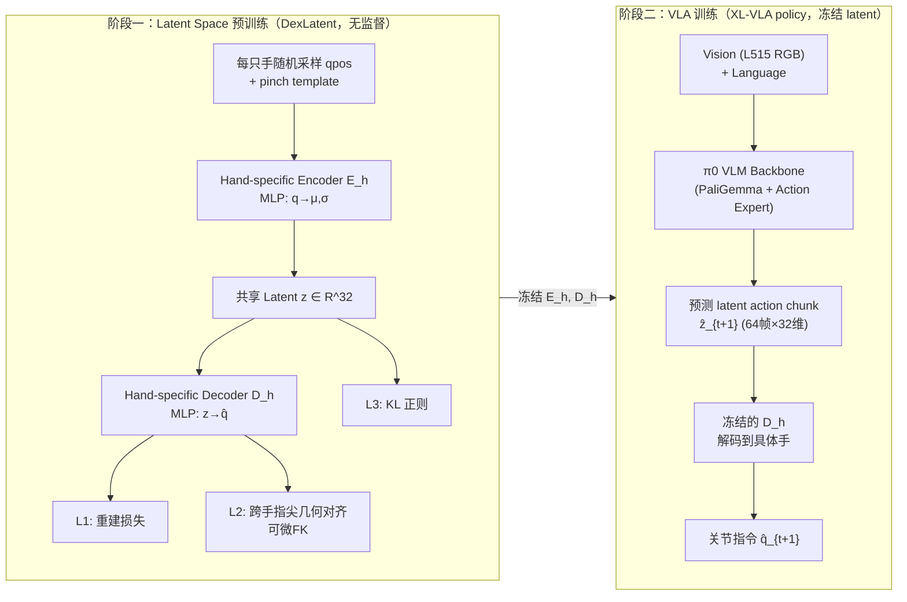
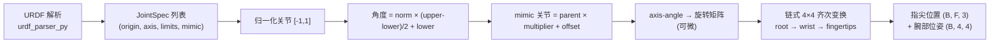
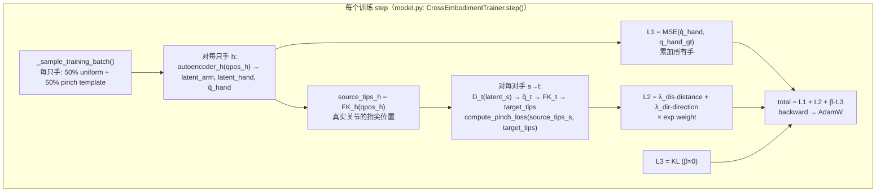
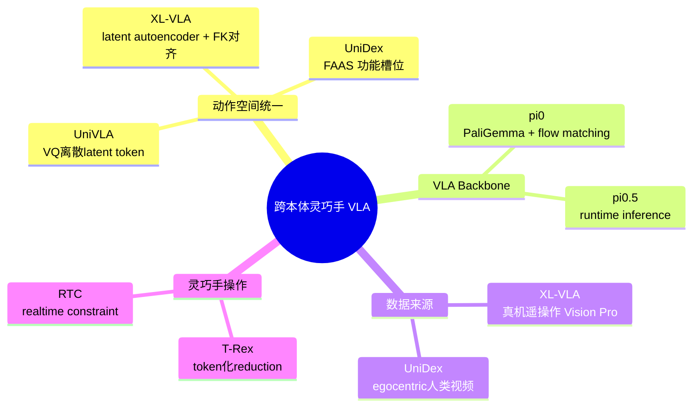

## XL-VLA 精读笔记：跨灵巧手 Latent 动作空间

> **abstract**
> XL-VLA 的核心命题：**不同灵巧手的关节空间天然异构（DoF 不同、运动学不同、肌腱耦合不同），但"捏合几何"（thumb-fingertip 的距离与方向）是跨手通用的功能不变量。**
>
> $$
> \underbrace{q^{(h)}_{\text{raw joints}}}_{\text{异构, 不可共享}}
> \xrightarrow{E_h}
> \underbrace{z \in \mathbb{R}^{32}}_{\text{统一 latent}}
> \xrightarrow{D_{h'}}
> \underbrace{\hat{q}^{(h')}}_{\text{任意手的关节}}
> $$
>
> 关键机制不是在 latent 上做对比学习对齐，而是通过**可微正运动学（FK）**约束：同一个 latent 解码到不同手后，指尖捏合几何（pinch distance + direction）必须一致。这是一种**几何功能对齐**，完全无监督、不需要跨手配对数据。

相关笔记：[UniDex_精读学习笔记_Obsidian](../unidex/)（FAAS 功能对齐空间）、[pi05_architecture_learning_notes_obsidian](../pi05-architecture-learning-notes/)、[pi0_model_architecture_flow_matching_notes_obsidian_mermaid_fixed](../pi0-model-architecture-flow-matching-notes-obsidian-mermaid-fixed/)（π0 backbone）、[pi0.7_runtime_inference_obsidian_notes_obsidian_v2](../pi0-7-runtime-inference-obsidian-notes-obsidian-v2/)。

---

## 1. 一句话理解 XL-VLA

$$
\boxed{
\text{为异构灵巧手学习一个 32 维共享 latent 动作空间，} \\
\text{通过指尖捏合几何对齐实现跨手一致，} \\
\text{再冻结 latent 编解码器、插入 pi0 VLA 做统一策略。}
}
$$

它同时解决三个层面的瓶颈：

| 瓶颈 | 具体问题 | XL-VLA 的干预 |
|---|---|---|
| **本体异构** | Ability(12DoF/6mimic)、Inspire(12/6)、X-Hand1(12/0)、Paxini(16/3,4指) 关节空间完全不同 | 32 维共享 latent + 指尖几何 retargeting loss 对齐 |
| **数据不可复用** | A 手采集的数据无法直接给 B 手用 | 同一 latent 可解码到任意手；跨手 latent replay 成功率 0.82 vs LAD 0.60 |
| **新本体接入** | 每出一只新灵巧手都要从头采集+训练 | latent autoencoder 无监督训练，新手只需加 encoder/decoder + URDF，无需配对数据 |

> **Important**
> 与 [UniDex](../unidex/) 的 FAAS（按 actuator 功能角色手动对齐坐标槽位）相比，XL-VLA **不做手动槽位对齐**，而是用可微 FK 让网络自动学习"什么latent对应什么捏合姿态"。FAAS 是**显式功能映射**，XL-VLA 是**隐式几何对齐**。

---

## 2. 核心问题：为什么 raw joint space 不行

### 2.1 异构性的本质

四只灵巧手的差异是根本性的：

| 灵巧手 | 手指数 | 总 DoF | 独立驱动 DoF (mimic 数) | 特点 |
|---|---|---|---|---|
| Ability Hand | 5 | 12 | 6 (6 mimic) | 肌腱耦合，欠驱动 |
| Inspire Hand | 5 | 12 | 6 (6 mimic) | 肌腱耦合，G1 标配 |
| X-Hand1 | 5 | 12 | 12 (0 mimic) | 全驱动，与其他手机械差异最大 |
| Paxini DexH13 | **4** | 16 | 3 (3 mimic) | **无小指**，DoF 最多 |

> **Warning**
> 关键难点
> - **维度不同**：12 vs 16，无法直接拼接或共享 action head
> - **拓扑不同**：Paxini 没有小指，pinch pair 集合 $\mathcal{P}$ 都不一样
> - **驱动方式不同**：mimic joint（肌腱耦合）使得"独立控制维度"远小于"总关节数"
> - π0 baseline 虽然"能"通过变长序列处理不同 DoF，但实际效果差（mean 0.32）

### 2.2 π0 baseline 为什么不行

论文的 baseline 是**同一个 π0 策略**在四只手 + 十个任务的混合数据上训练（通过调整序列长度适配不同 DoF）。结果 mean success rate 仅 **0.32**，而 XL-VLA 达到 **0.72**（+40%，绝对值翻倍以上）。

机制解释：π0 的 action expert 直接回归 raw joints，不同手的 joint 维度语义完全不同（关节 3 在 Ability 上是拇指屈肌，在 Paxini 上可能是无名指侧摆），模型无法从混合数据中学到一致的 action 表示。而 latent 空间把所有手映射到同一个 32 维流形上，语义统一。

---

## 3. 方法详解

### 3.1 整体 Pipeline：两阶段



> **Note**
> 两阶段解耦的核心好处
> Latent autoencoder 可以**独立于 VLA 预训练**，不需要任何示教数据——只用 URDF 定义的关节空间随机采样。这意味着加入新灵巧手时，只需为其训练新的 encoder/decoder（几十分钟），无需重新训练整个 VLA。

### 3.2 Latent Autoencoder（DexLatent）——核心创新

#### 3.2.1 架构

每只手 $h$ 有独立的 VAE-style autoencoder：

$$
\text{Encoder}: \quad q^{(h)} \xrightarrow{\text{MLP}[64,128,64]} (\mu^{(h)}, \log\sigma^{(h)}) \in \mathbb{R}^{32}
$$

$$
\text{Latent}: \quad z = \mu + \epsilon \cdot \sigma \quad \text{(reparameterize, 训练时)}; \quad z = \mu \quad \text{(推理时)}
$$

$$
\text{Decoder}: \quad z \xrightarrow{\text{MLP}[64,128,64] + \text{Tanh}} \hat{q}^{(h)} \in [-1,1]^{d_h}
$$

> **Tip**
> 代码验证的架构细节
> 从 `HandLatent/model.py` 的 `HandAutoencoder` 类确认：
> - 编码器 backbone：`Linear → LayerNorm → ReLU` × 3 层（64→128→64）
> - 两个独立 head：`mean_head` 和 `logvar_head`（各一个 Linear 到 32 维）
> - 解码器：同样 MLP，**末层 Tanh** 确保 $\hat{q} \in [-1,1]$（归一化关节空间）
> - `latent_dim_hand = 32`，`hand_hidden_dims = (64, 128, 64)`

#### 3.2.2 Arm 的处理：pass-through

```python
## model.py — HandAutoencoder.encode()
def encode(self, qpos):
    latent_arm, qpos_hand = self._split_qpos(qpos)  # qpos = [arm(7), hand(d_h)]
    hand_features = self.hand_encoder_backbone(qpos_hand)
    mean_hand = self.hand_mean_head(hand_features)
    logvar_hand = self.hand_logvar_head(hand_features)
    return latent_arm, mean_hand, logvar_hand  # arm 直接透传，不编码
```

> **Important**
> Arm 不进 latent
> 7-DoF 机械臂关节**直接 pass-through**，只有灵巧手关节被压缩到 32 维 latent。这是因为论文中所有 setup 都用 xArm7（同构手臂）。在部署阶段，arm 的跨本体通过 **EE Pose 表示 + IK 求解**实现（见 3.4 节）。
>
> **对你的 JAKA 场景**：这是一个需要关注的点——如果你的手臂与 xArm7 运动学差异大，latent 中的 arm 部分需要重新设计（见第 8 节）。

#### 3.2.3 三大损失函数

$$
\mathcal{L}_{\text{latent}} = \mathcal{L}_1 + \mathcal{L}_2 + \beta \mathcal{L}_3
$$

**① 重建损失 $\mathcal{L}_1$（每只手自编码器）**

$$
\mathcal{L}_1 = \frac{1}{|\mathcal{H}|} \sum_{h \in \mathcal{H}} \text{MSE}(\hat{q}^{(h)}, q^{(h)})
$$

确保每只手能从 latent 完整重建自身关节空间。消融实验显示去掉 $\mathcal{L}_1$ 后 joint RMSE 从 5.5 飙到 61.7（×11 倍），latent 完全坍塌。

**② Retargeting 损失 $\mathcal{L}_2$（跨手指尖几何对齐）——核心创新**

这是让 latent 真正"跨手"的关键。对每对手 $(s, t)$，将源手 $s$ 的 latent 解码到目标手 $t$，用可微 FK 计算指尖位置，约束**捏合几何一致**：

$$
\mathcal{L}_2 = \frac{1}{|\mathcal{H}|(|\mathcal{H}|-1)|\mathcal{P}|} \sum_{s \neq t} \sum_{(i,j) \in \mathcal{P}} \Big[ \underbrace{\lambda_{\text{dis}} \left( \|\boldsymbol{\delta}_{ij}^{(s)}\| - \|\hat{\boldsymbol{\delta}}_{ij}^{(t)}\| \right)^2}_{\text{pinch 距离一致}} + \underbrace{\lambda_{\text{dir}} \left(1 - \cos(\boldsymbol{\delta}_{ij}^{(s)}, \hat{\boldsymbol{\delta}}_{ij}^{(t)})\right)}_{\text{pinch 方向一致}} \cdot w_{ij}^{(s)} \Big]
$$

其中：
- $\boldsymbol{\delta}_{ij} = \mathbf{p}_i - \mathbf{p}_j$ 是指尖对 $(i,j)$ 的位移向量（thumb 对 index/middle/ring/little）
- $\mathcal{P}$ = {(thumb, index), (thumb, middle), (thumb, ring), (thumb, little)}，Paxini 无 little 则丢弃该 pair
- $w_{ij}^{(s)} = \exp(-\lambda_{\text{dis}}^{\exp} \|\boldsymbol{\delta}_{ij}^{(s)}\|^2)$：**指数权重，越接近捏合（距离越小）权重越高**，强调操作相关的紧密捏合姿态
- 权重：$\lambda_{\text{dis}} = 2000, \lambda_{\text{dir}} = 5, \lambda_{\text{dis}}^{\exp} = 12$

> **abstract**
> 为什么用指尖几何而不是 latent 对齐？
> 直接在 latent 空间做对比学习（如 contrastive loss）需要定义"什么是相似的 latent"——但不同手的 latent 流形结构未知。而**指尖在 3D 空间中的几何关系**是一个**物理可测、跨手通用**的不变量。通过可微 FK 把 latent → 指尖位置 → 几何 loss，梯度可以直接回传到 encoder/decoder，自动学到"什么样的 latent 编码对应什么样的捏合姿态"。
>
> 这与 [UniDex](../unidex/) 的 FAAS 思路形成对比：FAAS **手动**定义功能槽位映射，而 XL-VLA 让网络通过 FK **自动**学习对齐。

**③ KL 正则 $\mathcal{L}_3$**

$$
\mathcal{L}_3 = \mathbb{E}_q \left[ \text{KL}\left( q(z|q) \| \mathcal{N}(0, I) \right) \right], \quad \beta = 10^{-5}
$$

极小的 $\beta$ 说明 KL 主要起光滑化作用，不强制严格的高斯先验。代码中默认 `lambda_kl = 0.0`（!），论文中 $\beta = 10^{-5}$——说明 KL 的贡献微乎其微，**重建 + retargeting 才是主力**。

#### 3.2.4 可微正运动学（Differentiable FK）

$\mathcal{L}_2$ 能回传梯度的前提是 FK 可微。代码 `HandLatent/kinematics.py` 实现了完整的可微 FK 链：



> **Tip**
> Mimic Joint（肌腱耦合）的处理
> `HandKinematicsModel._normalized_to_all_joint_angles()` 中：独立驱动的关节先计算角度，然后 mimic 关节通过 `angle = parent × multiplier + offset` 推导。这意味着 **Ability/Inspire 的 6 个独立驱动关节控制 12 个物理关节**，FK 自动处理耦合关系。梯度只回传到独立驱动关节。

关键实现（`axis_angle_to_matrix`）：

```python
## 可微的 axis-angle → rotation matrix（标准 Rodrigues 公式的 batch 实现）
def axis_angle_to_matrix(axis, angle):  # axis: (B,3), angle: (B,)
    axis = F.normalize(axis, dim=-1)
    cos, sin = torch.cos(angle), torch.sin(angle)
    # ... Rodrigues formula，完全可微
```

#### 3.2.5 Pinch Template 采样——训练数据的关键设计

> **Warning**
> 如果只在关节空间均匀随机采样 [-1,1]^d_h...
> 绝大多数随机关节组合是**无意义的、松散张开的手势**，几乎不会出现"捏合"这种操作核心姿态。latent autoencoder 会优化这些无意义姿态的重建，浪费容量。

解决方案（`CrossEmbodimentTrainer._cache_pinch_templates()`）：

1. 对每只手，计算 neutral pose 的腕部位姿
2. 在腕部坐标系下设定一个 pinch 目标点（offset = `[0.07, 0.0, -0.08]` 米）
3. 对每个手指 $i$（index/middle/ring/little），构造目标：拇指尖和指尖 $i$ 都到该 pinch 点
4. 用 IK（梯度下降，100 次迭代）求解出 pinch 关节配置
5. 加噪声（std=0.01）生成 2048 个 pinch template
6. 训练时 **50% 采样来自 pinch template + 噪声，50% 来自均匀随机**

```python
## model.py — _sample_training_batch()
pinch_count = int(round(batch_size * self.config.pinch_sampling_probability))  # 50%
uniform_count = batch_size - pinch_count  # 50%
## 混合均匀随机 + pinch-centric 采样
```

这确保 latent 空间在**操作相关姿态区域**（捏合附近）有足够密度，是工程上非常聪明的设计。

### 3.3 VLA 集成（XL-VLA Policy）

> **Note**
> Policy 代码尚未公开
> `github.com/luccachiang/XL-VLA` 目前返回 404（截至 2026-07-10）。以下基于论文描述。

XL-VLA 的 VLA 部分基于 **π0**（[π0 架构笔记](../pi0-model-architecture-flow-matching-notes-obsidian-mermaid-fixed/)）：

| 组件 | π0 原版 | XL-VLA 修改 |
|---|---|---|
| 视觉编码 | SigLIP + DINOv2 | 不变 |
| 语言编码 | PaliGemma | 不变 |
| 状态输入 | raw joint state tokens（堆叠） | **替换为 latent action tokens** $z_t = E_h(q_t^{(h)})$ |
| Action Expert | flow matching 预测 raw joint chunks | flow matching 预测 **latent chunks** |
| 解码 | 直接输出关节 | **冻结的 $D_h$ 解码 latent → 关节** |
| 手身份 $h$ | 不适用 | **不作为输入 token**，只用于选择 $E_h$/$D_h$ |

$$
\text{Policy}: \quad \hat{z}_{t+1} = F(z_t, V, T) \quad \longrightarrow \quad \hat{q}_{t+1}^{(h)} = D_h(\hat{z}_{t+1})
$$

> **Important**
> 手身份不进 VLA
> 手身份 $h$ **从不作为显式 token 输入** VLA backbone。VLA 策略是完全 hand-agnostic 的——它只看到统一的 latent 动作。$h$ 仅在数据加载时用于选择正确的 encoder/decoder。这意味着策略学到的是**纯动作语义**，不依赖于"我在控制哪只手"。

**Action Chunk 规格**：
- 每帧：1 个 32 维 latent 向量（替代 $d_h$ 维 raw joints）
- 每块：64 帧 @ 20Hz = 3.2 秒运动
- 每步 VLA 预测一个 64×32 的 latent chunk

> **Tip**
> 为什么 latent 比 raw joint 更适合 VLA
> 对于 12-16 DoF 的灵巧手，64 帧 × 12-16 维 = 768-1024 个连续值需要回归。而 latent 把每帧压缩到 32 维（固定），64×32=2048... 等等，这看起来没省。真正的节省在于：
> 1. **语义统一**：不同手的 latent 维度一致（32），VLA 的 action head 不需要变长
> 2. **信息瓶颈**：32 维 latent 是手姿态的低维流形表示（手姿态的 intrinsic dimensionality ~10-20），过滤了冗余
> 3. **跨手泛化**：同一 latent 语义在不同手上一致，策略可以跨手迁移

### 3.4 部署时的 EEPose 表示与 Arm IK

从 `HandLatent/infer.py` 的 `encode_hand_sequence_eepose()` / `decode_hand_sequence_eepose()` 可以看到部署时的完整表示：

$$
\text{完整动作 latent} = \underbrace{[\text{alignment}(3), \text{wrist\_quat}(4)]}_{\text{手臂 EE 表示, 7维}} \oplus \underbrace{\text{hand\_latent}(32)}_{\text{手姿态}} = 39 \text{ 维}
$$

- **alignment point (3)**：所有 pinch pair 中点的加权平均（权重 = 捏合紧密度），代表"抓取发生的位置"
- **wrist quaternion (4)**：腕部朝向
- **hand latent (32)**：手部姿态

**解码到目标手时**：
1. `hand_latent → D_h → 目标手关节`（冻结 decoder）
2. `alignment + wrist_quat → Pink IK → 目标手臂关节`（Pinocchio QP 求解，手关节固定，只解 arm 7 DoF）

```python
## ik.py — pink_align_arm()
## 手关节固定（velocity[arm_dof:] = 0），只优化 arm 7 DoF
## 目标：pinch midpoint 对齐 alignment point + wrist 朝向对齐 quaternion
wrist_task = FrameTask(frame=wrist_link, position_cost=1.0, orientation_cost=rotation_weight)
velocity = solve_ik(configuration, tasks, dt, solver="osqp")
velocity_np[arm_dof:] = 0.0  # 冻结手关节
```

> **abstract**
> Arm 的跨本体策略
> Arm 不进 latent，而是编码为**与本体无关的 EE 表示**（pinch 对齐点 + 腕部朝向）。部署到新手臂时，用该手臂自己的 IK 求解器恢复关节角。这是一个优雅的解耦：**手臂用 EE space 跨本体，灵巧手用 latent space 跨本体**。

---

## 4. 代码精读（DexLatent 仓库）

### 4.1 仓库结构

```
DexLatent/
├── HandLatent/
│   ├── model.py          ← 核心：HandAutoencoder + CrossEmbodimentTrainer
│   ├── kinematics.py     ← 可微 FK + IK（从 URDF 构建）
│   ├── ik.py             ← Pink/Pinocchio IK（部署时 arm 求解）
│   ├── train.py          ← 训练入口
│   ├── infer.py          ← 推理/retargeting/可视化入口
│   └── visualize.py      ← Rerun 3D 可视化
├── Assets/               ← 4 种手的 URDF + xArm7 URDF + mesh
│   ├── xhand/            ← X-Hand1 (12 DoF, 全驱动)
│   ├── ability_hand/     ← Ability (12 DoF, 6 mimic)
│   ├── inspire_hand/     ← Inspire (12 DoF, 6 mimic)
│   ├── paxini/           ← Paxini DexH13 (16 DoF, 3 mimic, 4指)
│   └── xarm7_*/          ← arm+hand 组合 URDF
├── Checkpoints/          ← 预训练 checkpoint (epoch 1000)
├── Dataset/demo.npz      ← 示范轨迹（left_qpos, right_qpos）
└── pyproject.toml        ← 依赖（torch, pinocchio, pink, rerun, scipy）
```

### 4.2 核心数据流（训练）



### 4.3 关键超参数（来自 `TrainingConfig`）

| 参数 | 值 | 含义 |
|---|---|---|
| `latent_dim_hand` | 32 | 手 latent 维度 |
| `hand_hidden_dims` | (64, 128, 64) | MLP 隐藏层 |
| `batch_size` | 1024 | 每步采样数 |
| `num_steps` | 10000 | 优化步数 |
| `learning_rate` | 2e-3 | AdamW |
| `lambda_dis` | 2000.0 | pinch 距离损失权重（很大！） |
| `lambda_dir` | 5.0 | pinch 方向损失权重 |
| `lambda_dis_exp` | 12.0 | pinch 权重指数衰减系数 |
| `lambda_kl` | 0.0 | KL 权重（代码中关闭，论文 β=1e-5） |
| `pinch_sampling_probability` | 0.5 | pinch template 占比 |
| `pinch_template_count` | 2048 | 预计算 pinch 配置数 |
| `arm_dof` | 7 | xArm7 DoF |

> **Tip**
> λ_dis = 2000 为什么这么大？
> Pinch 距离差的单位是米²（ fingertip 距离差的平方），量级在 1e-4 ~ 1e-3。乘以 2000 后才和重建损失（radians²，量级 ~1）可比。这是典型的**不同量纲损失需要大幅调权**的情况。

### 4.4 训练的四只手（`train.py`）

```python
hand_names = [
    "xarm7_xhand_right",     # X-Hand1
    "xarm7_ability_right",   # Ability
    "xarm7_inspire_right",   # Inspire
    "xarm7_paxini_right",    # Paxini DexH13
]
```

注意命名格式是 `xarm7_{hand}_{side}`——arm + hand 组合 URDF，说明 FK 模型是 arm+hand 整体。

### 4.5 推理流程（`infer.py`）

```python
## 1. 加载预训练 checkpoint
trainer.load_autoencoders_from_payload(payload)

## 2. 读取源手轨迹（demo.npz 中的 inspire_qpos）
source_qpos = dataset[f"{side}_qpos"]
source_norm = trainer.normalized_qpos(source_hand, source_qpos)

## 3. 编码到 EEPose latent
latents = encode_hand_sequence_eepose(trainer, source_hand, source_norm)
## latents shape: (T, 39) = [alignment(3), quat(4), hand_latent(32)]

## 4. 解码到四只目标手
for target_hand in ["xhand", "ability", "inspire", "paxini"]:
    decoded = decode_hand_sequence_eepose(trainer, target_hand, latents)
    # decode: hand_latent → D_h → hand joints; alignment+quat → Pink IK → arm joints

## 5. Rerun 3D 可视化对比
visualize_hand_motion(...)
```

---

## 5. 实验

### 5.1 数据集与硬件

| 项目 | 规格 |
|---|---|
| 任务数 | 10 个桌面操作任务 |
| 灵巧手 | 4 种（Ability, Inspire, X-Hand1, Paxini DexH13） |
| 示教数 | 每任务每手 50 条，共 2000 条 |
| State-action pairs | ~2M |
| 采集工具 | Apple Vision Pro（手部追踪 + retargeting + IK） |
| 手臂 | 双臂 7-DoF xArm（桌面）/ Unitree G1（人形） |
| 相机 | 单 RealSense L515，前视，960×540 → 224×224 |
| VLA 训练 | 8× H100 80GB，60K steps，batch 128，~10 小时 |

**10 个任务**：PF（备水果）、SC（叠罐头）、SoC（分拣罐头）、HB（双臂递瓶子）、RL（整理柠檬）、PS（倒酱）、RB（整理盒子）、PuS（推糖）、PoS（加糖到杨桃）、PC（推罐头）。

### 5.2 主结果：跨手 VLA（Table 2）

| 方法 | Ability | Inspire | Paxini | X-Hand | **Mean** |
|---|---|---|---|---|---|
| **π0** | 0.37 | 0.27 | 0.35 | 0.29 | **0.32** |
| **XL-VLA** | 0.73 | 0.68 | 0.78 | 0.70 | **0.72 (+40%)** |

> **success**
> 核心结论
> 同一个 hand-agnostic VLA 策略，在统一 latent 空间上训练，四只手的平均成功率从 0.32 提升到 0.72。特别地，机械差异最大的 X-Hand 从 0.29 → 0.70（+41%），证明 latent 能弥合巨大本体差异。

### 5.3 Zero-shot 跨任务泛化（Fig. 4）

对每只手 holdout 部分任务，测试 unseen task-hand 组合：
- **XL-VLA** 在所有手和任务上都不低于 π0+RT（retargeting baseline）
- 特别在精细操作任务（HB 双臂递瓶、RB 整理盒子）上优势巨大——几何 retargeting 无法维持协调的手指运动

### 5.4 Latent Replay 对比（Table 4）

| 方法 | Ability+Inspire | Paxini+XHand | Mean |
|---|---|---|---|
| LAD（监督式 latent retargeting） | 0.60 | 0.61 | 0.605 |
| **XL-VLA（无监督）** | 0.82 | 0.81 | **0.815** |

> **Important**
> 无监督 > 有监督
> XL-VLA 的 latent 对齐**完全无监督**（只用 FK 几何，无配对数据），却比需要监督配对的 LAD 高 20+ 个点。这证明指尖几何是比"配对示教数据"更好的跨手对齐信号。

### 5.5 G1 跨机器人（Fig. 5 / Table 6）

co-train xArm 桌面数据 + G1 人形数据（Inspire 手），G1 成功率：

| 方法 | PF | HB | PS | PoS | Mean |
|---|---|---|---|---|---|
| π0 (raw action) | 0.4 | 0.6 | 0.5 | 0.6 | 0.525 |
| **XL-VLA (latent)** | 0.7 | 0.9 | 0.9 | 0.8 | **0.825 (+57%)** |

### 5.6 消融实验（Table 5）核心发现

| 变体 | 重建 Joint RMSE ↓ | 跨手 RTdist ↓ | 说明 |
|---|---|---|---|
| **Ours** | 5.48 | 10.49 | 完整方法 |
| -$\mathcal{L}_1$ | **61.67** | 10.40 | 重建坍塌，但 retargeting 还行（FK 强制几何） |
| -$\mathcal{L}_2$ (both) | 3.78 | **71.77** | **retargeting 崩溃**——没有跨手约束，latent 各自为政 |
| -$L_{dist}^2$ | 5.20 | 6.79 | 去掉距离项反而 RTdist 变好？方向项主导 |
| -$L_{dir}^2$ | 4.97 | 53.55 | 方向项对 RTdist 影响大 |
| Latent=128 | 20.91 | 10.96 | **latent 太大反而差**——过参数化阻碍不变性 |

> **Warning**
> Latent 维度不是越大越好
> L128（128 维 latent）重建 RMSE 飙到 20.9（vs Ours 5.5）。论文解释："excessively large latent spaces hinder embodiment-invariant structure"——太大的 latent 让每只手学到独立的编码，丧失跨手共享结构。32 维是手姿态流形的合适瓶颈。

---

## 6. 关键设计洞察

### 6.1 为什么"指尖几何"是正确的跨手不变量

$$
\text{raw joints（异构）} \xrightarrow{\text{FK}} \text{指尖位置（3D, 同构）} \xrightarrow{\text{pinch pairs}} \text{捏合几何（功能不变量）}
$$

灵巧手操作的物理本质是**指尖与物体的接触**。不同手的关节空间完全不同，但：
- 拇指与食指捏住一个物体的**距离和方向**是任务定义的，与手无关
- 这种几何关系通过 FK 可微地连接到关节空间
- 因此用 pinch geometry 做 loss = 用**任务功能**对齐 latent

### 6.2 Pinch Template 采样：密度聚焦

均匀随机采样的关节空间体积巨大（$[-1,1]^{12}$），但操作有用的姿态只占极小子集。pinch template 采样把 50% 训练密度聚焦到**捏合姿态邻域**，确保 latent 在操作关键区域有足够分辨率。这是 domain-specific 的数据增强。

### 6.3 两阶段解耦的可扩展性

```
新灵巧手接入流程：
1. 准备 URDF → HandKinematicsModel 自动解析 FK
2. 训练该手的 encoder/decoder + retargeting loss（~10K steps，CPU 即可）
3. 冻结新 encoder/decoder
4. VLA 策略无需重训（如果只做 retargeting）/ 或在 latent 上 finetune
```

---

## 7. 与 UniDex (FAAS) 的对比

| 维度 | UniDex (FAAS) | **XL-VLA** (Latent) |
|---|---|---|
| **跨手对齐方式** | 手动定义功能槽位（Function-Actuator-Aligned Space） | 自动学习（可微 FK + pinch geometry loss） |
| **对齐粒度** | actuator 级别（每个驱动器映射到功能槽） | 指尖几何级别（pinch distance + direction） |
| **需要配对数据** | 需要（人类视频 → 机器人轨迹） | **不需要**（纯无监督 FK 几何） |
| **数据来源** | egocentric 人类视频 → robot-centric | 真机遥操作（Vision Pro） |
| **VLA backbone** | 3D pointcloud + flow matching | π0（PaliGemma + flow matching） |
| **latent/action** | FAAS 坐标（显式功能空间） | 32 维 VAE latent（隐式学习空间） |
| **手臂处理** | FAAS 包含手臂 | arm pass-through / EE pose + IK |
| **新本体接入** | 需要重新定义 FAAS 映射 | 加 encoder/decoder + URDF |
| **优势** | 显式可控，可解释 | 无监督，自动化程度高 |
| **劣势** | 手动映射工作量大，泛化受限于映射质量 | latent 不可解释，需要调参 |

> **abstract**
> 本质区别
> FAAS 是**自顶向下**的设计：先定义"什么是功能等价的 actuator"，再做映射。
> XL-VLA 是**自底向上**的学习：只定义"什么几何关系应该跨手一致"，让网络自动发现对齐。
>
> 两者可以互补：FAAS 的功能映射可以作为 XL-VLA 的**先验初始化**或**额外监督信号**。

---

## 8. 对你的场景的启示（JAKA 双臂 + 021 灵巧手）

### 8.1 你的场景与论文的差异

| 维度 | XL-VLA 论文 | 你的场景 |
|---|---|---|
| 手臂 | xArm7（7 DoF） | **JAKA 协作臂**（运动学不同） |
| 灵巧手 | Ability/Inspire/X-Hand1/Paxini | **021 灵巧手**（未在论文中） |
| 配置 | 双臂双手 | 双臂双 021 手 |
| 目标 | 跨手 zero-shot 迁移 | **单手种数据采集 + 微调 + 部署** |

### 8.2 核心问题：你需要跨本体 latent 吗？

> **question**
> 关键判断
> 如果你的目标**只在 021 手上采集、微调、部署**，那么跨本体 latent 不是必需的——直接用 raw joint space 的 π0 即可。
>
> **XL-VLA 的价值在于**：(1) 如果你未来想加入其他灵巧手的数据（如公开的 Inspire/X-Hand 数据集），(2) 如果你想用其他手的示教数据来 bootstrap 021 手的策略，(3) 如果你有多只不同的手需要统一策略。

### 8.3 如果要应用 XL-VLA 方法到你的场景

**路径 A：只用 Latent 表示（推荐起点）**

即使只有一个手种，使用 latent 表示也有好处——32 维 latent 是手姿态的压缩表示，可能比 raw joint 更容易学习策略。

```
1. 获取 021 手的 URDF
2. 用 DexLatent 框架训练 021 的 encoder/decoder
   - 需要可微 FK → URDF 解析（kinematics.py 可直接复用）
   - 单手训练时 L2 retargeting loss 不适用（需要 ≥2 只手）
   - 退化为纯 autoencoder + pinch template 采样
3. 在 JAKA+021 上采集遥操作数据
4. 将数据编码为 latent
5. 训练 VLA（π0 或其他）在 latent 上
```

**路径 B：加入现有手的预训练 latent（跨本体）**

```
1. 在 DexLatent 已有 4 只手 latent 的基础上
2. 添加 021 手作为第 5 只手（新 encoder/decoder + URDF）
3. 联合训练，L2 retargeting loss 自动对齐 021 与其他手
4. 可以利用其他手的公开数据预训练 VLA，再在 021 上 finetune
```

**路径 C：Arm 跨本体（JAKA vs xArm7）**

> **Warning**
> Arm 差异是更大的挑战
> 论文中所有手都用 xArm7（同构手臂），arm pass-through。你的 JAKA 运动学完全不同：
> - **方案 1**：用 EEPose 表示（论文 infer.py 的做法）——将 JAKA arm 编码为 wrist pose + alignment point，部署时用 JAKA 自己的 IK 求解。这需要实现 JAKA 的 Pink/Pinocchio IK。
> - **方案 2**：为 JAKA 单独训练 arm 的 latent autoencoder（类似 hand 的做法，但 arm DoF 只有 6-7，可能不需要压缩）。
> - **方案 3**：如果只用 JAKA + 021（单一 arm+hand 组合），arm 直接用 raw joint，不做跨 arm latent。

### 8.4 实操建议

1. **先跑通 DexLatent 的 inference demo**（`uv run -m HandLatent.infer`），理解 latent retargeting 的效果
2. **获取 021 手 URDF**，验证 FK 正确性（指尖位置合理）
3. **单手 latent autoencoder** 训练（021 only），观察重建精度和 latent 可视化
4. **采集少量 021 遥操作数据**（~50 条），编码为 latent，验证 latent 能否忠实表示轨迹
5. **决定是否需要跨手**：如果只部署 021，直接 raw joint + π0 可能更简单

---

## 9. 局限与开放问题

### 9.1 方法局限

| 局限 | 具体问题 | 影响 |
|---|---|---|
| **Arm 假设同构** | 论文所有手都用 xArm7，arm pass-through | 跨手臂（JAKA vs xArm）需额外处理 |
| **Pinch pair 手动对齐** | thumb-index/middle/ring/little 的对应关系是手动定义的 | 新手需手动确认指尖语义对应 |
| **只对齐 pinch 几何** | 不对齐 grasp type、contact force、物体交互 | 不同 grasping strategy 可能映射到相似 latent |
| **单相机 2D 输入** | 只用前视 RGB（L515），无深度/点云 | 遮挡和深度感知受限 |
| **Policy 代码未公开** | luccachiang/XL-VLA 404 | VLA 集成部分无法直接复现 |

### 9.2 开放问题

1. **Latent 维度 32 的理论依据**：消融显示 32 最优，128 反而差。手姿态的 intrinsic dimensionality 是多少？PCA synergy 研究表明 ~10-20，32 可能仍有冗余。
2. **非 pinch 姿态的对齐**：L2 只约束 pinch pair 几何。power grasp、侧捏等非拇指主导的姿态如何跨手对齐？
3. **接触动力学**：latent 只编码运动学（关节角度），不含力/触觉信息。contact-rich 任务可能需要扩展。

### 9.3 与你笔记库中其他工作的关系



---

## 10. 论文信息速查

```bibtex
@article{jiang2026cross,
  title={Cross-Hand Latent Representation for Vision-Language-Action Models},
  author={Jiang, Guangqi and Liang, Yutong and Ye, Jianglong and Huang, Jia-Yang and Jing, Changwei and Duan, Rocky and Abbeel, Pieter and Wang, Xiaolong and Zou, Xueyan},
  journal={arXiv preprint arXiv:2603.10158},
  year={2026}
}
```

| 项目 | 内容 |
|---|---|
| **会议** | CVPR 2026 Highlight |
| **arXiv** | 2603.10158 (2026-03-10) |
| **代码（Latent）** | [github.com/EmptyBlueBox/DexLatent](https://github.com/EmptyBlueBox/DexLatent) ✅ 已开源 |
| **代码（Policy）** | [github.com/luccachiang/XL-VLA](https://github.com/luccachiang/XL-VLA) ❌ 暂未公开 |
| **数据集** | [huggingface.co/datasets/GqJiang/XL-VLA](https://huggingface.co/datasets/GqJiang/XL-VLA) |
| **作者单位** | UC San Diego · Amazon FAR · UC Berkeley |
| **一作** | Guangqi Jiang (luccachiang), Yutong Liang (EmptyBlueBox) |
| **通讯** | Xiaolong Wang, Xueyan Zou |

---

> **quote**
> 一句话总结
> XL-VLA 证明了一个优雅的命题：**灵巧手的"捏合几何"是跨本体的通用语言**。通过可微 FK 把这个几何不变量注入 latent autoencoder 的训练，一个完全无监督的 32 维 latent 空间就能让四只截然不同的灵巧手共享同一套动作语义，并直接插入 π0 VLA 实现统一策略。
